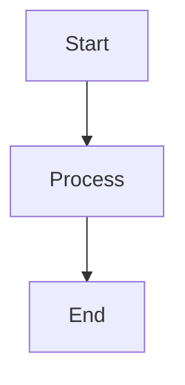

# CLAUDE.md

This file provides guidance to Claude Code (claude.ai/code) when working with code in this repository.

## Repository Overview

This is a course repository for ITAM's Artificial Intelligence class (Primavera 2026). It contains course materials, guides, and student assignments. The site is built using **uu_framework**, a custom static site generator based on Eleventy.

## Repository Structure

```
ia_p26/
├── clase/                    # Course content (rendered to site)
│   ├── 00_index.md           # Main index
│   ├── 01_*/                 # Numbered chapters
│   ├── a_stack/              # Appendix A: Technical stack
│   ├── b_libros/             # Appendix B: Books (not rendered)
│   ├── 07_certificaciones/   # Certification guides
│   └── flow.sh               # Git workflow script
├── estudiantes/              # Student work (not rendered)
├── uu_framework/             # Static site framework
│   ├── config/               # Site & theme configuration
│   ├── scripts/              # Python preprocessing
│   ├── eleventy/             # Eleventy SSG config & templates
│   ├── docker/               # Docker build environment
│   └── docs/                 # Framework documentation
├── _site/                    # Built output (gitignored)
└── CLAUDE.md                 # This file
```

## uu_framework Architecture

### Build Pipeline

```
1. Python Preprocessing (scripts/)
   ├── extract_metadata.py   → metadata.json
   ├── generate_indices.py   → hierarchy.json
   └── aggregate_tasks.py    → tasks.json

2. Eleventy Build (eleventy/)
   ├── Parse markdown with markdown-it
   ├── Apply Nunjucks templates
   └── Generate HTML pages

3. Tailwind CSS Processing
   └── Generate themed CSS
```

### File Naming Convention

| Pattern | Meaning | Example |
|---------|---------|---------|
| `00_*.md` | Index file | `00_index.md` |
| `01_`, `02_` | Chapters (ordered) | `01_intro/` |
| `a_`, `b_` | Appendices | `a_stack/` |
| `??_*` | Work-in-progress (hidden) | `??_draft/` |

### Markdown Components

Use container syntax for special content blocks:

```markdown
:::homework{id="hw-01" title="Task Name" due="2026-02-01" points="10"}
Assignment instructions...
:::

:::exercise{title="Exercise Title"}
Exercise steps...
:::

:::prompt{title="LLM Prompt"}
Prompt text to copy...
:::

:::example{title="Example"}
Example content...
:::

:::exam{id="exam-01" title="Exam Name" date="2026-03-15"}
Exam information...
:::

:::project{id="proj-01" title="Project Name" due="2026-05-15"}
Project description...
:::
```

### Mermaid Diagrams

Mermaid diagrams are auto-rendered:

````markdown

````

## Key Commands

### Docker Build Commands

```bash
# Start dev server with hot reload
docker compose -f uu_framework/docker/docker-compose.yaml up dev

# Production build
docker compose -f uu_framework/docker/docker-compose.yaml run build

# Run preprocessing only (debug)
docker compose -f uu_framework/docker/docker-compose.yaml run preprocess
```

Dev server runs at: `http://localhost:3000/ia_p26/`

### Git Workflow Script (flow.sh)

```bash
./clase/flow.sh setup    # Initial setup
./clase/flow.sh sync     # Sync with upstream
./clase/flow.sh start <task-name>  # Start new task
./clase/flow.sh save "message"     # Commit changes
./clase/flow.sh upload   # Push branch
./clase/flow.sh finish   # Clean up after merge
```

Upstream: `git@github.com:sonder-art/ia_p26.git`

## Development Guidelines

### When Modifying the Framework

1. **Eleventy config** (`.eleventy.js`): Filters, collections, transforms
2. **Templates** (`_includes/`): Nunjucks layouts and components
3. **Theming** (`src/css/`): CSS variables for colors, fonts
4. **Preprocessing** (`scripts/`): Python data extraction

### When Creating Content

1. Follow file naming convention for proper ordering
2. Use YAML frontmatter for metadata:
   ```yaml
   ---
   title: "Page Title"
   summary: "Brief description"
   ---
   ```
3. Use component syntax for assignments (:::homework, etc.)
4. Links to other `.md` files are auto-converted

### Language Guidelines

- **Framework code & dev docs**: English
- **Course content & user guides**: Spanish
- **Comments in code**: English preferred

## Documentation Structure

```
uu_framework/docs/
├── dev/           # Developer guides (English)
│   ├── architecture, preprocessing, eleventy
│   ├── theming, components, docker
├── profesor/      # Professor guides (Spanish)
│   ├── estructura, frontmatter, componentes
│   ├── mermaid, mejores_practicas
└── estudiante/    # Student guides (Spanish)
    ├── navegacion, accesibilidad, tareas
```

## Student Workflow

Students work in `estudiantes/<username>/`:
1. `./clase/flow.sh start tarea-X` - Create branch
2. Work in your directory
3. `./clase/flow.sh save "message"` - Commit
4. `./clase/flow.sh upload` - Push and create PR
