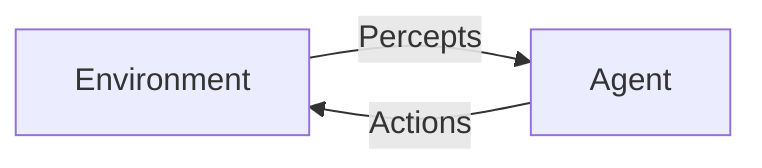
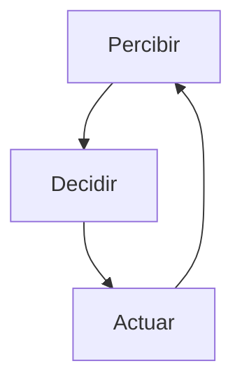

# Introducción: Agents & Environments

:::exam{id="EX-01" title="Primer Examen: Clase 1, 2 y 3" date="2026-01-21" points="10" duration="20 minutos"}

El examen cubre las primeras tres clases del curso:

- **Clase 1**: Introducción e Historia de la IA
- **Clase 2**: Agents y Environments
- **Clase 3**: Lógica

El examen incluirá todo lo que hemos visto sobre cómo evalúo, los temas de historia de la IA, agentes y ambientes, y lógica proposicional.

:::

---

## ¿Por qué estudiar Agentes?

Todo el curso gira alrededor de una pregunta central:

> **¿Cómo construimos sistemas que actúan inteligentemente?**

La respuesta: modelamos estos sistemas como **agentes** que interactúan con **environments**.

## El Ciclo Fundamental

Cualquier sistema inteligente, desde un termostato hasta GPT-4, sigue este ciclo:

## Marco Conceptual del Curso

Cada tema del curso responde a preguntas sobre este ciclo:

| Fase | Pregunta | Temas del curso |
|------|----------|-----------------|
| **Percibir** | ¿Qué sé del mundo? | Probabilidad, Bayesian Inference, HMMs |
| **Decidir** | ¿Qué debo hacer? | Decision Theory, Search, Planning, Game Theory |
| **Actuar** | ¿Cómo ejecuto? | MDPs, RL, Neural Networks |
| **Aprender** | ¿Cómo mejoro? | Learning Theory, RL |

---

## Visualización: Landscape del Curso

---

## Preguntas para Reflexionar

Antes de continuar, piensa en estos sistemas:
- Un carro autónomo
- Un filtro de spam
- Un chatbot
- Un jugador de ajedrez
- Tú mismo

¿Qué tienen en común? ¿Qué los diferencia?
