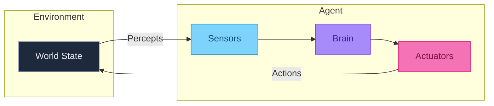
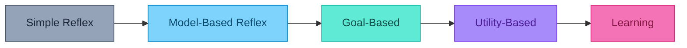
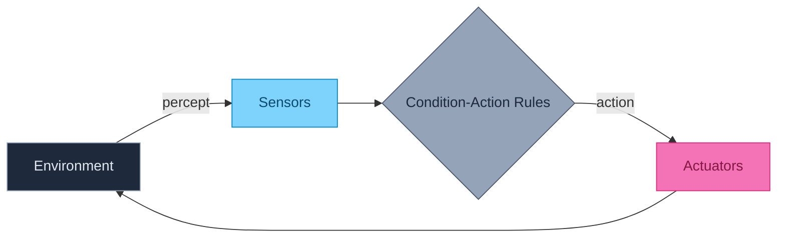
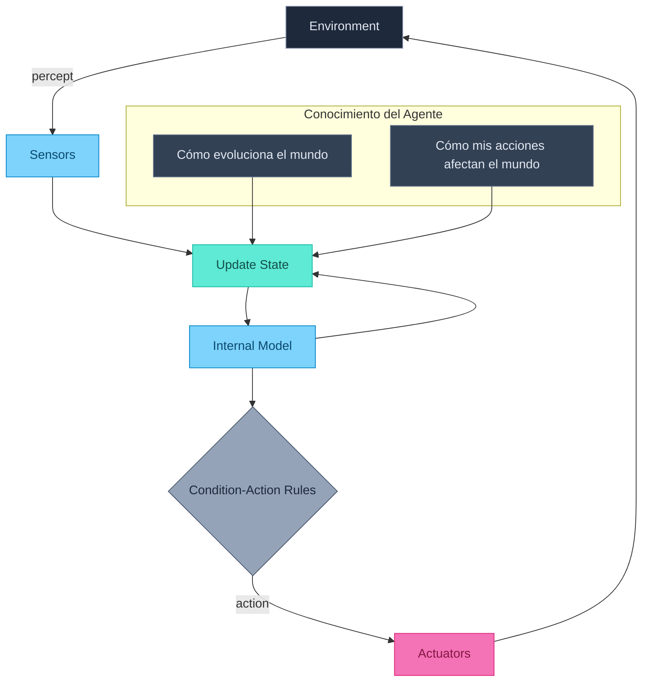
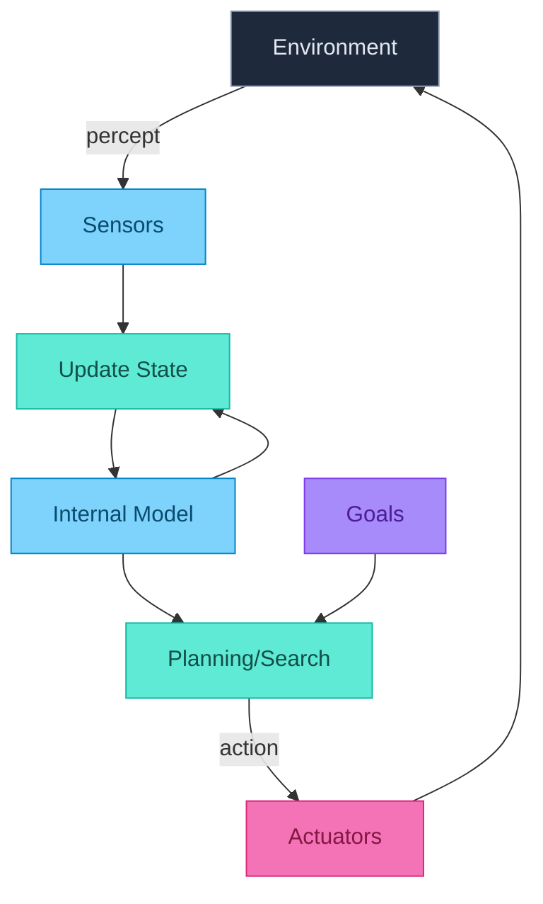
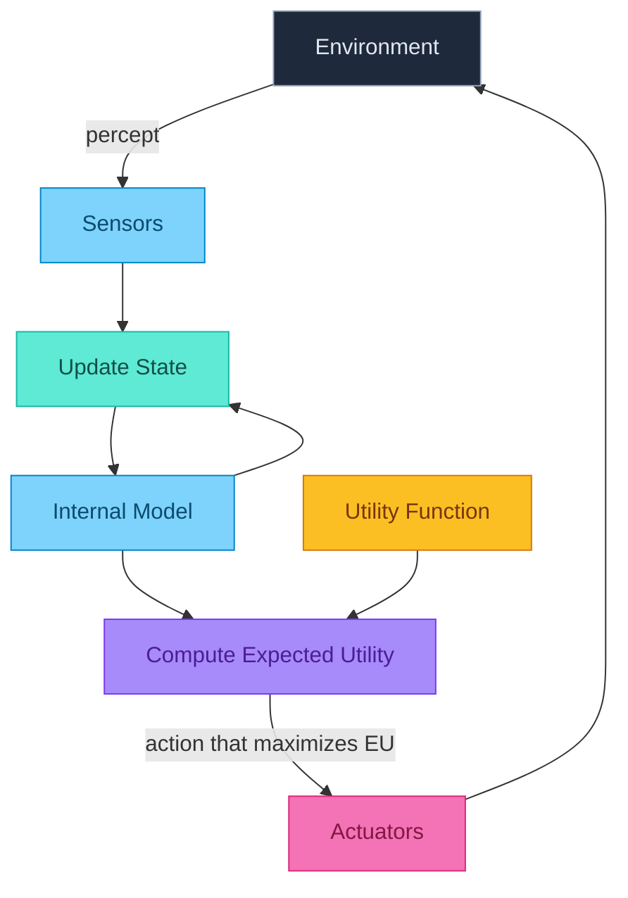
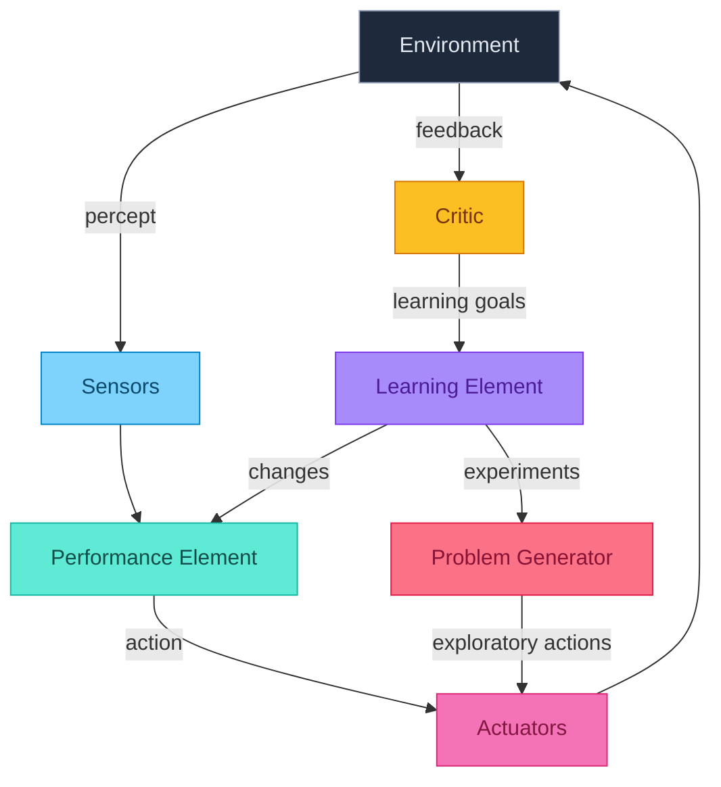
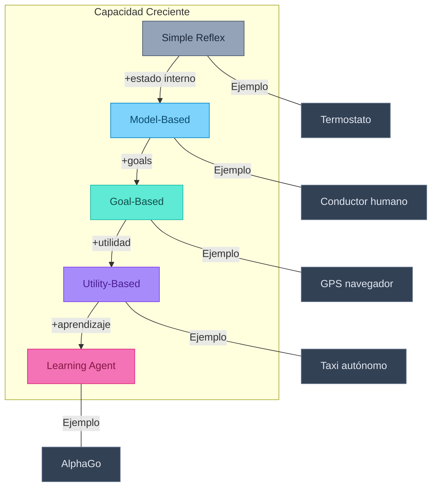
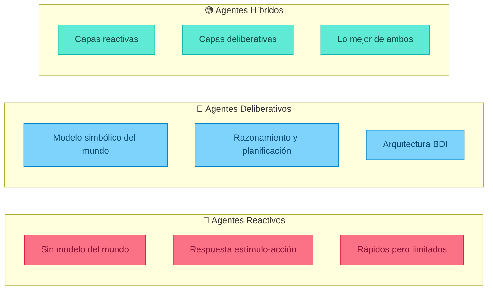
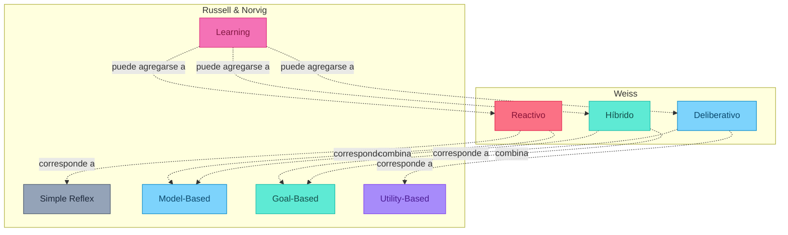

# ¿Qué es un Agente?

## Definición

Un **agente** es cualquier cosa que puede verse como:
1. **Percibiendo** su entorno a través de **sensores**
2. **Actuando** sobre ese entorno a través de **actuadores**



## Ejemplos de Agentes

| Agente | Sensores | Actuadores |
|--------|----------|------------|
| **Humano** | Ojos, oídos, piel | Manos, piernas, voz |
| **Robot** | Cámaras, LIDAR, touch | Motores, grippers |
| **Software** | Archivos, network, input | Display, network, files |
| **Termostato** | Termómetro | Switch on/off |


---

## Clasificación de Agentes: Russell & Norvig (AIMA)

La clasificación más utilizada en IA proviene de Russell y Norvig en *"Artificial Intelligence: A Modern Approach"*. Clasifica agentes por su **arquitectura interna** — cómo procesan información para decidir qué hacer.

### Visión General



Cada tipo **añade capacidades** al anterior:

| Tipo | Usa percept actual | Tiene estado interno | Tiene goals | Tiene utilidad | Aprende |
|------|:------------------:|:--------------------:|:-----------:|:--------------:|:-------:|
| **Simple Reflex** | ✓ | ✗ | ✗ | ✗ | ✗ |
| **Model-Based** | ✓ | ✓ | ✗ | ✗ | ✗ |
| **Goal-Based** | ✓ | ✓ | ✓ | ✗ | ✗ |
| **Utility-Based** | ✓ | ✓ | ✓ | ✓ | ✗ |
| **Learning** | ✓ | ✓ | ✓ | ✓ | ✓ |

---

### 1. Simple Reflex Agents

El agente más básico. Selecciona acciones basándose **únicamente en el percept actual**, ignorando toda la historia.



**Mecanismo**: Reglas **if-then** (condición-acción)

```
function SIMPLE-REFLEX-AGENT(percept):
    rules ← conjunto de reglas condición-acción
    state ← INTERPRET-INPUT(percept)
    rule ← RULE-MATCH(state, rules)
    action ← rule.ACTION
    return action
```

**Ejemplo: Termostato**

| Percept (Temperatura) | Acción |
|-----------------------|--------|
| T < 18°C | Encender calefacción |
| T > 22°C | Encender AC |
| 18°C ≤ T ≤ 22°C | No hacer nada |

**Ejemplo: Vacuum World Simple**


| Percept | Acción |
|---------|--------|
| [A, Dirty] | Suck |
| [A, Clean] | Right |
| [B, Dirty] | Suck |
| [B, Clean] | Left |

**Ventajas**:
- Muy simples de implementar
- Respuesta inmediata (tiempo constante)
- No requieren memoria

**Limitaciones**:
- Solo funcionan en entornos **fully observable**
- No pueden manejar estados ocultos
- Pueden caer en **loops infinitos**

:::example{title="El Problema del Loop"}
En Vacuum World, si el agente está en A (limpio) y va a Right, luego en B (limpio) va a Left, ¡repite infinitamente!

**Solución**: Necesita memoria (→ Model-Based)
:::

---

### 2. Model-Based Reflex Agents

Mantiene un **estado interno** que representa aspectos del mundo que no puede ver directamente.



**Mecanismo**: Estado interno + reglas

```
function MODEL-BASED-REFLEX-AGENT(percept):
    state ← UPDATE-STATE(state, action, percept, model)
    rule ← RULE-MATCH(state, rules)
    action ← rule.ACTION
    return action
```

El agente necesita dos tipos de conocimiento:
1. **Modelo de transición**: Cómo evoluciona el mundo independientemente del agente
2. **Modelo del sensor**: Cómo el estado del mundo se refleja en los percepts

**Ejemplo: Conductor que no ve un carro**

Un conductor en una autopista sabe que había un carro en su punto ciego hace 2 segundos. Aunque ahora no lo ve, **mantiene en su estado interno** que probablemente sigue ahí.

**Ejemplo: Vacuum World con Memoria**

El agente recuerda qué cuartos ya limpió:

| Estado Interno | Percept | Acción |
|----------------|---------|--------|
| {A: unknown, B: unknown} | [A, Dirty] | Suck, update A:clean |
| {A: clean, B: unknown} | [A, Clean] | Right |
| {A: clean, B: unknown} | [B, Dirty] | Suck, update B:clean |
| {A: clean, B: clean} | [B, Clean] | **Stop** (¡ya terminó!) |

**Ventajas**:
- Funciona en entornos **partially observable**
- Puede evitar loops
- Puede razonar sobre objetos que no ve actualmente

**Limitaciones**:
- El modelo puede ser incorrecto o incompleto
- Aún no tiene **objetivos explícitos**
- No puede planificar a futuro

---

### 3. Goal-Based Agents

Además del estado actual, tiene **objetivos explícitos** que quiere alcanzar. Esto le permite **planificar** y **buscar** secuencias de acciones.



**Mecanismo**: Búsqueda + Planificación

```
function GOAL-BASED-AGENT(percept):
    state ← UPDATE-STATE(state, action, percept, model)
    if goal-achieved(state, goals):
        return NoOp
    plan ← SEARCH(state, goals, model)
    action ← first(plan)
    return action
```

**Ejemplo: GPS / Navegación**

- **Estado**: Posición actual, mapa
- **Goal**: Llegar a destino D
- **Proceso**: Buscar ruta óptima de A → D
- **Acción**: Seguir la ruta paso a paso

**Ejemplo: Robot que entrega paquetes**

```
Estado: en(robot, oficina), tiene(robot, paquete)
Goal: en(paquete, almacén)

Plan:
1. ir(oficina, pasillo)
2. ir(pasillo, almacén)
3. soltar(paquete)
```

**Diferencia clave con Reflex**:

| Situación | Reflex Agent | Goal-Based Agent |
|-----------|--------------|------------------|
| Obstáculo en el camino | Gira a la derecha (regla fija) | Recalcula ruta óptima al goal |
| Múltiples caminos | Siempre elige el mismo | Evalúa cuál llega al goal |
| Goal cambia | No puede adaptarse | Replanifica automáticamente |

**Ventajas**:
- Comportamiento **flexible** — el goal puede cambiar
- Puede manejar **situaciones nuevas**
- Razonamiento sobre **consecuencias** de acciones

**Limitaciones**:
- No distingue entre goals igualmente alcanzables
- ¿Qué pasa si hay **múltiples goals** conflictivos?
- ¿Cómo elegir entre rutas igual de válidas?

---

### 4. Utility-Based Agents

Tiene una **función de utilidad** $U: S \to \mathbb{R}$ que mide qué tan "feliz" está el agente en cada estado. Maximiza la **utilidad esperada**.



**Mecanismo**: Maximización de utilidad esperada

$$a^* = \arg\max_a \sum_{s'} P(s'|s,a) \cdot U(s')$$

**¿Por qué utilidad y no solo goals?**

Los goals son **binarios** (logrado/no logrado). La utilidad permite:
- **Trade-offs** entre objetivos conflictivos
- **Preferencias** sobre cómo lograr el objetivo
- Manejo de **incertidumbre** probabilística

**Ejemplo: Taxi Autónomo**

| Factor | Goal-Based | Utility-Based |
|--------|------------|---------------|
| Objetivo | Llegar al destino | $U = f(seguridad, tiempo, costo, comfort)$ |
| Ruta rápida pero peligrosa | ¿Válida? | $U = 0.3 \cdot rapido - 0.7 \cdot peligro$ → rechazada |
| Ruta lenta pero segura | ¿Válida? | $U = 0.3 \cdot lento + 0.7 \cdot seguro$ → aceptada |
| Cliente con prisa | Misma decisión | Ajustar pesos: $w_{tiempo} \uparrow$ |

**Ejemplo: Decisión bajo incertidumbre**

Tienes dos rutas:
- **Ruta A**: 30 min seguro
- **Ruta B**: 20 min con 50% de probabilidad, 60 min con 50% (por tráfico)

| Tipo de Agente | Decisión |
|----------------|----------|
| Goal-Based | Ambas llegan → ¿cuál elegir? 🤷 |
| Utility-Based | $E[U_A] = U(30) = 0.7$, $E[U_B] = 0.5 \cdot U(20) + 0.5 \cdot U(60) = 0.55$ → Elige A |

**Ventajas**:
- Maneja **múltiples objetivos** con trade-offs
- Toma decisiones **óptimas bajo incertidumbre**
- Comportamiento **racional** formalmente definido

**Limitaciones**:
- Definir $U$ correctamente es **difícil**
- Computar la acción óptima puede ser **costoso**
- El agente no mejora con la experiencia

---

### 5. Learning Agents

Puede **mejorar su comportamiento** a través de la experiencia. Tiene componentes adicionales para aprender.



**Componentes**:

| Componente | Función | Ejemplo |
|------------|---------|---------|
| **Performance Element** | Selecciona acciones (como los agentes anteriores) | El "cerebro" actual |
| **Critic** | Evalúa qué tan bien lo está haciendo | Compara con estándar de performance |
| **Learning Element** | Modifica el Performance Element | Actualiza reglas, modelo, utilidad |
| **Problem Generator** | Sugiere acciones exploratorias | "¿Qué pasa si pruebo esto?" |

**Tipos de Aprendizaje**:

| Qué aprende | Ejemplo |
|-------------|---------|
| **Reglas condición-acción** | Aprender que "cielo oscuro → llevar paraguas" |
| **Modelo del mundo** | Aprender cómo el tráfico afecta tiempos de viaje |
| **Función de utilidad** | Aprender preferencias del usuario |
| **Goals** | Descubrir qué objetivos son importantes |

**Ejemplo: Sistema de Recomendación**

```
Día 1: Recomienda películas aleatorias
       Usuario da ratings
       Critic: "Le gustaron las de acción, no le gustaron las románticas"
       Learning Element: Actualiza modelo de preferencias
       
Día 30: Recomienda películas de acción con alta precisión
        Problem Generator: "¿Y si pruebo una comedia de acción?"
        → Descubre nuevo gusto del usuario
```

**Ejemplo: AlphaGo**

1. **Performance Element**: Red neuronal que evalúa posiciones + MCTS
2. **Critic**: ¿Ganó o perdió la partida?
3. **Learning Element**: Backpropagation, actualiza pesos de la red
4. **Problem Generator**: Self-play genera nuevas situaciones

**Ventajas**:
- Puede operar en **entornos desconocidos**
- **Mejora** con el tiempo
- Puede descubrir **estrategias no anticipadas** por el diseñador

**Limitaciones**:
- Necesita **mucha experiencia** para aprender bien
- Puede aprender **comportamientos no deseados**
- El diseño del sistema de aprendizaje es complejo

---

### Resumen: Progresión de Arquitecturas



| Pregunta | Simple Reflex | Model-Based | Goal-Based | Utility-Based | Learning |
|----------|---------------|-------------|------------|---------------|----------|
| ¿Qué hay ahora? | ✓ | ✓ | ✓ | ✓ | ✓ |
| ¿Qué pasará si hago X? | ✗ | ✓ | ✓ | ✓ | ✓ |
| ¿Qué quiero lograr? | ✗ | ✗ | ✓ | ✓ | ✓ |
| ¿Qué tan bueno es? | ✗ | ✗ | ✗ | ✓ | ✓ |
| ¿Cómo puedo mejorar? | ✗ | ✗ | ✗ | ✗ | ✓ |

---

## Clasificación Alternativa: Weiss (1999)

Gerhard Weiss en *"Multiagent Systems"* ofrece una perspectiva complementaria, clasificando agentes por **propiedades observables** y **arquitectura cognitiva**.

### Propiedades Fundamentales de un Agente

Para Weiss, un agente "verdadero" debe tener estas propiedades:

| Propiedad | Descripción | Ejemplo |
|-----------|-------------|---------|
| **Autonomía** | Opera sin intervención directa | Un robot que decide cuándo recargar batería |
| **Reactividad** | Responde a cambios del entorno oportunamente | Un carro que frena ante un obstáculo |
| **Pro-actividad** | Toma iniciativa, no solo reacciona | Un asistente que sugiere tareas sin que le preguntes |
| **Habilidad Social** | Interactúa con otros agentes | Un bot de trading que negocia con otros bots |

### Tipos de Agentes según Weiss



**1. Agentes Reactivos**
- No tienen modelo interno del mundo
- Mapeo directo percepción → acción
- Inspirados en comportamiento de insectos
- Ejemplo: Arquitectura de subsunción de Brooks

**2. Agentes Deliberativos**
- Mantienen un modelo simbólico del mundo
- Razonan sobre ese modelo para decidir
- Arquitectura **BDI** (Beliefs-Desires-Intentions):
  - **Beliefs**: Lo que el agente cree sobre el mundo
  - **Desires**: Los estados que quiere alcanzar
  - **Intentions**: Los planes que se ha comprometido a ejecutar

**3. Agentes Híbridos**
- Combinan capas reactivas (respuesta rápida) con deliberativas (planificación)
- La capa reactiva maneja emergencias
- La capa deliberativa planifica a largo plazo
- Ejemplo: Arquitectura InteRRaP, TouringMachines

---

## Comparación: Russell & Norvig vs Weiss

| Aspecto | Weiss | Russell & Norvig |
|---------|-------|------------------|
| **Pregunta central** | "¿Qué propiedades tiene?" | "¿Cómo decide qué hacer?" |
| **Enfoque** | Comportamiento observable | Mecanismo interno |
| **Contexto** | Sistemas multiagente | Agente individual |
| **Categorías** | 3 tipos (reactivo, deliberativo, híbrido) | 5 tipos progresivos |

#### Mapeo entre Clasificaciones



#### Diferencias Clave

| Criterio | Weiss | Russell & Norvig |
|----------|-------|------------------|
| **Modelo interno** | Reactivo=no, Deliberativo=sí | Reflex=no, Model-based+=sí |
| **Planificación** | Solo deliberativos | Goal-based y Utility-based |
| **Aprendizaje** | No es categoría separada | Es un tipo adicional |
| **Interacción social** | Propiedad fundamental | No es central |
| **BDI** | Arquitectura específica para deliberativos | No se menciona explícitamente |

---

### ¿Cuál usamos en este curso?

> **Seguimos la clasificación de Russell & Norvig** porque:
> 1. Progresión clara de capacidades
> 2. Conecta directamente con las técnicas del curso
> 3. Es el estándar en cursos introductorios

Pero la perspectiva de **Weiss aporta**:
- El concepto de **autonomía** como propiedad fundamental
- La arquitectura **BDI** para agentes deliberativos
- La importancia de la **habilidad social** en sistemas reales
- El diseño de **agentes híbridos** con capas

:::exercise{title="Clasifica según Weiss y R&N" difficulty="2"}

Para cada agente, clasifícalo según **ambas** taxonomías:

1. **Roomba básica** (aspiradora robot simple)
   - Weiss: ¿Reactivo, Deliberativo, o Híbrido?
   - R&N: ¿Simple Reflex, Model-Based, Goal-Based, Utility-Based?

2. **GPS de carro** (calcula rutas)
   - Weiss: ?
   - R&N: ?

3. **Carro autónomo Waymo**
   - Weiss: ?
   - R&N: ?

4. **AlphaGo** (juega Go)
   - Weiss: ?
   - R&N: ?

5. **ChatGPT**
   - Weiss: ?
   - R&N: ?

Justifica cada clasificación.

:::

<details>
<summary><strong>Ver Respuestas</strong></summary>

#### 1. Roomba básica

| Taxonomía | Clasificación | Justificación |
|-----------|---------------|---------------|
| **Weiss** | **Reactivo** | Responde directamente a sensores: ¿sucio? aspirar. ¿obstáculo? girar. No planea ni mantiene modelo complejo. |
| **R&N** | **Simple Reflex** (básica) o **Model-Based** (avanzada) | Las Roombas básicas usan reglas condición-acción. Las nuevas construyen mapas → Model-Based. |

#### 2. GPS de carro

| Taxonomía | Clasificación | Justificación |
|-----------|---------------|---------------|
| **Weiss** | **Deliberativo** | Razona sobre un modelo del mundo (mapa), planifica rutas, no solo reacciona. |
| **R&N** | **Goal-Based** (o **Utility-Based**) | Tiene objetivo explícito (destino), usa búsqueda/planificación. Si optimiza tiempo/distancia/tráfico → Utility-Based. |

#### 3. Carro autónomo Waymo

| Taxonomía | Clasificación | Justificación |
|-----------|---------------|---------------|
| **Weiss** | **Híbrido** | Combina capas reactivas (frenado de emergencia) con deliberativas (planificación de ruta, predicción de otros vehículos). |
| **R&N** | **Utility-Based + Learning** | Maximiza utilidad (seguridad × velocidad × comodidad × legalidad), aprende de datos, mantiene modelo del mundo. |

#### 4. AlphaGo

| Taxonomía | Clasificación | Justificación |
|-----------|---------------|---------------|
| **Weiss** | **Híbrido** | Tiene componentes reactivos (red de policy aprendida) y deliberativos (MCTS para planificación). |
| **R&N** | **Learning + Utility-Based** | Aprendió de self-play, usa función de valor (utilidad), planifica con MCTS. |

#### 5. ChatGPT

| Taxonomía | Clasificación | Justificación |
|-----------|---------------|---------------|
| **Weiss** | **Reactivo** (principalmente) | No mantiene memoria entre sesiones, responde al input actual. Aunque tiene patrones complejos aprendidos. |
| **R&N** | **Learning** (entrenamiento) → desplegado como **Model-Based Reflex** sofisticado | Fue entrenado (learning), pero en uso no tiene goals explícitos ni optimiza utilidad en el sentido clásico. Es un caso límite interesante. |

#### Nota sobre ChatGPT

Los LLMs no encajan perfectamente en las taxonomías clásicas de agentes:
- No tienen **estado persistente** (no son model-based en el sentido tradicional)
- No tienen **objetivos explícitos** (no son goal-based)
- No optimizan una **utilidad definida** en cada interacción
- Pero sí **aprendieron** patrones complejos del mundo

Esto es un tema de discusión activo en AI: ¿Son los LLMs agentes? ¿Qué tipo? La respuesta depende de cómo los integremos en sistemas más amplios.

</details>

---

## Agent Function vs Agent Program

Dos conceptos relacionados pero distintos:

| Concepto | Descripción | Naturaleza |
|----------|-------------|------------|
| **Agent Function** | Mapeo de percept sequences a actions | Abstracta, matemática |
| **Agent Program** | Implementación concreta | Código ejecutable |

$$f: \mathcal{P}^* \rightarrow \mathcal{A}$$

Donde $\mathcal{P}^*$ es el conjunto de todas las secuencias posibles de percepts y $\mathcal{A}$ es el conjunto de acciones.

### El Problema de la Tabla

Si intentáramos implementar un agente con una **tabla de lookup**:

```
Percept Sequence → Action
[A, Clean] → Right
[A, Dirty] → Suck
[B, Clean] → Left
[B, Dirty] → Suck
[A, Clean], [A, Clean] → Right
...
```

Para un taxi autónomo con cámara HD a 30fps por 1 hora:
- Entradas posibles: $> 10^{600,000,000,000}$
- Átomos en el universo observable: $< 10^{80}$

#### ¿De dónde sale ese número astronómico?

Calculemos paso a paso:

1. **Un frame de video HD**:
   - Resolución: $1920 \times 1080 = 2,073,600$ píxeles
   - Cada píxel tiene 3 canales (RGB)
   - Cada canal tiene 256 valores posibles (8 bits)
   - **Bits por frame**: $1920 \times 1080 \times 3 \times 8 \approx 50 \times 10^6$ bits

2. **Una hora de video a 30fps**:
   - Frames totales: $30 \times 60 \times 60 = 108,000$ frames
   - **Bits totales**: $50 \times 10^6 \times 108,000 \approx 5.4 \times 10^{12}$ bits

3. **Número de posibles secuencias de percepts**:
   - Cada secuencia de $n$ bits puede tomar $2^n$ valores
   - Posibles historias: $2^{5.4 \times 10^{12}}$

4. **Convertir a base 10**:
   - $2^n = 10^{n \cdot \log_{10}(2)} = 10^{n \cdot 0.301}$
   - $2^{5.4 \times 10^{12}} = 10^{5.4 \times 10^{12} \times 0.301} \approx 10^{1.6 \times 10^{12}}$

Eso es $10^{1,600,000,000,000}$ — ¡diez elevado a 1.6 **trillones**!

El número $10^{600,000,000,000}$ en el texto es una estimación conservadora (asumiendo menos bits por frame o compresión). El punto es el mismo: **es incomprensiblemente más grande que cualquier cosa física**.

> **Perspectiva**: Si cada átomo en el universo fuera una computadora, y cada computadora pudiera almacenar un estado por cada nanosegundo desde el Big Bang... no alcanzarías ni a rozar $10^{600,000,000,000}$.

**Conclusión**: Necesitamos programas compactos, no tablas.

---

## Visualización: Espectro de Agentes


---

:::exercise{title="Identificando Agentes" difficulty="1"}

Para cada sistema, identifica:
1. ¿Es un agente? ¿Por qué?
2. Si sí, ¿cuáles son sus sensores y actuadores?

Sistemas:
- a) Un reloj de pared
- b) Un termostato programable
- c) Una puerta automática
- d) Google Search
- e) Un virus biológico
- f) Una empresa (como organización)

:::

---

:::exercise{title="Vacuum World" difficulty="2"}

Considera el mundo de la aspiradora con dos cuartos (A y B):

```
┌───┬───┐
│ A │ B │
└───┴───┘
```

Cada cuarto puede estar limpio o sucio. La aspiradora puede:
- Moverse a la izquierda (Left)
- Moverse a la derecha (Right)
- Aspirar (Suck)

1. ¿Cuántos estados posibles tiene el environment?
2. ¿Cuántas percept sequences de longitud 3 existen?
3. Diseña una agent function simple (tabla pequeña) que limpie ambos cuartos.

:::

---

:::prompt{title="Explorar Agentes con LLM" for="Claude/ChatGPT"}

Quiero entender mejor el concepto de agente en IA. 

Dado el siguiente sistema: [DESCRIBE TU SISTEMA]

1. ¿Puede modelarse como un agente? Justifica.
2. Si sí, ¿cuáles serían sus:
   - Sensores (¿qué percibe?)
   - Actuadores (¿qué acciones puede tomar?)
   - Environment (¿en qué mundo opera?)
3. ¿Qué tan complejo es su "agent function"?
4. ¿Qué desafíos tendría implementar este agente?

Dame ejemplos concretos y específicos.

:::

---

## Puntos Clave

1. **Agente = Percepción + Acción** en un environment
2. La **agent function** es el mapeo ideal; el **agent program** es la implementación
3. Las tablas de lookup son **imposibles** para problemas reales
4. El reto de AI es encontrar **programas compactos** que aproximen buenas agent functions

