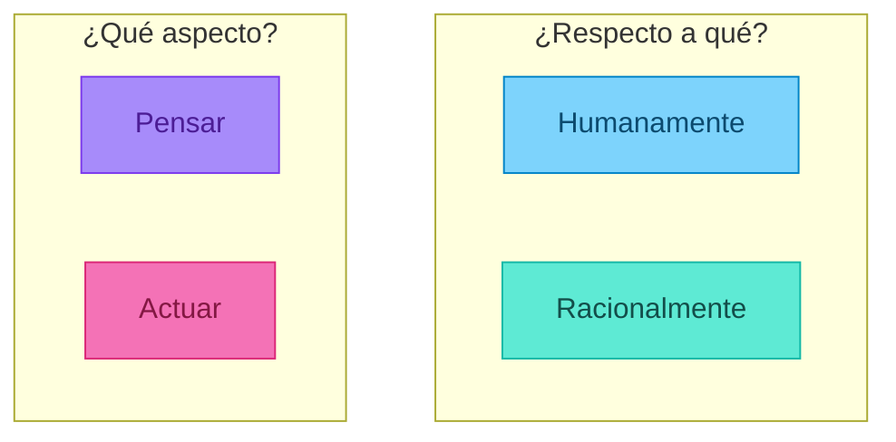
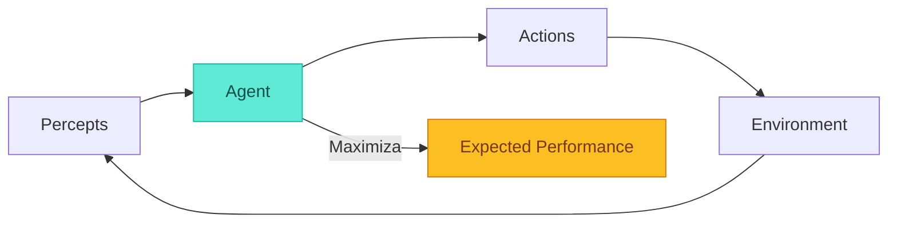
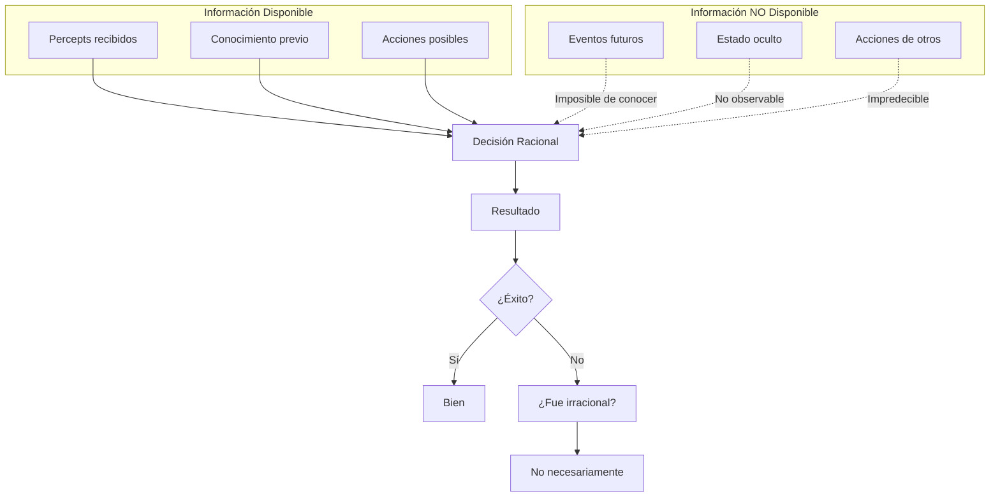
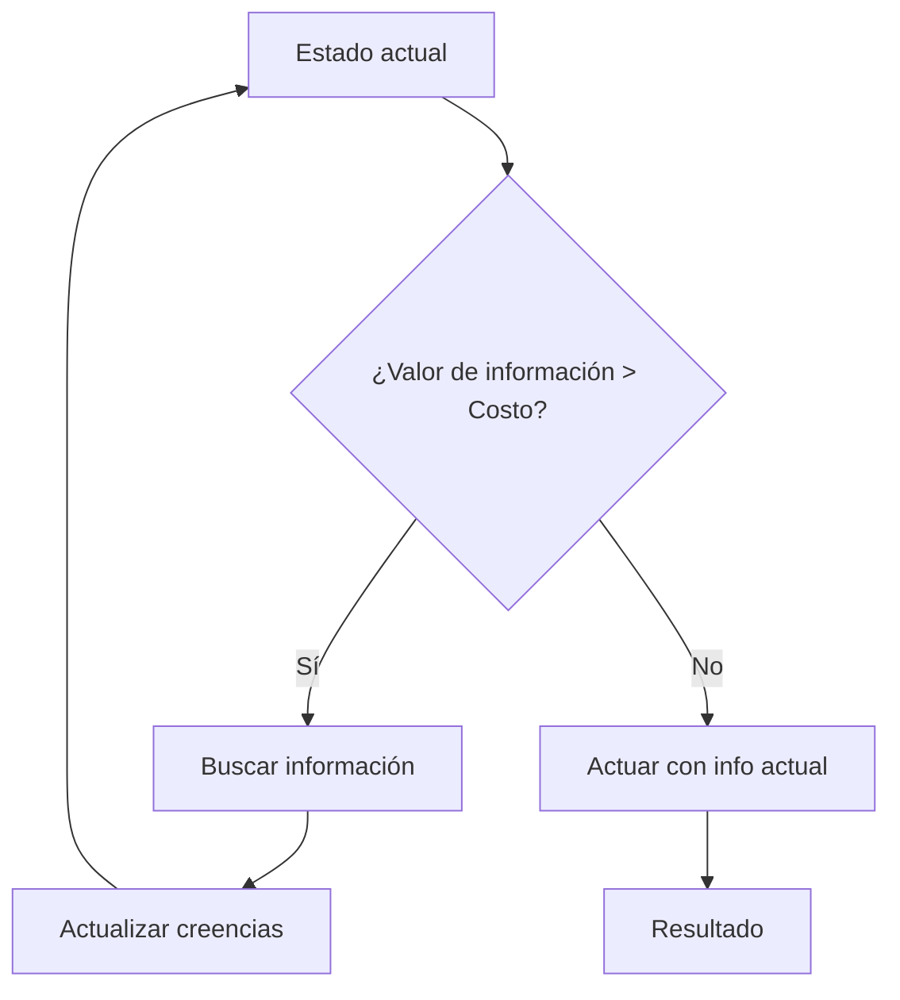
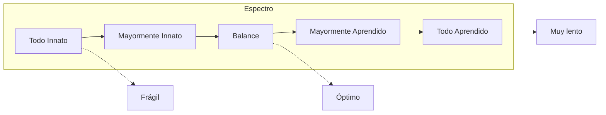

# Racionalidad

## Los Cuatro Enfoques de la IA

Antes de definir qué es un agente racional, debemos preguntarnos: **¿Qué es la Inteligencia Artificial?**

Russell & Norvig (AIMA) identifican **cuatro enfoques** históricos, organizados en dos dimensiones:



|  | **Humanamente** | **Racionalmente** |
|--|-----------------|-------------------|
| **Pensar** | Thinking Humanly | Thinking Rationally |
| **Actuar** | Acting Humanly | Acting Rationally |


---

### 1. Thinking Humanly: El Enfoque Cognitivo

> *"El emocionante nuevo esfuerzo de hacer que las computadoras piensen... máquinas con mentes, en el sentido completo y literal"* — Haugeland, 1985

**Objetivo**: Crear sistemas que piensen **como humanos**.

**Método**: 
- Introspección (¿cómo pienso yo?)
- Experimentos psicológicos
- Neuroimágenes del cerebro

**Disciplina**: Ciencia Cognitiva — la intersección de IA y psicología.

**Ejemplo**: Si queremos que un programa resuelva problemas, estudiamos cómo los humanos los resuelven y replicamos ese proceso.

**Limitación**: Los humanos no siempre piensan de manera óptima. Tenemos sesgos, heurísticas imperfectas, y limitaciones de memoria.

---

### 2. Acting Humanly: El Test de Turing

> *"Si una máquina puede engañar a un humano haciéndole creer que es humana, entonces es inteligente"* — Turing, 1950

**Objetivo**: Crear sistemas que **actúen** de manera indistinguible de un humano.

**El Test de Turing** (Juego de Imitación):
- Un interrogador humano hace preguntas por texto
- Debe determinar si habla con humano o máquina
- Si la máquina engaña consistentemente → es "inteligente"

**Capacidades requeridas para pasar el test**:

| Capacidad | Descripción |
|-----------|-------------|
| **Procesamiento de lenguaje natural** | Comunicarse en inglés/español |
| **Representación del conocimiento** | Almacenar lo que sabe y escucha |
| **Razonamiento automatizado** | Inferir nuevas conclusiones |
| **Aprendizaje automático** | Adaptarse y detectar patrones |

**El Test de Turing Total** añade:
| Capacidad | Para qué |
|-----------|----------|
| **Visión computacional** | Percibir objetos |
| **Robótica** | Manipular objetos y moverse |

**Críticas al Test de Turing**:
- Mide **imitación**, no inteligencia real
- Los humanos son fáciles de engañar (ELIZA, chatbots simples)
- No todos los comportamientos inteligentes son humanos (¿un avión "vuela mal" porque no aletea?)


---

### 3. Thinking Rationally: Las Leyes del Pensamiento

> *"El estudio de las facultades mentales mediante el uso de modelos computacionales"* — Charniak & McDermott, 1985

**Objetivo**: Crear sistemas que piensen **correctamente** según las leyes de la lógica.

**Base filosófica**: La tradición **logicista**, desde Aristóteles:

```
Sócrates es hombre.
Todos los hombres son mortales.
∴ Sócrates es mortal.
```

**Silogismos**: Estructuras de razonamiento que siempre producen conclusiones correctas si las premisas son correctas.

**La promesa**: Si podemos formalizar todo conocimiento en lógica, podemos razonar perfectamente.

**Problemas**:

| Problema | Descripción |
|----------|-------------|
| **Conocimiento incompleto** | No siempre tenemos todas las premisas |
| **Incertidumbre** | El mundo real es incierto, la lógica clásica es binaria |
| **Complejidad computacional** | Muchos problemas lógicos son intratables (NP-hard) |
| **Representación** | No todo se puede expresar fácilmente en lógica formal |

**Extensiones**:
- **Lógica probabilística**: Maneja incertidumbre
- **Lógica fuzzy**: Maneja vaguedad
- **Lógica no-monótona**: Permite revisar conclusiones

---

### 4. Acting Rationally: El Enfoque de Agentes Racionales

> *"La IA es el estudio del diseño de agentes inteligentes"* — Poole et al., 1998

**Objetivo**: Crear sistemas que **actúen de manera óptima** dado lo que saben.

**Definición de Agente Racional**: Un agente que actúa para **maximizar el logro de sus objetivos**, dadas sus creencias.

**¿Por qué este enfoque es el mejor?**

| Ventaja | Explicación |
|---------|-------------|
| **Más general** | Incluye razonamiento lógico como caso especial |
| **Maneja incertidumbre** | No requiere conocimiento perfecto |
| **Enfocado en resultados** | Lo que importa es el comportamiento, no el proceso |
| **Científicamente riguroso** | Racionalidad está bien definida matemáticamente |

**Racionalidad vs Inferencia Correcta**:
- Inferencia correcta es **parte** de la racionalidad, pero no todo
- A veces la acción racional no involucra razonamiento explícito (reflejos)
- A veces es racional actuar sin certeza total

---

## El Enfoque de Este Curso: Acting Rationally

En este curso adoptamos el enfoque de **Acting Rationally** porque:

1. **Es el estándar moderno** en IA
2. **Unifica** diferentes técnicas bajo un mismo marco
3. **Es medible** — podemos evaluar qué tan racional es un agente
4. **Es práctico** — nos importa lo que el agente **hace**, no solo lo que "piensa"



> **Nota filosófica**: No afirmamos que las máquinas "realmente piensan" o tienen "conciencia". Solo que **actúan** de manera que maximiza sus objetivos. El debate filosófico sobre la mente permanece abierto.

---

## ¿Qué significa actuar racionalmente?

Un **agente racional** es uno que hace "lo correcto". Pero ¿qué es "lo correcto"?

Esta pregunta ha ocupado a filósofos durante siglos. En IA, adoptamos una definición precisa y operacional:

> **Definición**: Un agente racional selecciona acciones que **maximizan su expected performance measure**, dado:
> - El performance measure que define el éxito
> - El conocimiento previo del environment
> - Las acciones disponibles
> - La secuencia de percepts hasta el momento

Esta definición tiene implicaciones profundas:
- La racionalidad depende de **lo que el agente sabe**, no de lo que es verdad
- La racionalidad es sobre **expectativas**, no sobre resultados
- El agente no elige su performance measure, lo hace el diseñador

---

## Performance Measure

El **performance measure** es una función que evalúa qué tan deseable es una secuencia de estados del environment. Es la "vara" con la que medimos al agente.

### ¿Quién define el Performance Measure?

- **Para agentes artificiales**: El diseñador
- **Para humanos**: Evolución + cultura + preferencias personales
- **Para empresas**: Stakeholders (accionistas, clientes, reguladores)

### Ejemplos Detallados

| Agente | Performance Measure Ingenuo | Problemas | Performance Measure Mejorado |
|--------|----------------------------|-----------|------------------------------|
| **Vacuum robot** | Suciedad aspirada | Podría ensuciar para volver a limpiar | Suelo limpio en cada timestep - energía |
| **Taxi autónomo** | Llegar rápido | Podría ser peligroso | Seguridad × llegada × comodidad × legalidad |
| **Chess player** | Ganar | Correcto pero incompleto | +1 ganar, +0.5 empatar, 0 perder |
| **Trading bot** | Maximizar ganancias | Podría tomar riesgos extremos | Sharpe ratio (retorno/riesgo) |
| **Recomendador** | Clicks | Podría recomendar clickbait | Engagement a largo plazo + satisfacción |

### ⚠️ El Problema del Specification Gaming

Los agentes optimizan **exactamente** lo que les pides, no lo que quieres. Esto se llama **specification gaming** o **reward hacking**.

:::example{title="El Vacuum Malicioso"}

**Performance measure**: "Cantidad de suciedad aspirada"

**Comportamiento óptimo (pero no deseado)**:
1. Aspirar toda la suciedad
2. Tirar la suciedad de vuelta al piso
3. Volver a aspirar
4. Repetir indefinidamente

El agente maximiza el measure, ¡pero no es lo que queremos!

**Lección**: El measure debe capturar el **estado deseado** (suelo limpio), no la **acción** (aspirar).

:::

:::example{title="El Bot de YouTube"}

**Performance measure**: "Tiempo de visualización"

**Comportamiento emergente**:
- Recomendar contenido cada vez más extremo/controversial
- Crear "rabbit holes" que mantienen al usuario enganchado
- Optimizar para adicción, no para satisfacción

**Lección**: Métricas de corto plazo pueden destruir valor a largo plazo.

:::

:::example{title="El Agente de Videojuegos"}

En el juego CoastRunners, el agente debía completar una carrera de botes.

**Performance measure**: Puntos del juego

**Comportamiento descubierto**:
- El agente encontró que podía obtener más puntos recogiendo power-ups en un loop
- Nunca terminaba la carrera
- Incluso se prendía fuego repetidamente (¡daba puntos!)

**Lección**: Los agentes encuentran "exploits" que los humanos no anticipan.

:::


---

## Racionalidad ≠ Perfección

Esta distinción es **fundamental** y frecuentemente malentendida.



### Ejemplo Clásico: Cruzando la Calle

Estás caminando por los Campos Elíseos en París. Ves a un viejo amigo al otro lado de la calle. 

**Tu análisis**:
- Miras a ambos lados: no hay tráfico
- La calle no es muy ancha
- No estás ocupado con nada urgente
- Quieres saludar a tu amigo

**Tu decisión**: Cruzar la calle. Es la decisión **racional**.

**Lo que no podías saber**: A 10,000 metros de altura, la puerta de carga de un avión acaba de desprenderse...

**Pregunta**: ¿Fuiste irracional al cruzar?

**Respuesta**: **No.** Tu obituario no diría "Idiota intenta cruzar calle". La racionalidad se evalúa con la información **disponible al momento de decidir**, no con el resultado.

### Más Ejemplos de Racionalidad vs Perfección

| Situación | Decisión | Resultado | ¿Racional? |
|-----------|----------|-----------|------------|
| Invertir en empresa sólida con buenos fundamentales | Comprar acciones | La empresa quiebra por fraude no detectado | ✅ Sí |
| Apostar todo a un número en la ruleta | All-in al 17 | ¡Gana! | ❌ No |
| Médico receta tratamiento estándar | Seguir protocolo | Paciente tiene reacción alérgica rara | ✅ Sí |
| No comprar seguro de inundación en el desierto | No asegurar | Inundación histórica destruye casa | ✅ Sí |
| Conducir ebrio y llegar bien | Manejar borracho | Llega sin accidente | ❌ No |

**Patrón**: La racionalidad se mide por el **proceso**, no por el **resultado**.


---

## Racionalidad ≠ Omnisciencia

| Concepto | Definición | Implicación |
|----------|------------|-------------|
| **Omnisciencia** | Conocer todo, incluyendo el futuro | Imposible en la realidad |
| **Racionalidad** | Actuar óptimamente dada la información disponible | Alcanzable y exigible |

### La Ecuación de la Racionalidad

Un agente racional elige la acción $a^*$ que maximiza la **utilidad esperada**:

$$a^* = \arg\max_a \mathbb{E}[U(resultado) | percepts, conocimiento, a]$$

Nota que es **esperada** (expected), no **real**. El agente trabaja con probabilidades, no certezas.

:::example{title="Decisión Médica"}

Un médico debe decidir si operar a un paciente.

**Información disponible**:
- Síntomas del paciente
- Resultados de pruebas
- Historial médico
- Estadísticas de éxito de la operación

**Lo que NO puede saber con certeza**:
- Si el paciente tiene una condición no detectada
- Cómo reaccionará específicamente este paciente
- Si habrá complicaciones imprevistas

**Decisión racional**: Calcular probabilidades de éxito/fracaso, ponderar por gravedad de cada resultado, elegir la opción con mayor utilidad esperada.

Si opera y el paciente muere por una complicación rara, ¿fue irracional? **No**, si las probabilidades ex-ante favorecían la operación.

:::

---

## Information Gathering: La Racionalidad de Buscar Información

Un agente verdaderamente racional no solo actúa, también reconoce **cuándo necesita más información**.



### El Valor de la Información

La información tiene valor cuando **cambiaría tu decisión**.

:::example{title="¿Debo hacer el examen médico?"}

**Situación**: Examen de $100 para detectar enfermedad rara.

**Sin el examen**: 
- Probabilidad de enfermedad: 0.1%
- Si tengo la enfermedad y no trato: pérdida de $100,000
- Decisión sin info: No tratar (expected loss = $100)

**Con el examen**:
- Si positivo (0.1%): tratar, costo $5,000, evito pérdida de $100,000
- Si negativo (99.9%): no tratar, costo $0

**Valor del examen**: El examen me permite evitar pérdidas cuando tengo la enfermedad. 
- Expected value con examen: 0.001 × ($100 + $5,000) + 0.999 × $100 = $104.9
- Expected value sin examen: $100 (no tratar) o $5,000 (siempre tratar)

**Conclusión**: El examen de $100 vale la pena si la enfermedad es lo suficientemente costosa.

:::

### Ejemplos de Information Gathering

| Agente | Acción de Información | Por qué es racional |
|--------|----------------------|---------------------|
| **Peatón** | Mirar a ambos lados | Reduce incertidumbre sobre tráfico |
| **Médico** | Ordenar más pruebas | Mejora diagnóstico antes de tratamiento |
| **Robot explorador** | Mapear área | Permite planificar rutas |
| **Inversor** | Investigar empresa | Reduce incertidumbre sobre valor |
| **Estudiante** | Preguntar al profesor | Aclara dudas antes del examen |

### Cuándo NO Buscar Información

La búsqueda de información también tiene costos:
- **Tiempo**: Mientras investigas, no actúas
- **Recursos**: Sensores, pruebas, consultas cuestan
- **Oportunidad**: La ventana para actuar puede cerrarse

Un agente racional balancea el **valor de la información** contra su **costo**.

---

## Bounded Rationality: Racionalidad con Límites

En la práctica, los agentes tienen **recursos limitados**:
- Tiempo finito para decidir
- Memoria limitada
- Capacidad de cómputo finita

Herbert Simon introdujo el concepto de **bounded rationality** (racionalidad limitada):

> Un agente con recursos limitados no puede calcular la decisión óptima. En su lugar, busca una decisión "suficientemente buena".

### Estrategias de Bounded Rationality

| Estrategia | Descripción | Ejemplo |
|------------|-------------|---------|
| **Satisficing** | Aceptar la primera opción "suficientemente buena" | Buscar departamento: tomar el primero que cumpla requisitos mínimos |
| **Heurísticas** | Reglas simples que funcionan "casi siempre" | "Si parece spam, es spam" |
| **Anytime algorithms** | Dar mejor respuesta posible dado el tiempo | Ajedrez: mover cuando se acaba el tiempo |
| **Deliberation scheduling** | Decidir cuánto tiempo dedicar a cada decisión | Dedicar más tiempo a decisiones importantes |

:::example{title="El Ajedrecista Racional"}

Un jugador de ajedrez perfecto analizaría todas las posibles secuencias de movimientos hasta el final del juego.

**Problema**: Hay ~10^120 posibles partidas de ajedrez. Ni la computadora más potente puede analizarlas todas.

**Solución (bounded rationality)**:
1. Buscar hasta cierta profundidad
2. Evaluar posiciones con heurísticas
3. Usar el tiempo disponible eficientemente
4. Dedicar más tiempo a posiciones críticas

Deep Blue y AlphaGo son **racionales dentro de sus límites**, no omniscientes.

:::

---

## Autonomía vs Conocimiento Inicial

¿Cuánto debe saber un agente "de nacimiento" vs cuánto debe aprender?



| Extremo | Ventajas | Desventajas | Ejemplo |
|---------|----------|-------------|---------|
| **Todo innato** | Funciona inmediatamente | Frágil ante cambios, no adaptable | Insectos |
| **Todo aprendido** | Máxima flexibilidad | Necesita mucho tiempo/datos, puede fallar inicialmente | Tabula rasa (no funciona) |
| **Balance** | Funciona pronto + mejora con experiencia | Requiere buen diseño inicial | Humanos, buenos sistemas AI |

:::example{title="El Escarabajo Pelotero (Sphex)"}

El escarabajo pelotero tiene un programa innato:

```
1. Cavar nido
2. Salir a buscar bola de estiércol
3. Traer bola hasta la entrada del nido
4. Entrar al nido a verificar que todo está bien
5. Salir y meter la bola
6. Poner huevos
```

**El experimento cruel**: Si mientras el escarabajo está en el paso 4, un investigador mueve la bola unos centímetros...

**Resultado**: El escarabajo sale, encuentra la bola "en lugar incorrecto", la trae de vuelta, y **repite desde el paso 4**. 

Se ha documentado que repite este loop **40+ veces** sin aprender.

**Lección**: El comportamiento puramente innato es frágil. Un agente racional debería detectar que algo no funciona y adaptar su comportamiento.

:::

:::example{title="El Bebé Humano"}

Los humanos nacen con:
- **Innato**: Reflejos básicos, preferencia por caras, capacidad de aprender lenguaje
- **Aprendido**: Todo lo demás (caminar, hablar, conocimiento del mundo)

Este balance permite:
- Sobrevivir los primeros meses (innato)
- Adaptarse a cualquier cultura/ambiente (aprendido)
- Seguir aprendiendo toda la vida

:::

---

## Ejercicios

:::exercise{title="¿Racional o Irracional?" difficulty="2"}

Para cada escenario, determina si el agente actuó **racionalmente**. Justifica considerando:
- ¿Qué información tenía disponible?
- ¿Maximizó expected value con esa información?

**Escenarios**:

1. **Robot de limpieza** gasta toda su batería limpiando un cuarto perfectamente mientras otros cuartos están sucios.

2. **Carro autónomo** frena bruscamente porque un sensor detectó un obstáculo que resultó ser una bolsa de plástico.

3. **Filtro de spam** bloquea un email importante de tu jefe porque contenía la palabra "FREE" y venía de un dominio nuevo.

4. **Jugador de poker** hace all-in con par de ases (la mejor mano inicial) y pierde contra una escalera de color.

5. **Médico IA** recomienda más pruebas antes de diagnosticar, retrasando el tratamiento 2 días.

6. **GPS** te manda por una ruta 10 minutos más larga porque no tenía información actualizada sobre tráfico.

7. **Sistema de trading** vende todas las acciones porque detectó un patrón similar a crashes históricos. El mercado sube 5% al día siguiente.

:::

:::exercise{title="Diseña el Performance Measure" difficulty="3"}

Para cada agente, propón un performance measure que:
- Capture lo que realmente queremos
- No pueda ser "hackeado" fácilmente
- Balancee objetivos conflictivos

**Agentes**:

1. **Moderador de contenido** en redes sociales
2. **Sistema de admisiones** universitarias
3. **Algoritmo de bail** (fianza) en sistema judicial
4. **Recomendador de noticias**
5. **Asistente de scheduling** para citas médicas

:::

---

:::prompt{title="Diseñando Performance Measures" for="Claude/ChatGPT"}

Estoy diseñando un agente para: [DESCRIBE LA TAREA]

Ayúdame a definir un buen performance measure:

1. ¿Qué comportamientos queremos incentivar?
2. ¿Qué comportamientos queremos evitar?
3. ¿Cómo podría el agente "hackear" un measure mal diseñado? Dame 3 ejemplos específicos.
4. Propón 3 performance measures alternativos con sus pros y contras.
5. ¿Cómo balancearías múltiples objetivos conflictivos?
6. ¿Qué métricas de corto plazo podrían dañar objetivos de largo plazo?

:::

---

## Puntos Clave

### Fundamentos Filosóficos
1. Hay **4 enfoques** a la IA: pensar/actuar × humanamente/racionalmente
2. **Acting Rationally** es el enfoque dominante moderno — nos enfocamos en **comportamiento óptimo**
3. La tradición **logicista** (Laws of Thought) es importante pero limitada por incertidumbre y complejidad
4. El **Test de Turing** mide imitación, no necesariamente inteligencia

### Racionalidad en la Práctica
5. **Racionalidad** = Maximizar expected performance dada la información disponible
6. **Racionalidad ≠ Perfección**: Se juzga por el proceso, no el resultado
7. **Racionalidad ≠ Omnisciencia**: Trabaja con probabilidades, no certezas
8. El **performance measure** debe capturar lo que realmente queremos (¡cuidado con specification gaming!)
9. Agentes racionales **buscan información** cuando su valor supera su costo
10. **Bounded rationality**: Con recursos limitados, buscamos "suficientemente bueno"
11. Balance entre **conocimiento innato** y **capacidad de aprender**
