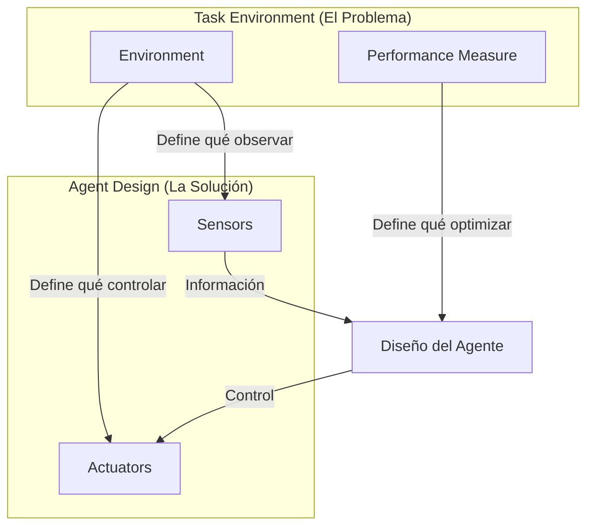
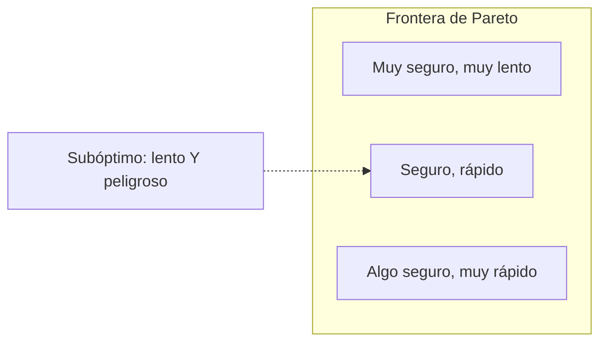

# Framework PEAS

El primer paso para diseñar un agente es especificar su **task environment** de manera precisa. El framework PEAS proporciona una estructura sistemática para esta especificación.

## Los 4 Componentes

**PEAS** = **P**erformance, **E**nvironment, **A**ctuators, **S**ensors

Cada componente responde a una pregunta fundamental. Antes de ver la tabla resumen, definamos la notación usando **Pac-Man** como ejemplo unificador:

### Notación Matemática

| Símbolo | Nombre | Descripción | Ejemplo: Pac-Man |
|---------|--------|-------------|------------------|
| $\mathcal{S}$ | Espacio de estados | El conjunto de **todas las configuraciones posibles** del mundo. Es la "realidad completa" en cualquier momento. | Todas las combinaciones de: posición de Pac-Man, posición de cada fantasma, qué pellets quedan, power-ups activos, vidas restantes, puntuación actual |
| $\mathcal{A}$ | Espacio de acciones | El conjunto de **todas las acciones que el agente puede ejecutar**. Define su "vocabulario de control". | $\{↑, ↓, ←, →, quedarse\}$ — los 5 movimientos posibles |
| $\mathcal{P}$ | Espacio de percepts | El conjunto de **todos los percepts posibles**. Un *percept* es una observación individual — lo que los sensores entregan al agente en un instante. Es su "ventana al mundo": no el mundo real, sino la **representación** que el agente recibe. La *percept sequence* es la historia completa de percepts. | Si Pac-Man solo ve 3 casillas adelante: cada percept es una "foto" de esas 3 casillas. $\mathcal{P}$ = todas las combinaciones posibles de {vacío, muro, pellet, fantasma, power-up} en esas posiciones |
| $U$ | Función de utilidad | Una función que asigna un **valor numérico** a estados o secuencias de estados. Define qué significa "éxito". | $U =$ puntuación final. Comer pellet = +10, comer fantasma = +200, perder vida = -500 |
| $T$ | Función de transición | Describe **cómo el mundo cambia** cuando el agente actúa. Dado el estado actual y una acción, produce el siguiente estado. | Si Pac-Man está en (3,4) y ejecuta →, entonces se mueve a (4,4). Si hay fantasma ahí, pierde vida. |
| $O$ | Función de observación | **Transforma el estado real en una percepción**. Es el "filtro" entre la realidad y lo que el agente ve. Puede perder información (observabilidad parcial) o agregar ruido (sensores imperfectos). | El estado real tiene toda la info del laberinto, pero $O$ solo devuelve las 3 casillas que Pac-Man puede "ver" desde su posición |
| $\mathbb{R}$ | Números reales | El espacio de valores numéricos. Permite expresar "mejor" y "peor" cuantitativamente. | Puntuación: 0, 100, 2500, etc. |

> **Percept vs Función de Observación**: El **percept** es lo que el agente recibe — una "foto" del mundo en un instante. La **función de observación** $O$ es el *proceso* que genera esa foto — cómo los sensores transforman la realidad en un percept. Piensa en $O$ como una cámara y cada percept como una foto que esa cámara toma. $\mathcal{P}$ es el álbum de todas las fotos posibles.

#### Edge Cases: Cuando el Percept ≠ Realidad

| Caso | Ejemplo | Estado Real $s$ | Percept $O(s)$ | Problema |
|------|---------|-----------------|----------------|----------|
| **Parcial** | Poker | Todas las cartas del mazo | Solo tus 2 cartas | Información oculta — no sabes qué tiene el rival |
| **Ruidoso** | GPS | Posición exacta (3.4521, -5.1234) | (3.45 ± 0.01, -5.12 ± 0.01) | Error de medición — puedes estar en el carril equivocado |
| **Aliasing** | Robot en pasillo | Pasillo A vs Pasillo B (idénticos) | "Paredes a ambos lados" | Mismo percept, estados distintos — ¿dónde estoy? |
| **Retrasado** | Trading | Precio actual: \$105 | Último dato: \$100 (hace 2s) | Latencia — decides con info obsoleta |
| **Alucinación** | Cámara + adversarial patch | Señal de STOP | "Límite 45 mph" | El sensor "ve" algo que no existe |
| **Nulo** | Cámara en oscuridad | Obstáculo adelante | Imagen negra | Sin información útil — ¿qué haces? |

**Implicación para diseño**: El agente debe razonar sobre la *incertidumbre* de su percept, no asumir que $O(s) = s$.

### Resumen: Los 4 Componentes Formalizados

Con esta notación, cada componente PEAS tiene una interpretación precisa:

| Componente | Pregunta | Formalización | Lectura | Pac-Man |
|------------|----------|---------------|---------|---------|
| **Performance** | ¿Qué significa éxito? | $U: \mathcal{S} \to \mathbb{R}$ | "U toma un estado y devuelve qué tan bueno es" | Puntuación final del juego |
| **Environment** | ¿En qué mundo opera? | $\mathcal{S}$; $T: \mathcal{S} \times \mathcal{A} \to \mathcal{S}$ | "S son los estados posibles, T dice cómo cambian con cada acción" | El laberinto con sus reglas de movimiento |
| **Actuators** | ¿Qué puede hacer? | $\mathcal{A}$ | "El menú de acciones disponibles" | Controles: ↑↓←→ |
| **Sensors** | ¿Qué puede percibir? | $O: \mathcal{S} \to \mathcal{P}$ | "O transforma el estado real en un percept" | Visión limitada → percept de 3 casillas |

---

## Performance Measure: Definiendo el Éxito

### Formalización Matemática

El **performance measure** es una función que asigna un valor numérico a secuencias de estados del environment:

$$U: \mathcal{S}^T \to \mathbb{R}$$

Donde $\mathcal{S}^T$ representa secuencias de estados a lo largo del tiempo.

### Tipos de Performance Measures

| Tipo | Fórmula | Ejemplo |
|------|---------|---------|
| **Final state** | $U = f(s_T)$ | Ajedrez: ganar/perder al final |
| **Cumulative** | $U = \sum_{t} r_t$ | Total de puntos en un juego |
| **Discounted** | $U = \sum_{t} \gamma^t r_t$ | Valor presente de recompensas futuras |
| **Average** | $U = \frac{1}{T}\sum_{t} r_t$ | Throughput promedio |
| **Worst-case** | $U = \min_t r_t$ | Seguridad: evitar cualquier falla |

### El Factor de Descuento $\gamma$

El factor de descuento $\gamma \in [0,1]$ controla cuánto importa el futuro:

$$U = r_0 + \gamma r_1 + \gamma^2 r_2 + \gamma^3 r_3 + \cdots = \sum_{t=0}^{\infty} \gamma^t r_t$$

| $\gamma$ | Comportamiento | Horizonte efectivo |
|----------|----------------|---------------------|
| $\gamma = 0$ | Solo importa el presente | 1 paso |
| $\gamma = 0.9$ | Balance presente/futuro | ~10 pasos |
| $\gamma = 0.99$ | El futuro importa mucho | ~100 pasos |
| $\gamma \to 1$ | Todos los pasos importan igual | Infinito |

**Interpretación financiera**: Si $\gamma = 0.95$, entonces \$1 mañana vale \$0.95 hoy. Esto captura:
- Incertidumbre sobre el futuro
- Preferencia temporal (impaciente vs paciente)
- Posibilidad de que el proceso termine

### Performance Measures Multiobjetivo

En la realidad, los agentes tienen **múltiples objetivos** que pueden conflictuar:

$$U = w_1 U_1 + w_2 U_2 + \cdots + w_n U_n$$

Donde $\sum_i w_i = 1$ y cada $w_i \geq 0$ representa la importancia relativa.

:::example{title="Trade-offs en Taxi Autónomo"}

| Objetivo | Métrica | Conflicto con |
|----------|---------|---------------|
| **Seguridad** | $U_s$ = −(número de accidentes) | Velocidad (más lento = más seguro) |
| **Rapidez** | $U_r$ = −(tiempo de viaje) | Seguridad, comodidad |
| **Comodidad** | $U_c$ = −(aceleración máxima) | Rapidez |
| **Costo** | $U_k$ = −(combustible gastado) | Rapidez, confort (AC) |
| **Legalidad** | $U_l$ = −(número de infracciones) | Rapidez |

**El problema**: ¿Cómo elegir los pesos $w_s, w_r, w_c, w_k, w_l$?

Diferentes stakeholders tienen diferentes preferencias:
- **Pasajero apurado**: Alto $w_r$
- **Pasajero nervioso**: Alto $w_s$, $w_c$
- **Empresa de taxis**: Alto $w_k$
- **Regulador**: Alto $w_l$, $w_s$

:::

### Pareto Optimality

Cuando hay múltiples objetivos, una solución es **Pareto óptima** si no se puede mejorar un objetivo sin empeorar otro.

En el diseño de agentes, a menudo buscamos soluciones en la **frontera de Pareto** y dejamos que el usuario elija según sus preferencias.

---

## Environment: El Mundo del Agente

### Formalización Matemática

El environment se define por:

1. **Espacio de estados** $\mathcal{S}$: Todos los estados posibles del mundo
2. **Estado inicial** $s_0 \in \mathcal{S}$: Donde empieza el agente
3. **Función de transición** $T: \mathcal{S} \times \mathcal{A} \to \mathcal{S}$ (determinista) o $T: \mathcal{S} \times \mathcal{A} \to \Delta(\mathcal{S})$ (estocástica)

**¿Qué es $\Delta(\mathcal{S})$?** Es el **simplex de probabilidad** sobre $\mathcal{S}$ — el conjunto de todas las distribuciones de probabilidad válidas sobre los estados:

$\Delta(S) := \\{p \mid p : S \to [0,1],\ \sum_{s \in S} p(s) = 1\\}$

Es decir, $\Delta(\mathcal{S})$ contiene vectores de probabilidades que **suman 1**. Cuando $T$ mapea a $\Delta(\mathcal{S})$, significa que dado (estado, acción), obtienes una *distribución* sobre posibles siguientes estados, no un estado único.

### Transiciones Deterministas vs Estocásticas

**Determinista**: El siguiente estado está completamente determinado:
$$s_{t+1} = T(s_t, a_t)$$

**Estocástica**: El siguiente estado es una distribución de probabilidad:
$$P(s_{t+1} | s_t, a_t) = T(s_t, a_t, s_{t+1})$$

:::example{title="Vacuum World: Formalización"}

**Estados**: $\mathcal{S} = \{A, B\} \times \{0, 1\} \times \{0, 1\}$
- Posición del robot: $\{A, B\}$
- Estado del cuarto A: $\{0=limpio, 1=sucio\}$
- Estado del cuarto B: $\{0=limpio, 1=sucio\}$

**Tamaño**: $|\mathcal{S}| = 2 \times 2 \times 2 = 8$ estados

**Acciones**: $\mathcal{A} = \{Left, Right, Suck\}$

**Transiciones** (ejemplo):
- $T((A, 1, 0), Suck) = (A, 0, 0)$ — aspirar limpia el cuarto A
- $T((A, 0, 1), Right) = (B, 0, 1)$ — moverse a B

**Performance** (por timestep):

$$r_t = \mathbb{1}[A\ limpio] + \mathbb{1}[B\ limpio]$$

:::

### Complejidad del Espacio de Estados

| Problema | Variables de Estado | $\|\mathcal{S}\|$ |
|----------|---------------------|-------------------|
| Vacuum World | 3 binarias | $2^3 = 8$ |
| Ajedrez | ~40 piezas × 64 casillas | $\sim 10^{43}$ |
| Go | 361 posiciones × 3 estados | $\sim 10^{170}$ |
| Taxi autónomo | Continuas | $\infty$ |

---

## Actuators: La Capacidad de Actuar

### Formalización Matemática

Los **actuators** definen el espacio de acciones disponibles para el agente:

$$\mathcal{A} = \{a_1, a_2, \ldots, a_n\}$$

### Tipos de Espacios de Acciones

| Tipo | Descripción | Ejemplo | Formalización |
|------|-------------|---------|---------------|
| **Discreto finito** | Número finito de acciones | Ajedrez | $\mathcal{A} = \{a_1, \ldots, a_n\}$ |
| **Discreto infinito** | Infinitas acciones enumerables | Elegir un número entero | $\mathcal{A} = \mathbb{Z}$ |
| **Continuo** | Acciones en espacio continuo | Ángulo de volante | $\mathcal{A} \subseteq \mathbb{R}^n$ |
| **Híbrido** | Mezcla de discreto y continuo | Cambiar marcha + acelerar | $\mathcal{A} = \{1,..,5\} \times [0,1]$ |

### Restricciones en Acciones

No todas las acciones están disponibles en todos los estados. Definimos:

$$\mathcal{A}(s) \subseteq \mathcal{A}$$

Como el conjunto de acciones válidas en el estado $s$.

:::example{title="Acciones Válidas en Ajedrez"}

En ajedrez, $\mathcal{A}(s)$ depende de:
- Qué piezas tiene el jugador
- Dónde están ubicadas
- Si hay jaque
- Reglas especiales (enroque, en passant)

En promedio: $|\mathcal{A}(s)| \approx 35$ movimientos legales por posición.

En la posición inicial: $|\mathcal{A}(s_0)| = 20$ (16 movimientos de peones + 4 de caballos).

:::

### Efectos de las Acciones

Las acciones pueden tener efectos:

| Propiedad | Determinista | Estocástico |
|-----------|--------------|-------------|
| **Efecto** | Un único resultado | Distribución de resultados |
| **Fórmula** | $s' = T(s, a)$ | $s' \sim P(\cdot \mid s,a)$ |
| **Ejemplo** | Mover pieza en ajedrez | Tirar un dado |

### Acciones Continuas: El Espacio de Control

Para sistemas físicos, el espacio de acciones es típicamente continuo:

**Carro autónomo**:

$$\mathcal{A} = [-\theta_{max}, \theta_{max}] \times [0, 1] \times [0, 1]$$

Donde: primer intervalo = ángulo de volante, segundo = acelerador, tercero = freno.

**Robot con n articulaciones**:

$$\mathcal{A} = \prod_{i=1}^{n} [\tau_i^{min}, \tau_i^{max}]$$

Donde $\tau_i$ es el torque aplicado a la articulación $i$.

---

## Sensors: Percibiendo el Mundo

### Formalización Matemática

Los **sensors** definen una función de observación:

$$O: \mathcal{S} \to \mathcal{P}$$

Donde $\mathcal{P}$ es el espacio de percepts.

### Observabilidad

| Tipo | Condición | Implicación |
|------|-----------|-------------|
| **Fully Observable** | $O$ es inyectiva (1-1) | El agente conoce el estado exacto |
| **Partially Observable** | $O$ no es inyectiva | Múltiples estados producen el mismo percept |
| **Non-Observable** | $O(s) = c$ | El agente está "ciego" |

**Ejemplo de partial observability**:

En póker, ves tus cartas pero no las del oponente:
- Estado real: $(cartas_{mias}, cartas\_{oponente}, cartas\_{mesa})$
- Percept: $(cartas_{mias}, cartas\_mesa)$

Muchos estados reales mapean al mismo percept.

### Ruido en Sensores

En la práctica, los sensores son **ruidosos**:

$$O(s) = O_{true}(s) + \epsilon$$

Donde $\epsilon$ es ruido, típicamente modelado como:
- **Gaussiano**: $\epsilon \sim \mathcal{N}(0, \sigma^2)$
- **Uniforme**: $\epsilon \sim$ Uniform(−δ, δ)

:::example{title="GPS con Ruido"}

El GPS reporta posición con error:

$$pos_{percibida} = pos_{real} + \epsilon$$

Donde $\epsilon \sim \mathcal{N}(0, \sigma^2)$ con σ ≈ 3-5 metros en condiciones normales.

Esto significa que el agente **no conoce su posición exacta**, solo una distribución de probabilidad sobre posibles posiciones.

:::

### Información Contenida en Percepts

**El problema fundamental del agente**: Está en algún estado $s \in \mathcal{S}$, pero no lo sabe directamente. Solo recibe un percept $p \in \mathcal{P}$. La pregunta es: **¿cuánto me ayuda el percept a saber en qué estado estoy?**

Desde una perspectiva de **teoría de información**, podemos cuantificar esto. Definamos las variables:

| Variable | Significado | Descripción |
|----------|-------------|-------------|
| $S$ | Variable aleatoria del estado | "¿En cuál de los estados posibles estoy?" |
| $P$ | Variable aleatoria del percept | "¿Qué percept voy a recibir?" |
| $H(S)$ | Entropía de $S$ | Incertidumbre *antes* de observar: "¿qué tan difícil es adivinar el estado?" |
| $H(S \mid P)$ | Entropía condicional | Incertidumbre *después* de observar: "dado el percept, ¿qué tan difícil sigue siendo?" |
| $I(S; P)$ | Información mutua | Reducción de incertidumbre: "¿cuánto me ayudó el percept?" |

La relación clave es:

$$I(S; P) = H(S) - H(S|P)$$

**Intuición**: $I(S;P)$ mide cuánta incertidumbre sobre el estado *elimina* el percept.

> ⚠️ **Nota**: No hemos definido formalmente **entropía** — lo haremos en capítulos posteriores. Por ahora, una interpretación intuitiva (simplificada, no rigurosa):
> 
> **Entropía $H(S)$** ≈ "cuántas preguntas de sí/no necesitas para identificar en qué estado estás". Si hay 8 estados equiprobables, necesitas ~3 preguntas. Si ya sabes el estado, necesitas 0 → entropía = 0.
> 
> **¿Por qué 3 preguntas para 8 estados?** Cada pregunta óptima divide los candidatos a la mitad:
> - Pregunta 1: ¿Está en {1,2,3,4}? → quedan 4
> - Pregunta 2: ¿Está en {1,2}? → quedan 2  
> - Pregunta 3: ¿Es el 1? → queda 1 ✓
> 
> En general: $n$ estados equiprobables → $\log_2 n$ preguntas. Es búsqueda binaria.
> 
> **Información mutua $I(S;P)$** ≈ "cuántas preguntas te ahorra el percept para identificar el estado". Si antes necesitabas 10 preguntas y después de ver el percept solo necesitas 3, el percept te "regaló" ~7 preguntas de información.
> 
> Esta intuición de "preguntas" es útil pero incompleta — la definición formal involucra probabilidades y logaritmos que veremos después.

**Fully observable**: $I(S;P) = H(S)$ — el percept elimina *toda* la incertidumbre. Después de observar, sabes exactamente en qué estado estás.

**Partially observable**: $I(S;P) < H(S)$ — el percept ayuda, pero queda incertidumbre. Varios estados son consistentes con lo que observaste.

### Costos de Sensado

Los sensors tienen **costos** asociados:

| Tipo de Costo | Descripción | Ejemplo |
|---------------|-------------|---------|
| **Económico** | Precio del sensor | LIDAR vs cámara |
| **Energético** | Consumo de energía | Radar activo vs pasivo |
| **Computacional** | Procesamiento requerido | Video HD vs baja resolución |
| **Temporal** | Tiempo para obtener lectura | Biopsia vs síntomas |
| **De privacidad** | Intrusión | Monitoreo constante |

**Trade-off fundamental**: Más información $\leftrightarrow$ Más costo

---

## Ejemplo Completo: Taxi Autónomo

Formalicemos completamente un taxi autónomo:

### Performance Measure

$$U = \sum_{t=0}^{T} \gamma^t \left[ w_s r_t^{(s)} + w_r r_t^{(r)} + w_c r_t^{(c)} + w_k r_t^{(k)} + w_l r_t^{(l)} \right]$$

Donde:
- $r_t^{(s)}$ = reward de seguridad, $r_t^{(r)}$ = rapidez, $r_t^{(c)}$ = comodidad, $r_t^{(k)}$ = costo, $r_t^{(l)}$ = legalidad
- Cada $r_t$ está normalizado a $[0,1]$

### Environment

**Estado** $s \in \mathcal{S}$:

$$s = (x, y, \theta, v, \{(x_i, y_i, v_i)\}_{i=1}^{N}, m, c, d)$$

Donde: $(x, y, \theta, v)$ = ego vehicle, $\{(x_i, y_i, v_i)\}$ = otros vehículos, $m$ = mapa, $c$ = clima, $d$ = destino.

**Transición** (simplificada, modelo de bicicleta):
$$\begin{aligned}
x_{t+1} &= x_t + v_t \cos(\theta_t) \cdot \Delta t \\
y_{t+1} &= y_t + v_t \sin(\theta_t) \cdot \Delta t \\
\theta_{t+1} &= \theta_t + \frac{v_t}{L} \tan(\delta_t) \cdot \Delta t \\
v_{t+1} &= v_t + a_t \cdot \Delta t
\end{aligned}$$

Donde $L$ = distancia entre ejes, $\delta$ = ángulo de volante, $a$ = aceleración.

### Actuators

$$\mathcal{A} = [-30°, 30°] \times [-8, 3] \times \{0,1\}$$

Donde: primer término = ángulo de volante $\delta$, segundo = aceleración en m/s², tercero = señales on/off.

### Sensors

| Sensor | Output | Ruido | Costo |
|--------|--------|-------|-------|
| **GPS** | $(x, y) \in \mathbb{R}^2$ | $\sigma \approx 3m$ | Bajo |
| **IMU** | $(a_x, a_y, a_z, \omega_x, \omega_y, \omega_z)$ | $\sigma \approx 0.01$ | Bajo |
| **LIDAR** | Point cloud | $\sigma_r \approx 2cm$ | Alto |
| **Cámaras** | RGB $H \times W \times 3$ | Depende de luz | Medio |
| **Radar** | $(r, \dot{r}, \theta)$ | Bajo | Medio |

**Observabilidad**: Parcialmente observable
- No vemos intenciones de otros conductores
- Oclusiones bloquean la vista
- El futuro es incierto

---

## Visualización: Comparando Agentes PEAS

---

## Más Ejemplos PEAS Detallados

### Sistema de Diagnóstico Médico

| Componente | Especificación | Formalización |
|------------|----------------|---------------|
| **P** | Diagnóstico correcto, minimizar pruebas invasivas, minimizar costo | $U = w_1 \cdot acc - w_2 \cdot inv - w_3 \cdot cost$ |
| **E** | Paciente (síntomas, historial, genética), hospital, base de conocimiento | $s = (sint, hist, labs)$ |
| **A** | Solicitar pruebas, hacer preguntas, emitir diagnóstico | $\mathcal{A} = \{pruebas\} \cup \{preguntas\} \cup \{dx\}$ |
| **S** | Síntomas reportados, resultados de laboratorio, imágenes médicas | Parcialmente observable |

### Robot que Recoge Partes (Pick and Place)

| Componente | Especificación | Formalización |
|------------|----------------|---------------|
| **P** | Maximizar partes correctamente clasificadas por hora | $U = \frac{correctos}{T} - \lambda \cdot errores$ |
| **E** | Banda transportadora, partes de diferentes tipos, bins de destino | $s = (\{(tipo_i, pos_i)\}, pos, vel)$ |
| **A** | Mover brazo $(x,y,z,\theta)$, abrir/cerrar gripper | $\mathcal{A} = \mathbb{R}^4 \times \{open, close\}$ |
| **S** | Cámara (visión), sensores de fuerza en gripper, encoders | Ruido en visión por luz |

### Tutor Inteligente de Inglés

| Componente | Especificación | Formalización |
|------------|----------------|---------------|
| **P** | Mejorar score del estudiante, engagement, eficiencia | $U = \Delta score + w \cdot time$ |
| **E** | Estudiante (conocimiento, motivación, estilo), corpus de ejercicios | Estado oculto: conocimiento real |
| **A** | Presentar ejercicios, dar feedback, ajustar dificultad | $\mathcal{A} = \{ej\} \times \{fb\} \times [0,1]$ |
| **S** | Respuestas del estudiante, tiempo de respuesta, patrones de error | Solo vemos respuestas |

---

:::exercise{title="PEAS Analysis" difficulty="2"}

Completa la tabla PEAS para cada agente. Para cada uno, especifica:
- **P**: Métrica(s) de éxito y posibles conflictos
- **E**: Elementos del environment y su naturaleza
- **A**: Acciones disponibles (discretas/continuas)
- **S**: Qué puede percibir y qué queda oculto

**1. Filtro de Spam**
| P | E | A | S |
|---|---|---|---|
| ? | ? | ? | ? |

**2. Recomendador de Netflix**
| P | E | A | S |
|---|---|---|---|
| ? | ? | ? | ? |

**3. Robot Aspiradora (Roomba)**
| P | E | A | S |
|---|---|---|---|
| ? | ? | ? | ? |

**4. Asistente Virtual (Alexa/Siri)**
| P | E | A | S |
|---|---|---|---|
| ? | ? | ? | ? |

**5. Sistema de Trading Algorítmico**
| P | E | A | S |
|---|---|---|---|
| ? | ? | ? | ? |

:::

<strong>Ver Respuestas Detalladas</strong>

### 1. Filtro de Spam

| Componente | Especificación |
|------------|----------------|
| **P** | Maximizar detección de spam, minimizar falsos positivos. Trade-off: ser muy agresivo detecta más spam pero bloquea emails importantes. $U = TP - \lambda \cdot FP$ donde $\lambda > 1$. |
| **E** | Flujo de emails entrantes, historial del usuario, bases de datos de spam conocido, patrones de phishing. Environment dinámico: spammers evolucionan. |
| **A** | $\mathcal{A} = \{inbox, spam, quarantine\}$ — Discreto, finito. Algunas variantes permiten scoring continuo $[0,1]$. |
| **S** | Contenido del email (texto, HTML), headers, archivos adjuntos, reputación del dominio. **Parcialmente observable**: no sabe la intención del remitente. |

**Formalización del trade-off**:

$$\text{Precision} = \frac{TP}{TP + FP}, \quad \text{Recall} = \frac{TP}{TP + FN}$$

El filtro debe balancear precision (pocos falsos positivos) vs recall (detectar todo el spam).

---

### 2. Recomendador de Netflix

| Componente | Especificación |
|------------|----------------|
| **P** | Maximizar engagement, satisfacción, retención. **Conflictos**: Corto plazo vs largo plazo. $U = w_1 \cdot watch + w_2 \cdot ratings + w_3 \cdot retention$ |
| **E** | Catálogo (~15,000 títulos), perfiles (~200M usuarios), historial, hora/día, dispositivo, trending. Multiagente. |
| **A** | Ordenar/seleccionar contenido, personalizar thumbnails. $\mathcal{A} = Perm(N) \times \{thumbnails\}$ — Espacio combinatorio enorme. |
| **S** | Historial, ratings, tiempo de visualización, pausas, búsquedas. **Oculto**: Estado emocional, si está solo o acompañado. |

**El problema del cold start**: Para usuarios nuevos, $historial = \emptyset$, entonces hay poca información para personalizar.

---

### 3. Robot Aspiradora (Roomba)

| Componente | Especificación |
|------------|----------------|
| **P** | Maximizar área limpia, minimizar tiempo, minimizar energía. $U = \frac{area_{limpia}}{area_{total}} - w_1 \cdot t - w_2 \cdot colisiones$ |
| **E** | Casa/oficina con layout desconocido, muebles, alfombras, cables, mascotas, escaleras. Parcialmente observable y dinámico. |
| **A** | $\mathcal{A} = \{fwd, left, right, suck\} \times \{low, high\}$. Modelos avanzados: $\mathcal{A} \subset \mathbb{R}^2$. |
| **S** | Bumpers (contacto), cliff sensors (IR), encoders de rueda, sensor de suciedad. Modelos avanzados: LIDAR/cámara. |

**Estrategias de cobertura**:
- **Random walk**: Simple pero ineficiente, $O(n^2)$ tiempo para $n$ celdas
- **Espiral + bouncing**: Mejor cobertura
- **SLAM + planning**: Óptimo pero requiere más sensores y cómputo

---

### 4. Asistente Virtual (Alexa/Siri)

| Componente | Especificación |
|------------|----------------|
| **P** | Tasa de éxito en tareas, satisfacción del usuario, tiempo de respuesta, naturalidad. **Conflictos**: Rápido vs correcto; privacidad vs personalización. |
| **E** | Usuario(s), dispositivos IoT, servicios web, ruido ambiental, múltiples hablantes. Multiagente: múltiples usuarios. |
| **A** | Generar voz, controlar dispositivos, llamadas, recordatorios, búsquedas. $\mathcal{A} = \{resp\} \times \{IoT\} \times \{queries\}$ |
| **S** | Audio (voz + ruido), wake word, speech-to-text, historial, contexto. **Muy parcialmente observable**: no ve al usuario. |

**El problema de la ambigüedad**:
- "Play something" → ¿Qué género? ¿Para quién?
- "Turn on the light" → ¿Cuál luz?
- "Call mom" → ¿La mamá de quién?

---

### 5. Sistema de Trading Algorítmico

| Componente | Especificación |
|------------|----------------|
| **P** | Maximizar retorno ajustado por riesgo (Sharpe), minimizar drawdown. $U = \frac{E[R] - r_f}{\sigma_R}$ sujeto a $VaR < limite$. **Conflicto**: Retorno vs riesgo. |
| **E** | Mercado (precios, volúmenes, order book), noticias, datos macro, otros traders (adversarios). **Altamente adversarial y estocástico**. |
| **A** | Comprar/vender cantidades, tipos de órdenes (market, limit, stop). $\mathcal{A} = \{buy, sell, hold\} \times \mathbb{R}^+ \times \{tipos\}$. En HFT: miles/seg. |
| **S** | Precios real-time, volúmenes, order book, noticias (NLP), indicadores técnicos. **Crucial**: Latencia (μs importan en HFT). **Oculto**: Intenciones de otros traders. |

**Formalización del riesgo**:
- **Volatilidad**: $\sigma = \sqrt{Var(R)}$
- **Value at Risk (VaR)**: Pérdida máxima con probabilidad $1-\alpha$
- **Maximum Drawdown**: Máxima caída desde un pico

$$\text{Sharpe Ratio} = \frac{\mu_R - r_f}{\sigma_R}$$

Un Sharpe > 2 es excelente; < 1 es mediocre.

---

:::exercise{title="Diseña tu Agente" difficulty="3"}

Elige un problema que te interese y diseña un agente para resolverlo:

1. **Describe el problema** en 2-3 oraciones
2. **Completa PEAS** con formalización matemática donde sea posible
3. **Identifica trade-offs** en el performance measure
4. **Analiza la observabilidad**: ¿Qué información está oculta?
5. **Estima la complejidad** del espacio de estados $|\mathcal{S}|$
6. **Propón** cómo evaluarías si tu agente es "bueno"

Problemas sugeridos:
- Agente que gestiona tu calendario
- Agente que optimiza consumo de energía en casa
- Agente que modera contenido en redes sociales
- Agente que ayuda a estudiar para exámenes
- Agente que juega un videojuego específico

:::

---

:::prompt{title="PEAS Formal con LLM" for="Claude/ChatGPT"}

Quiero diseñar un agente inteligente para: [DESCRIBE TU PROBLEMA]

Ayúdame a hacer un análisis PEAS **formal y matemático**:

1. **Performance**:
   - Define la función objetivo $U: \mathcal{S}^T \to \mathbb{R}$
   - ¿Es un measure de estado final, acumulativo, o descontado?
   - ¿Qué trade-offs existen entre objetivos?
   - ¿Cómo elegirías los pesos si es multiobjetivo?

2. **Environment**:
   - Define el espacio de estados $\mathcal{S}$
   - ¿Cuál es $|\mathcal{S}|$? (finito, infinito contable, continuo)
   - ¿La función de transición $T$ es determinista o estocástica?
   - ¿Qué propiedades tiene? (episódico, estático, discreto, etc.)

3. **Actuators**:
   - Define el espacio de acciones $\mathcal{A}$
   - ¿Es discreto, continuo, o híbrido?
   - ¿$\mathcal{A}(s)$ depende del estado?
   - ¿Las acciones tienen efectos deterministas?

4. **Sensors**:
   - Define la función de observación $O: \mathcal{S} \to \mathcal{P}$
   - ¿Es fully observable ($O$ inyectiva)?
   - ¿Hay ruido? ¿Cómo se modela?
   - ¿Cuál es $I(S;P)$ (información disponible)?

Sé riguroso y usa notación matemática donde sea apropiado.

:::

---

## Por Qué PEAS es Fundamental

### 1. Clarifica el Problema

Sin PEAS claro:
- "Haz un bot que juegue bien" → ¿Qué significa "bien"?
- "Optimiza el sistema" → ¿Optimizar qué? ¿A costa de qué?

### 2. Identifica Restricciones Físicas

Los sensores y actuadores definen los **límites físicos** de lo que el agente puede hacer:
- Si no puede ver algo, no puede reaccionar a ello
- Si no puede actuar de cierta forma, esa opción no existe

### 3. Revela Trade-offs Ocultos

Al formalizar el performance measure, los conflictos se hacen explícitos:
- Seguridad vs velocidad
- Privacidad vs personalización
- Corto plazo vs largo plazo

### 4. Guía la Selección de Algoritmos

Las propiedades del environment determinan qué algoritmos usar:

| Si el environment es... | Entonces usa... |
|------------------------|-----------------|
| Fully observable, determinista | Búsqueda clásica |
| Parcialmente observable | Filtros de Bayes, POMDPs |
| Adversarial | Minimax, MCTS |
| Continuo | Control óptimo, RL continuo |
| Estocástico | MDPs, RL |

### 5. Define Métricas de Evaluación

El performance measure se convierte directamente en la métrica de evaluación:
- Si $U = \text{accuracy}$, medimos accuracy
- Si $U = \text{Sharpe}$, medimos Sharpe ratio
- Si $U$ es multiobjetivo, reportamos frontera de Pareto

> **"Si no puedes especificar PEAS formalmente, no entiendes tu problema lo suficiente para resolverlo."**

---

## Puntos Clave

1. **PEAS** es el framework para especificar task environments de manera **precisa y formal**

2. **Performance** = Función objetivo $U: \mathcal{S}^T \to \mathbb{R}$
   - Puede ser final, acumulativo, o descontado
   - Trade-offs requieren pesos o soluciones Pareto

3. **Environment** = Espacio de estados $\mathcal{S}$ + dinámica $T$
   - El tamaño de $\mathcal{S}$ determina la complejidad
   - $T$ puede ser determinista o estocástica

4. **Actuators** = Espacio de acciones $\mathcal{A}$
   - Discreto, continuo, o híbrido
   - Define lo que el agente **puede** hacer

5. **Sensors** = Función de observación $O: \mathcal{S} \to \mathcal{P}$
   - Determina observabilidad
   - Ruido y costos son consideraciones reales

6. Especificar PEAS formalmente es el **primer y más importante paso** del diseño de agentes
