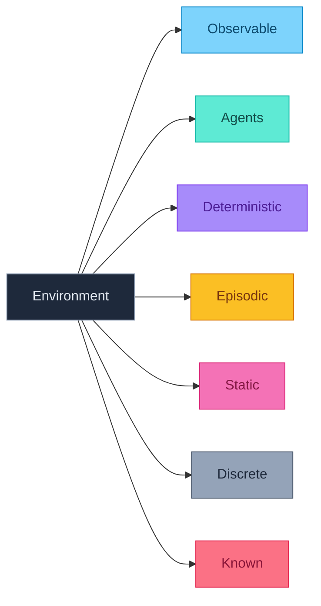

# Propiedades del Environment

Las características del environment determinan qué tipo de agente necesitamos y qué técnicas son apropiadas.

## Las 7 Dimensiones

Cada dimensión responde a una pregunta fundamental:

| Dimensión | Pregunta |
|-----------|----------|
| Observable | ¿Cuánto puede ver el agente? |
| Agents | ¿Hay otros agentes? |
| Deterministic | ¿Los resultados son predecibles? |
| Episodic | ¿Las decisiones son independientes? |
| Static | ¿El mundo cambia mientras pienso? |
| Discrete | ¿Los estados/acciones son finitos? |
| Known | ¿Conozco las reglas del juego? |

---

## 1. Observable: Fully vs Partially

| Tipo | Descripción | Implicación para el agente |
|------|-------------|----------------------------|
| **Fully Observable** | El agente ve todo el estado relevante | No necesita memoria, puede decidir solo con percept actual |
| **Partially Observable** | Parte del estado está oculta | Debe mantener **creencias** sobre estados ocultos |
| **Unobservable** | Sin sensores | Debe actuar "a ciegas" o con conocimiento previo |

**Ejemplos**:

| Environment | Observabilidad | ¿Qué está oculto? |
|-------------|----------------|-------------------|
| Ajedrez | Fully | Nada |
| Poker | Partially | Cartas de oponentes |
| Solitario | Partially | Cartas boca abajo |
| Conducir | Partially | Intenciones de otros, detrás de edificios |

---

## 2. Agents: Single vs Multi

| Tipo | Descripción | Complejidad |
|------|-------------|-------------|
| **Single Agent** | Solo el agente actúa en el environment | Más simple: optimizar sin adversarios |
| **Multi-Agent Competitive** | Otros optimizan **contra** ti | Requiere game theory, minimax |
| **Multi-Agent Cooperative** | Otros trabajan **contigo** | Requiere coordinación, comunicación |
| **Mixed** | Algunos cooperan, otros compiten | Más complejo: equipos rivales |

**Pregunta clave**: ¿El comportamiento de otros se modela mejor como **agente** o como **parte del environment** (ruido/física)?

- Si sus acciones dependen de las tuyas → **Agente** (requiere razonamiento estratégico)
- Si actúan independientemente → Parte del environment (tratarlo como estocasticidad)

---

## 3. Deterministic vs Stochastic

| Tipo | Mismo estado + misma acción = | Ejemplo |
|------|-------------------------------|---------|
| **Deterministic** | Siempre mismo resultado | Ajedrez: mover torre siempre funciona |
| **Stochastic** | Distribución de resultados | Backgammon: resultado depende de dados |
| **Strategic** | Depende de otro agente | Poker: depende de qué hagan otros |

> **Nota**: Un environment determinista puede **parecer** estocástico si es partially observable (no ves todo lo que determina el resultado).

---

## 4. Episodic vs Sequential

| Tipo | Descripción | Implicación |
|------|-------------|-------------|
| **Episodic** | Cada decisión es independiente | Optimiza cada episodio por separado |
| **Sequential** | Decisiones afectan estados futuros | Debe considerar **consecuencias a largo plazo** |

**Ejemplos**:

| Environment | Tipo | Razón |
|-------------|------|-------|
| Clasificar spam | Episodic | Cada email es independiente |
| Ajedrez | Sequential | Cada movimiento cambia el tablero |
| Diagnóstico médico | Sequential | Tests afectan qué información tienes |
| OCR (leer caracteres) | Episodic | Cada carácter es independiente |

---

## 5. Static vs Dynamic

| Tipo | ¿Cambia mientras piensas? | Implicación |
|------|---------------------------|-------------|
| **Static** | No | Puedes tomarte tu tiempo para decidir |
| **Dynamic** | Sí | "No actuar" es una acción con consecuencias |
| **Semi-dynamic** | El estado no, pero el score sí | Ajedrez con reloj: misma posición, menos tiempo |

**Ejemplo de Dynamic**: Conducir un carro — mientras piensas en qué hacer, los otros carros se siguen moviendo.

---

## 6. Discrete vs Continuous

Aplica a **cuatro aspectos**:

| Aspecto | Discrete | Continuous |
|---------|----------|------------|
| **Estados** | Finitos o enumerables | Valores reales |
| **Tiempo** | Turnos discretos | Tiempo continuo |
| **Percepts** | Categorías finitas | Mediciones continuas |
| **Acciones** | Set finito de opciones | Valores continuos |

**Ejemplos**:

| Environment | Estados | Tiempo | Acciones |
|-------------|---------|--------|----------|
| Ajedrez | Discrete | Discrete | Discrete |
| Taxi autónomo | Continuous | Continuous | Continuous |
| Atari games | Discrete (pixels) | Discrete (frames) | Discrete (botones) |

---

## 7. Known vs Unknown

| Tipo | ¿Conoce las "reglas"? | Ejemplo |
|------|----------------------|---------|
| **Known** | Sabe qué efectos tienen sus acciones | Ajedrez: conoce todas las reglas |
| **Unknown** | Debe aprender cómo funciona el mundo | Videojuego nuevo sin instrucciones |

> **Known ≠ Observable**: Puedes conocer las reglas sin ver todo el estado.
> 
> **Ejemplo**: En Solitario conoces las reglas (known) pero no ves todas las cartas (partially observable).

---

## Tabla Resumen de Environments Comunes

| Environment | Obs | Agents | Det | Epis | Static | Disc | Known |
|-------------|:---:|:------:|:---:|:----:|:------:|:----:|:-----:|
| Crucigrama | Full | Single | Det | Seq | Static | Disc | ✓ |
| Ajedrez | Full | Multi | Det | Seq | Static | Disc | ✓ |
| Ajedrez con reloj | Full | Multi | Det | Seq | Semi | Disc | ✓ |
| Poker | Partial | Multi | Stoch | Seq | Static | Disc | ✓ |
| Backgammon | Full | Multi | Stoch | Seq | Static | Disc | ✓ |
| **Taxi autónomo** | Partial | Multi | Stoch | Seq | Dynamic | Cont | ~✓ |
| Diagnóstico médico | Partial | Single | Stoch | Seq | Dynamic | Cont | ~✓ |

---

## El Caso Más Difícil: El Mundo Real

El **taxi autónomo** representa casi el "peor caso":

| Dimensión | Clasificación | Por qué es difícil |
|-----------|---------------|-------------------|
| Observable | **Partial** | No ves detrás de edificios, intenciones de otros |
| Agents | **Multi** | Otros carros, peatones, ciclistas |
| Deterministic | **Stochastic** | Clima, fallos mecánicos, comportamiento de otros |
| Episodic | **Sequential** | Cada decisión afecta las siguientes |
| Static | **Dynamic** | El mundo cambia constantemente |
| Discrete | **Continuous** | Posición, velocidad, ángulo son continuos |
| Known | **Mostly** | Conocemos física y leyes (pero no todo) |

---

:::exercise{title="Clasifica estos Environments" difficulty="2"}

Clasifica cada environment en las 7 dimensiones:

| Environment | Obs | Agents | Det | Epis | Static | Disc | Known |
|-------------|-----|--------|-----|------|--------|------|-------|
| 1. Sudoku | | | | | | | |
| 2. League of Legends | | | | | | | |
| 3. Roomba | | | | | | | |
| 4. ChatGPT respondiendo | | | | | | | |
| 5. Spotify recomendando | | | | | | | |
| 6. Mercado de valores | | | | | | | |

:::

<strong>Ver Respuestas</strong>

| Environment | Obs | Agents | Det | Epis | Static | Disc | Known |
|-------------|:---:|:------:|:---:|:----:|:------:|:----:|:-----:|
| **Sudoku** | Full | Single | Det | Seq | Static | Disc | ✓ |
| **League of Legends** | Partial | Multi | Stoch | Seq | Dynamic | Disc | ✓ |
| **Roomba** | Partial | Single | Stoch | Seq | Dynamic | Cont | ✓ |
| **ChatGPT** | Partial | Single* | Det | Epis | Static | Disc | ~✓ |
| **Spotify** | Partial | Single* | Stoch | Epis* | Dynamic | Disc | ✗ |
| **Mercado valores** | Partial | Multi | Stoch | Seq | Dynamic | Cont | ✗ |

**Notas**:
- **Sudoku**: Ves todo el tablero, reglas conocidas, cada número afecta los demás
- **LoL**: Fog of war, enemigos, efectos de habilidades variables, mundo cambia constantemente
- **Roomba**: No ve toda la casa, polvo aparece, se mueve continuamente
- **ChatGPT**: No ve todo el contexto del usuario, cada respuesta es relativamente independiente
- **Spotify**: No conoce gustos reales del usuario, otros usuarios influyen indirectamente, debe aprender preferencias
- **Mercado**: Información incompleta, otros traders, alta incertidumbre, consecuencias a largo plazo

---

:::exercise{title="Impacto en el Diseño" difficulty="3"}

Para cada propiedad, explica:
1. ¿Cómo afecta al diseño del agente?
2. ¿Qué técnicas se necesitan para manejarlo?

| Propiedad | Técnica necesaria |
|-----------|-------------------|
| Partially observable | → ? |
| Multi-agent competitive | → ? |
| Stochastic | → ? |
| Sequential | → ? |
| Dynamic | → ? |

:::

<strong>Ver Respuestas</strong>

| Propiedad | Impacto en diseño | Técnicas |
|-----------|-------------------|----------|
| **Partially observable** | Necesita **estado interno** para rastrear lo que no ve | Filtros Bayesianos, SLAM, POMDPs |
| **Multi-agent competitive** | Debe anticipar **acciones de adversarios** | Game theory, Minimax, Nash equilibrium |
| **Stochastic** | Debe maximizar **utilidad esperada**, no resultado garantizado | MDPs, Monte Carlo, Expected utility |
| **Sequential** | Debe considerar **consecuencias a largo plazo** | Planning, Search, Dynamic programming |
| **Dynamic** | Debe actuar **rápido** y re-planificar constantemente | Real-time algorithms, Anytime algorithms |
| **Continuous** | Necesita **discretizar** o usar métodos para espacios continuos | Function approximation, Control theory |
| **Unknown** | Debe **aprender** las reglas mientras actúa | Reinforcement Learning, Model learning |

---

:::prompt{title="Analizando Environments" for="Claude/ChatGPT"}

Estoy analizando el siguiente environment: [DESCRIBE EL ENVIRONMENT]

Para cada una de las 7 dimensiones (Observable, Agents, Deterministic, Episodic, Static, Discrete, Known):

1. Clasifica el environment
2. Justifica tu clasificación con ejemplos concretos
3. Explica cómo esta propiedad afecta el diseño del agente
4. Sugiere técnicas de IA apropiadas para manejar esta propiedad

Al final, indica qué tan "difícil" es este environment comparado con el peor caso (taxi autónomo).

:::

---

## Puntos Clave

1. Las **7 dimensiones** caracterizan completamente cualquier task environment
2. Cada dimensión determina qué **técnicas** son apropiadas
3. **Known ≠ Observable** — puedes conocer las reglas sin ver todo el estado
4. Environments más complejos → agentes más sofisticados
5. El "peor caso" es: **partial, multi, stochastic, sequential, dynamic, continuous, unknown**
6. La mayoría de problemas del **mundo real** están cerca del peor caso
