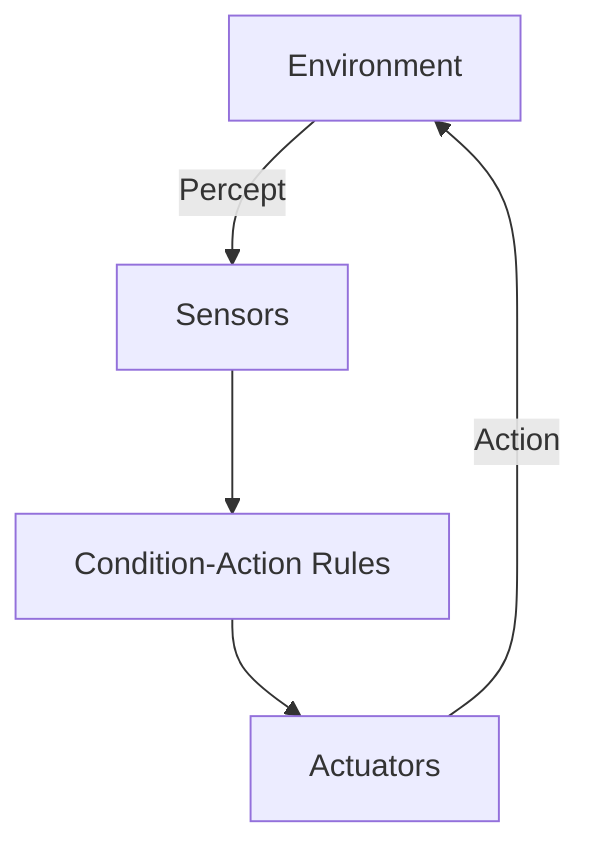
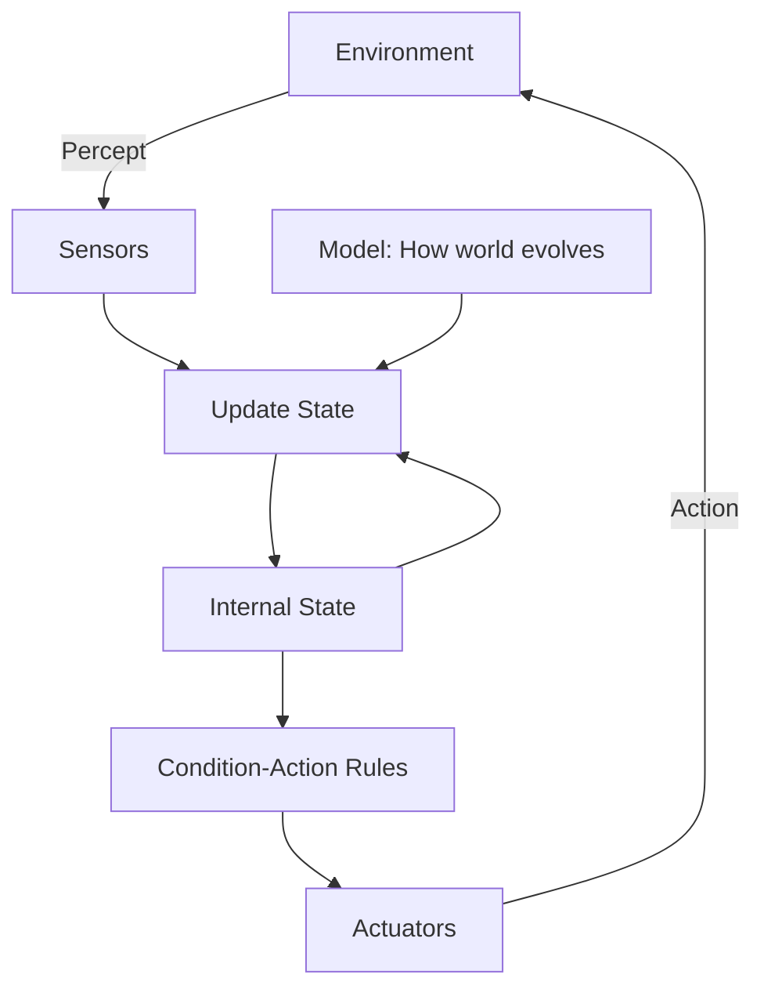
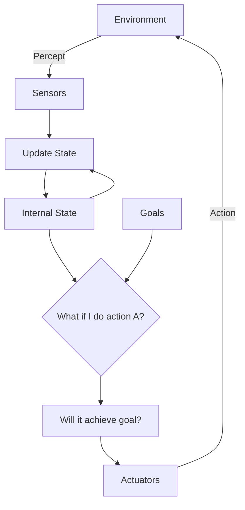
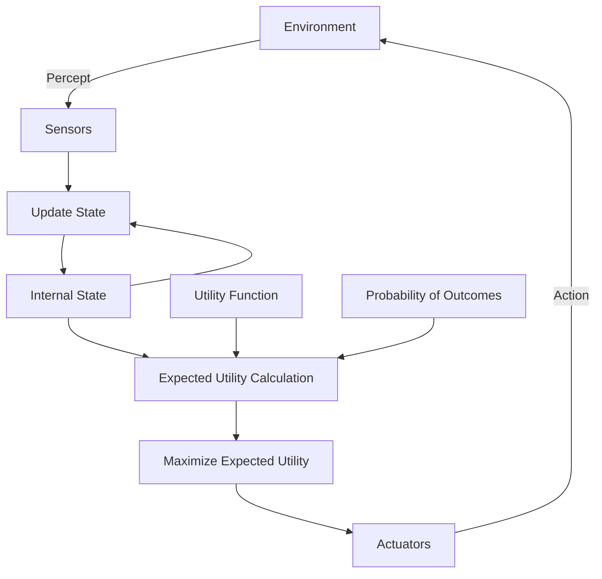
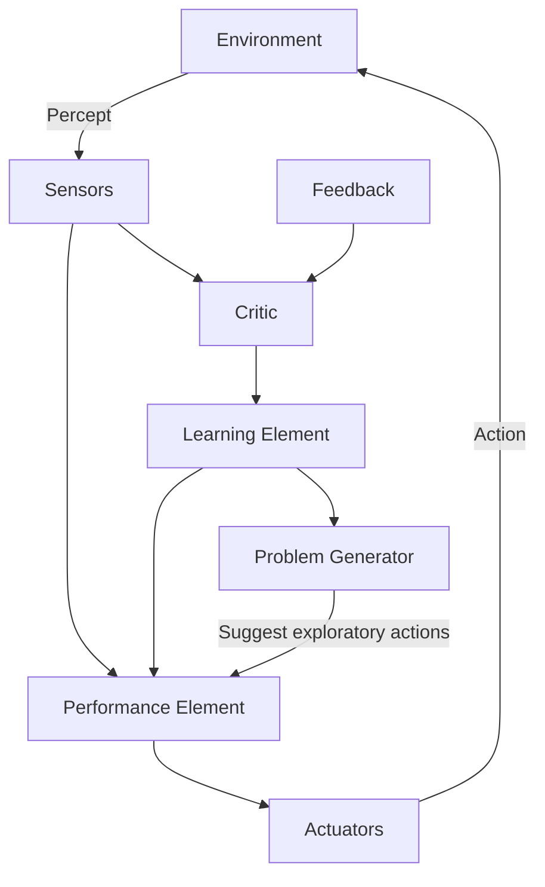

# Arquitecturas de Agentes

¿Cómo está organizado internamente un agente? Hay 4 arquitecturas básicas, cada una más capaz que la anterior.

---

## 1. Simple Reflex Agent

El agente más básico: actúa solo basándose en el **percept actual**.



### Implementación

```
function SIMPLE-REFLEX-AGENT(percept):
    rules ← a set of condition-action rules
    state ← INTERPRET-INPUT(percept)
    rule ← RULE-MATCH(state, rules)
    action ← rule.ACTION
    return action
```

### Ejemplo: Vacuum World

```
if status = Dirty then return Suck
else if location = A then return Right
else if location = B then return Left
```

### Limitaciones

- ❌ No funciona bien en environments **partially observable**
- ❌ No tiene **memoria**
- ❌ No puede **planear**


---

## 2. Model-Based Reflex Agent

Mantiene un **estado interno** que representa partes del mundo que no puede ver.



### Dos tipos de conocimiento

| Tipo | Descripción |
|------|-------------|
| **Transition Model** | ¿Cómo evoluciona el mundo independiente del agente? |
| **Sensor Model** | ¿Cómo mis percepts reflejan el estado del mundo? |

### Ventajas

- ✅ Puede manejar **partial observability**
- ✅ Tiene "memoria" del pasado
- ❌ Todavía usa reglas fijas

---

## 3. Goal-Based Agent

Tiene **goals** explícitos y considera el futuro.



### Diferencia clave

- Reflex: `if condition then action`
- Goal-based: `if action leads to goal then action`

### Requiere

- **Search** para encontrar secuencia de acciones
- **Planning** para construir planes complejos

### Ventajas

- ✅ Flexible ante cambios de goals
- ✅ Puede "razonar" sobre acciones
- ❌ Goals binarios (logrado/no logrado)

---

## 4. Utility-Based Agent

Tiene una **función de utilidad** que mide "qué tan bueno" es cada estado.



### ¿Por qué utilidad?

1. **Goals conflictivos**: ¿Rápido o seguro? Utilidad permite trade-offs
2. **Incertidumbre**: Maximizar utilidad **esperada**
3. **Múltiples formas de éxito**: No solo "logré el goal", sino "qué tan bien"

### La ecuación fundamental

$$\text{Acción óptima} = \arg\max_a \sum_{s'} P(s'|s,a) \cdot U(s')$$

Elegir la acción que maximiza la utilidad esperada.

---

## 5. Learning Agent

Puede **mejorar** su comportamiento con experiencia.



### Componentes

| Componente | Función |
|------------|---------|
| **Performance Element** | Selecciona acciones (los 4 anteriores) |
| **Critic** | Evalúa qué tan bien lo hace el agente |
| **Learning Element** | Modifica performance element para mejorar |
| **Problem Generator** | Sugiere acciones exploratorias |


### El trade-off fundamental

**Exploration vs Exploitation**
- Explotar lo que sabes → Reward inmediato
- Explorar lo desconocido → Mejor información futura

---

## Resumen Comparativo

| Arquitectura | Memoria | Goals | Utilidad | Aprende |
|--------------|---------|-------|----------|---------|
| Simple Reflex | ❌ | ❌ | ❌ | ❌ |
| Model-Based | ✅ | ❌ | ❌ | ❌ |
| Goal-Based | ✅ | ✅ | ❌ | ❌ |
| Utility-Based | ✅ | ✅ | ✅ | ❌ |
| Learning | ✅ | ✅ | ✅ | ✅ |


---

:::exercise{title="Identifica la Arquitectura" difficulty="2"}

¿Qué arquitectura usa cada agente?

1. Un termostato que enciende la calefacción cuando la temperatura baja de 20°C
2. Un GPS que recalcula la ruta cuando te sales del camino
3. Un robot que mantiene un mapa de la casa mientras limpia
4. Un jugador de ajedrez que evalúa posiciones numéricamente
5. Un chatbot que mejora con feedback de usuarios
6. Un semáforo con tiempos fijos
7. Un carro autónomo de Waymo

:::

---

:::exercise{title="Diseña el Agente" difficulty="3"}

Para cada problema, diseña un agente especificando:
- Arquitectura elegida y por qué
- Qué información mantiene en su estado interno
- Cómo decide qué acción tomar

**Problemas**:

1. **Robot mesero** en un restaurante
   - Debe llevar órdenes a mesas
   - Evitar obstáculos y personas
   - Optimizar tiempo de espera

2. **Sistema de precios dinámicos** (como Uber)
   - Debe fijar precios
   - Balancear oferta y demanda
   - Maximizar ganancias sin perder clientes

3. **Tutor personalizado** de matemáticas
   - Debe seleccionar ejercicios
   - Adaptarse al nivel del estudiante
   - Maximizar aprendizaje

:::

---

:::prompt{title="Explorando Arquitecturas" for="Claude/ChatGPT"}

Estoy diseñando un agente para: [DESCRIBE TU PROBLEMA]

Ya hice el análisis PEAS y las propiedades del environment son:
[LISTA LAS PROPIEDADES]

Ayúdame a elegir la arquitectura correcta:

1. Para cada arquitectura (simple reflex, model-based, goal-based, utility-based, learning):
   - ¿Funcionaría para este problema? ¿Por qué?
   - ¿Qué limitaciones tendría?

2. ¿Cuál es la arquitectura mínima que funcionaría?

3. ¿Cuál es la arquitectura ideal y qué agregaría?

4. ¿Qué componentes específicos necesitaría implementar?

:::

---

## Conexión con el Resto del Curso

| Arquitectura | Temas relacionados |
|--------------|-------------------|
| Model-Based | Probability, Bayesian Inference, HMMs |
| Goal-Based | Search, Planning, Logic |
| Utility-Based | Decision Theory, Game Theory, MDPs |
| Learning | Learning Theory, Neural Networks, RL |

> Cada tema del curso te da herramientas para implementar una parte de estas arquitecturas.

---

## Puntos Clave

1. Hay **4+1 arquitecturas** de complejidad creciente
2. Cada una añade **capacidades** sobre la anterior
3. La elección depende de las **propiedades del environment**
4. Los **learning agents** pueden mejorar cualquiera de las otras
5. El resto del curso enseña **técnicas** para implementar cada componente

