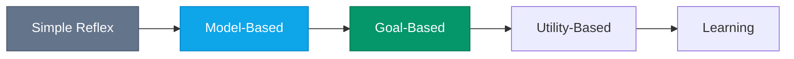
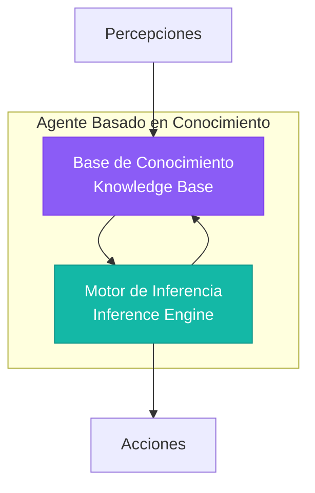
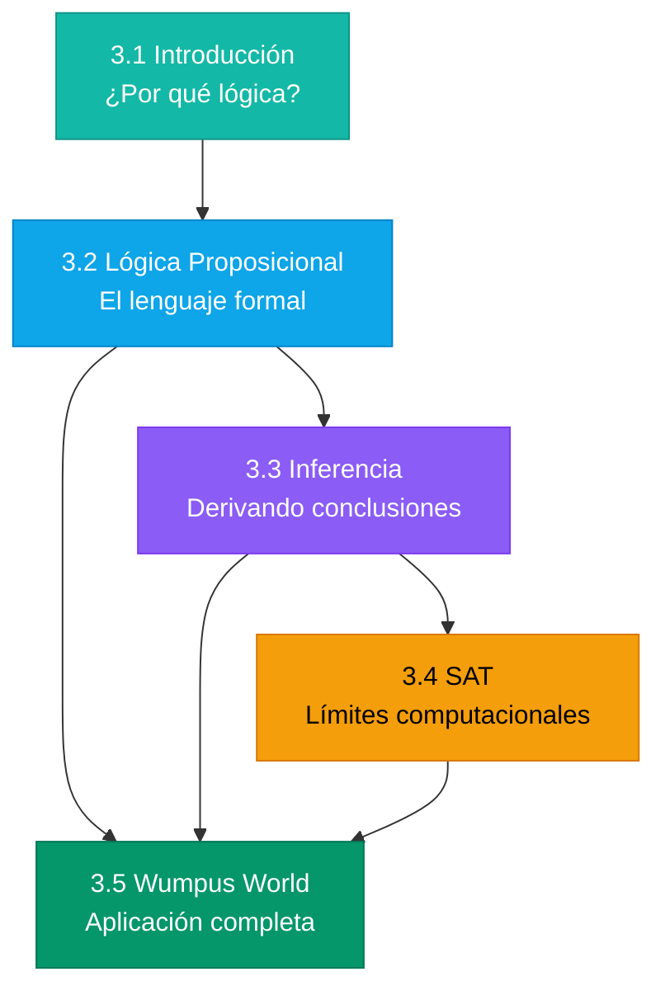

# Introducción: ¿Por qué Lógica?

## El Salto de Reaccionar a Razonar

En la clase anterior exploramos diferentes tipos de agentes. Vimos que los **agentes reflejo simples** funcionan con reglas directas:

```
si percepción == "sucio" entonces Aspirar
si percepción == "limpio" entonces Mover
```

Estos agentes son como máquinas expendedoras: estímulo → respuesta. Funcionan bien en situaciones simples y predecibles.



**Pero hay un problema fundamental:** ¿Qué hace el agente cuando enfrenta una situación que nunca ha visto? ¿Cómo puede derivar **conclusiones nuevas** a partir de lo que ya sabe?

---

## Un Problema Motivador

Imagina que eres un explorador en una cueva peligrosa. No puedes ver más allá de donde estás parado. La cueva tiene pozos mortales, pero también tiene pistas: sientes una brisa cuando hay un pozo cerca.


**Situación:**
- En la celda [1,1]: No sientes brisa
- Avanzas a [1,2]: ¡Sientes brisa!

**Pregunta crítica:** ¿Es seguro avanzar a [2,2]?

Un agente reflejo simple no puede responder esto. No tiene una regla "si brisa en [1,2] entonces..." para cada posible combinación de percepciones.

Para resolver este problema, el agente necesita:
1. **Recordar** lo que percibió en cada lugar
2. **Combinar** esa información 
3. **Derivar** nuevas conclusiones

Este tipo de razonamiento sistemático es exactamente lo que proporciona la **lógica**.

---

## Agentes Basados en Conocimiento

Un **agente basado en conocimiento** (Knowledge-Based Agent) tiene dos componentes principales que le permiten razonar:



### La Base de Conocimiento (KB)

La KB es donde el agente guarda todo lo que sabe. Contiene:

- **Hechos observados:** "No hay brisa en [1,1]", "Hay brisa en [2,1]"
- **Reglas del mundo:** "Si hay brisa, entonces hay un pozo adyacente"
- **Conocimiento previo:** "El agente empieza en [1,1], que es segura"

### El Motor de Inferencia

El motor de inferencia es el "cerebro" que procesa la KB para derivar nuevas conclusiones. Toma los hechos y reglas que tiene y produce nuevos hechos.

**Ejemplo:**
- Hecho: "Hay brisa en [2,1]"
- Regla: "Brisa significa pozo adyacente"
- **Conclusión derivada:** "Hay pozo en [1,1], [3,1], [2,0] o [2,2]"

### El Ciclo del Agente

En cada momento, el agente:

1. **TELL (decir):** Añade lo que percibe a su KB
2. **ASK (preguntar):** Consulta a la KB qué acciones son seguras
3. **TELL:** Registra la acción que tomó

```
función AGENTE-KB(percepción):
    TELL(KB, convertir_a_sentencia(percepción))
    acción ← ASK(KB, "¿qué acción debo tomar?")
    TELL(KB, convertir_a_sentencia(acción))
    return acción
```

---

## ¿Por Qué un Lenguaje Formal?

El conocimiento del agente debe estar en un **lenguaje formal** — no en español ni en inglés. ¿Por qué?

### El Problema de la Ambigüedad

El lenguaje natural es ambiguo:

> "Vi al hombre con el telescopio"

¿Qué significa?
- ¿Usé un telescopio para verlo?
- ¿El hombre tenía un telescopio?

Ambas interpretaciones son válidas en español. Una computadora no sabría cuál elegir.

### Las Ventajas del Lenguaje Formal

En un lenguaje formal como la lógica proposicional:

| Ventaja | Explicación |
|---------|-------------|
| **Sin ambigüedad** | Cada expresión tiene un único significado |
| **Procesable por máquina** | Las computadoras pueden manipularlo |
| **Verificable** | Podemos demostrar propiedades matemáticamente |
| **Composicional** | El significado de una expresión compleja se deriva de sus partes |

**En lógica, las dos interpretaciones serían distintas:**
- $Vio(Yo, Hombre) \land Usó(Yo, Telescopio)$
- $Vio(Yo, Hombre) \land Tiene(Hombre, Telescopio)$

No hay confusión posible.

---

## El Enfoque "Pensando Racionalmente"

¿Recuerdas los 4 enfoques de la IA de la Clase 2?

|  | **Como Humano** | **Racionalmente** |
|--|-----------------|-------------------|
| **Pensar** | Ciencia Cognitiva | **Leyes del Pensamiento** ← |
| **Actuar** | Test de Turing | Agentes Racionales |

La lógica es el corazón del enfoque **"Pensando Racionalmente"**. La idea es que hay patrones de razonamiento que siempre producen conclusiones correctas, independientemente de quién los use.

### Las Leyes del Pensamiento

Aristóteles (384-322 a.C.) identificó patrones de razonamiento que son universalmente válidos. El más famoso:

**El Silogismo:**
```
Premisa 1: Todos los hombres son mortales.
Premisa 2: Sócrates es hombre.
Conclusión: Sócrates es mortal.
```

Si las premisas son verdaderas, la conclusión **debe** ser verdadera. No hay forma de que sea de otra manera.

Este patrón funciona sin importar de qué se trate:
```
Premisa 1: Todos los pájaros tienen alas.
Premisa 2: Un canario es un pájaro.
Conclusión: Un canario tiene alas.
```

La lógica formaliza estos patrones para que las máquinas puedan usarlos.

---

## Tipos de Lógica

La lógica no es una sola cosa — hay diferentes "sabores" para diferentes necesidades:

| Tipo de Lógica | ¿Qué puede expresar? | Ejemplo | Complejidad |
|----------------|---------------------|---------|-------------|
| **Proposicional** | Hechos simples (verdadero/falso) | "Está lloviendo" | Decidible (NP) |
| **Primer Orden** | Objetos, relaciones, cuantificadores | "Todos los humanos son mortales" | Semi-decidible |
| **Temporal** | Cambios en el tiempo | "Eventualmente llegará" | Varía |
| **Modal** | Necesidad, posibilidad | "Es posible que llueva" | Varía |
| **Probabilística** | Grados de creencia | "Probablemente llueva" | Clase 5 |

En este módulo nos enfocamos en **lógica proposicional** — la más simple, pero que ilustra todos los conceptos fundamentales.

---

## Ventajas y Limitaciones

### Lo Bueno de la Lógica

| Ventaja | ¿Por qué importa? |
|---------|-------------------|
| **Precisión** | No hay ambigüedad — sabemos exactamente qué significa cada expresión |
| **Correctitud (Soundness)** | Si derivamos algo, es verdad — no hay conclusiones falsas |
| **Completitud** | Podemos derivar todo lo que es verdad |
| **Herramientas** | Existen SAT solvers muy optimizados para problemas reales |

### Las Limitaciones

| Limitación | ¿Por qué es problema? | ¿Cómo se resuelve? |
|------------|----------------------|-------------------|
| **Solo verdadero/falso** | No puedo decir "probablemente" | Probabilidad (Clase 5) |
| **Computacionalmente difícil** | SAT es NP-completo | Heurísticas, SAT solvers |
| **Asume conocimiento completo** | "Lo que no sé, no existe" | Lógica no-monótona |
| **Estática** | No captura cambio fácilmente | Lógica temporal |

---

## Mapa de Este Módulo



| Sección | Pregunta que responde |
|---------|----------------------|
| **3.2 Lógica Proposicional** | ¿Cómo represento conocimiento formalmente? |
| **3.3 Inferencia** | ¿Cómo derivo nuevas conclusiones? |
| **3.4 SAT** | ¿Qué puedo y qué no puedo computar? |
| **3.5 Wumpus World** | ¿Cómo aplico todo esto a un problema real? |

---

## Preguntas para Reflexionar

Antes de continuar, piensa en estas preguntas:

1. **Minesweeper:** ¿Cómo razonas cuando juegas? Cuando ves un "2", ¿cómo decides qué celdas son seguras?

2. **Saber vs. Demostrar:** ¿Cuál es la diferencia entre "saber" algo y "poder demostrarlo"?

3. **Incertidumbre:** Si la lógica solo permite verdadero/falso, ¿cómo representamos "no sé"?

4. **Historia:** ¿Por qué crees que los sistemas expertos de los años 80 (como MYCIN para diagnóstico médico) usaban lógica?

---

## Ejercicio de Calentamiento

:::exercise{title="Razonamiento Informal" difficulty="1"}

Sin usar lógica formal, analiza este razonamiento:

**Premisas:**
1. Si llueve, la calle se moja.
2. La calle está mojada.

**Conclusión propuesta:** Llovió.

**Preguntas:**
1. ¿Es válida esta conclusión?
2. ¿Qué otras explicaciones hay para que la calle esté mojada?
3. ¿Cómo distinguirías un razonamiento válido de uno inválido?

:::

<details>
<summary><strong>Ver Análisis</strong></summary>

**1. ¿Es válida?** No, no es válida.

Este es un error lógico clásico llamado **"Afirmación del Consecuente"**:
- Premisa 1: Si P entonces Q (Si llueve → calle mojada)
- Premisa 2: Q (calle mojada)
- Conclusión incorrecta: P (llovió)

El error es asumir que la única causa de Q es P.

**2. Otras explicaciones:**
- Alguien lavó su carro y salpicó agua
- Se rompió una tubería
- Pasó el camión de riego
- Un vecino regó sus plantas
- Hubo una inundación

**3. ¿Qué SÍ sería válido?**

**Modus Ponens** (que veremos en detalle):
- Si llueve → calle mojada
- Llovió
- ∴ Calle mojada ✓

**Modus Tollens**:
- Si llueve → calle mojada
- Calle NO está mojada
- ∴ NO llovió ✓

La lógica nos da herramientas precisas para distinguir razonamientos válidos de falacias.

</details>

---

## Puntos Clave

1. Los **agentes reflejo simples** no pueden razonar sobre situaciones nuevas
2. Los **agentes basados en conocimiento** tienen una KB y un motor de inferencia
3. El conocimiento se representa en un **lenguaje formal** para evitar ambigüedad
4. La lógica implementa las **"leyes del pensamiento"** — patrones de razonamiento universalmente válidos
5. La **lógica proposicional** es el tipo más simple, pero tiene limitaciones
6. Este módulo cubre: representación (sintaxis), significado (semántica), inferencia, y aplicación
