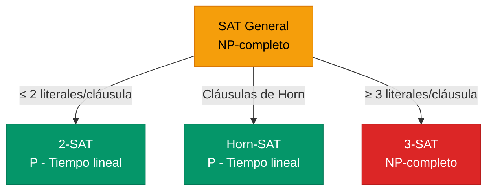

# Satisfacibilidad y SAT

El problema computacional en el corazón de la lógica.

## Introducción: Las Preguntas Fundamentales

Hasta ahora hemos aprendido a representar conocimiento (sintaxis) y a determinar cuándo es verdadero (semántica). Pero hay preguntas importantes que aún no hemos respondido:

- ¿Existe alguna situación donde mi fórmula sea verdadera?
- ¿Es mi fórmula siempre verdadera?
- ¿Mi fórmula es una contradicción?

Estas preguntas tienen nombres técnicos y están profundamente relacionadas entre sí.

---

## Clasificación de Fórmulas

Toda fórmula proposicional cae en exactamente una de tres categorías:

### Satisfacible

Una fórmula es **satisfacible** si existe **al menos un modelo** donde es verdadera.

**Ejemplo:** $P \land Q$ es satisfacible.

¿Por qué? Porque en el modelo $\{P=T, Q=T\}$, la fórmula es verdadera.

No importa que sea falsa en otros modelos (como $\{P=T, Q=F\}$). Solo necesitamos **un** modelo que la haga verdadera.

### Insatisfacible (Contradicción)

Una fórmula es **insatisfacible** si es falsa en **todos** los modelos posibles.

**Ejemplo:** $P \land \neg P$ es insatisfacible.

No importa qué valor tenga P:
- Si P=T: T ∧ F = F
- Si P=F: F ∧ T = F

No existe ningún modelo que la haga verdadera. Es una **contradicción**.

### Válida (Tautología)

Una fórmula es **válida** (o una **tautología**) si es verdadera en **todos** los modelos posibles.

**Ejemplo:** $P \lor \neg P$ es válida.

No importa qué valor tenga P:
- Si P=T: T ∨ F = T
- Si P=F: F ∨ T = T

Siempre es verdadera. Es una **ley lógica**.

### Resumen Visual


- **Satisfacibles** = Válidas + Contingentes (todo lo que no es contradicción)
- **Contingentes** = Satisfacibles pero no válidas (depende del modelo)

### Ejemplos Clasificados

| Fórmula | Satisfacible | Válida | Insatisfacible | Tipo |
|---------|:------------:|:------:|:--------------:|------|
| $P$ | ✓ | — | — | Contingente |
| $P \land Q$ | ✓ | — | — | Contingente |
| $P \lor \neg P$ | ✓ | ✓ | — | Tautología |
| $P \rightarrow P$ | ✓ | ✓ | — | Tautología |
| $(P \rightarrow Q) \lor (Q \rightarrow P)$ | ✓ | ✓ | — | Tautología |
| $P \land \neg P$ | — | — | ✓ | Contradicción |
| $(P \rightarrow Q) \land P \land \neg Q$ | — | — | ✓ | Contradicción |

#### Tablas de Verdad de los Ejemplos

**1. Contingente: $P$**

| P | Resultado |
|:---:|:---------:|
| T | **T** ✓ |
| F | **F** |

Es TRUE en 1 de 2 modelos → **Satisfacible** pero no válida → **Contingente**

---

**2. Contingente: $P \land Q$**

| P | Q | $P \land Q$ |
|:---:|:---:|:-----------:|
| T | T | **T** ✓ |
| T | F | **F** |
| F | T | **F** |
| F | F | **F** |

Es TRUE en 1 de 4 modelos → **Satisfacible** pero no válida → **Contingente**

---

**3. Tautología: $P \lor \neg P$ (Ley del Tercero Excluido)**

| P | $\neg P$ | $P \lor \neg P$ |
|:---:|:--------:|:---------------:|
| T | F | **T** ✓ |
| F | T | **T** ✓ |

Es TRUE en todos los modelos (2/2) → **Válida** → **Tautología**

**Intuición:** P es verdadero o P es falso. Siempre una de las dos opciones es cierta.

---

**4. Tautología: $P \rightarrow P$**

| P | $P \rightarrow P$ |
|:---:|:-----------------:|
| T | $T \rightarrow T = \mathbf{T}$ ✓ |
| F | $F \rightarrow F = \mathbf{T}$ ✓ |

Es TRUE en todos los modelos (2/2) → **Válida** → **Tautología**

**Intuición:** Cualquier cosa se implica a sí misma (reflexividad).

---

**5. Tautología: $(P \rightarrow Q) \lor (Q \rightarrow P)$**

| P | Q | $P \rightarrow Q$ | $Q \rightarrow P$ | $(P \rightarrow Q) \lor (Q \rightarrow P)$ |
|:---:|:---:|:-----------------:|:-----------------:|:------------------------------------------:|
| T | T | $T \rightarrow T = \mathbf{T}$ | $T \rightarrow T = \mathbf{T}$ | **T** ✓ |
| T | F | $T \rightarrow F = \mathbf{F}$ | $F \rightarrow T = \mathbf{T}$ | **T** ✓ |
| F | T | $F \rightarrow T = \mathbf{T}$ | $T \rightarrow F = \mathbf{F}$ | **T** ✓ |
| F | F | $F \rightarrow F = \mathbf{T}$ | $F \rightarrow F = \mathbf{T}$ | **T** ✓ |

Es TRUE en todos los modelos (4/4) → **Válida** → **Tautología**

**Intuición:** De dos proposiciones cualesquiera, siempre al menos una implica a la otra. ¿Por qué?
- Si tienen el mismo valor → ambas implicaciones son TRUE
- Si tienen valores diferentes → la que es FALSE implica a la que es TRUE (recordar: F→T = T)

**Clave:** Las dos implicaciones NO pueden ser FALSE simultáneamente porque:
- $P \rightarrow Q$ es FALSE solo cuando P=T y Q=F
- $Q \rightarrow P$ es FALSE solo cuando Q=T y P=F
- Es imposible tener P=T y P=F al mismo tiempo

---

**6. Contradicción: $P \land \neg P$**

| P | $\neg P$ | $P \land \neg P$ |
|:---:|:--------:|:----------------:|
| T | F | **F** ✗ |
| F | T | **F** ✗ |

Es FALSE en todos los modelos (0/2 son TRUE) → **Insatisfacible** → **Contradicción**

**Intuición:** Algo no puede ser verdadero y falso al mismo tiempo (principio de no contradicción).

---

**7. Contradicción: $(P \rightarrow Q) \land P \land \neg Q$**

| P | Q | $P \rightarrow Q$ | $\neg Q$ | $(P \rightarrow Q) \land P \land \neg Q$ |
|:---:|:---:|:-----------------:|:--------:|:----------------------------------------:|
| T | T | T | F | $T \land T \land F = \mathbf{F}$ ✗ |
| T | F | F | T | $F \land T \land T = \mathbf{F}$ ✗ |
| F | T | T | F | $T \land F \land F = \mathbf{F}$ ✗ |
| F | F | T | T | $T \land F \land T = \mathbf{F}$ ✗ |

Es FALSE en todos los modelos (0/4 son TRUE) → **Insatisfacible** → **Contradicción**

**Intuición:** Esta fórmula dice "Si P entonces Q" Y "P es verdadero" Y "Q es falso". Pero si P es verdadero y P→Q es verdadero, entonces Q debe ser verdadero (Modus Ponens). Contradicción con ¬Q.

---

## Relaciones Importantes

Estas clasificaciones están relacionadas de formas útiles:

### Relación entre Validez e Insatisfacibilidad

$$\alpha \text{ es válida} \iff \neg\alpha \text{ es insatisfacible}$$

**Intuición:** Si $\alpha$ es siempre verdadera, entonces $\neg\alpha$ es siempre falsa.

**Uso práctico:** Para verificar si $\alpha$ es una tautología, podemos verificar si $\neg\alpha$ es insatisfacible.

### Relación con Entailment

$$\alpha \models \beta \iff (\alpha \land \neg\beta) \text{ es insatisfacible}$$

**Intuición:** "$\alpha$ implica $\beta$" significa que no puede pasar que $\alpha$ sea verdadera y $\beta$ sea falsa.

**Uso práctico:** Esta es la base de la refutación por resolución que vimos en la sección anterior.

---

## El Problema SAT

El problema **SAT** (Boolean Satisfiability Problem) es:

> **Entrada:** Una fórmula proposicional $\phi$ (usualmente en CNF)
> 
> **Pregunta:** ¿Es $\phi$ satisfacible?
> 
> **Salida:** "SÍ" + un modelo que la satisface, o "NO"

### Ejemplo

**Entrada:** $(P \lor Q) \land (\neg P \lor R) \land (\neg Q \lor \neg R)$

**Proceso:** Buscar una asignación que haga todas las cláusulas verdaderas...

**Salida:** SÍ, satisfacible. Modelo: $\{P=T, Q=F, R=T\}$

**Verificación:**
- $(T \lor F) = T$ ✓
- $(F \lor T) = T$ ✓
- $(T \lor F) = T$ ✓

Todas las cláusulas son verdaderas, por lo tanto la fórmula es satisfacible.

---

## SAT es NP-Completo

### ¿Qué Significa NP-Completo?

En teoría de la complejidad computacional, los problemas se clasifican según su dificultad:

#### Clase P (Polynomial Time)

**Definición:** Problemas que se pueden **resolver** en tiempo polinomial.

**Característica:** Existe un algoritmo que encuentra la solución en tiempo $O(n^k)$ para alguna constante k.

**Ejemplos:**
- **Ordenar una lista** — Quicksort/Mergesort: $O(n \log n)$
- **Buscar en una lista ordenada** — Búsqueda binaria: $O(\log n)$
- **Encontrar el camino más corto** — Algoritmo de Dijkstra: $O(n^2)$ o $O(n \log n)$ con heap
- **Multiplicar dos matrices** — $O(n^3)$ (o mejor con algoritmos optimizados)

**Intuición:** Si un problema está en P, podemos resolverlo eficientemente incluso para entradas grandes.

---

#### Clase NP (Nondeterministic Polynomial Time)

**Definición:** Problemas cuyas **soluciones se pueden verificar** en tiempo polinomial.

**Característica:** Si alguien te da una solución candidata, puedes comprobar rápidamente si es correcta.

**Nota importante:** NP NO significa "no polinomial" — significa "polinomial no determinista".

**Ejemplos:**

1. **Problema SAT**
   - **Pregunta:** ¿Existe una asignación que satisface esta fórmula?
   - **Verificación:** Dada una asignación, evaluar la fórmula es $O(n)$ — ¡rápido!
   - **Solución:** Encontrar la asignación puede requerir $O(2^n)$ — ¡lento!

2. **Problema del Viajante (TSP - Decisión)**
   - **Pregunta:** ¿Existe un tour que visita todas las ciudades con distancia ≤ k?
   - **Verificación:** Dada una ruta, sumar distancias es $O(n)$ — ¡rápido!
   - **Solución:** Encontrar la mejor ruta puede requerir $O(n!)$ — ¡lento!

3. **Coloración de Grafos**
   - **Pregunta:** ¿Se puede colorear este grafo con k colores sin que nodos adyacentes tengan el mismo color?
   - **Verificación:** Dada una coloración, revisar aristas es $O(n^2)$ — ¡rápido!
   - **Solución:** Encontrar la coloración puede ser exponencial — ¡lento!

4. **Problema de la Mochila (Knapsack)**
   - **Pregunta:** ¿Puedo llenar una mochila de capacidad W con valor ≥ V?
   - **Verificación:** Dada una selección de objetos, sumar pesos y valores es $O(n)$ — ¡rápido!
   - **Solución:** Explorar todas las combinaciones es $O(2^n)$ — ¡lento!

**Intuición:** Es fácil **revisar** la tarea de alguien más, pero difícil **hacerla** tú mismo.

**Relación P y NP:** Claramente $P \subseteq NP$ (si puedes resolver algo rápido, también puedes verificarlo rápido). La pregunta del millón: **¿P = NP?**

---

#### Clase NP-Completo

**Definición:** Los problemas **más difíciles** de NP. Un problema es NP-completo si:
1. Está en NP (las soluciones se pueden verificar en tiempo polinomial)
2. Es **NP-hard** (cualquier problema en NP se puede reducir a él en tiempo polinomial)

**Intuición:** Si encuentras un algoritmo polinomial para **un** problema NP-completo, ¡puedes resolver **todos** los problemas en NP eficientemente! (P = NP)

**El primer problema NP-completo:** SAT (Teorema de Cook-Levin, 1971)

**Otros ejemplos NP-completos:**
- **3-SAT** — SAT con exactamente 3 literales por cláusula
- **Problema del Viajante (decisión)** — ¿Tour de longitud ≤ k?
- **Coloración de grafos** — ¿Colorear con k colores?
- **Clique** — ¿Existe un subgrafo completo de tamaño k?
- **Vertex Cover** — ¿k nodos cubren todas las aristas?
- **Subset Sum** — ¿Hay un subconjunto que suma exactamente k?
- **Sudoku generalizado** — ¿Completar un Sudoku n×n?
- **Minesweeper generalizado** — ¿Configuración consistente?

**Todos estos problemas son equivalentes en dificultad** — si resuelves uno eficientemente, resuelves todos.

---

#### Clase NP-Hard

**Definición:** Problemas **al menos tan difíciles** como los problemas NP-completos, pero **no necesariamente en NP**.

**Diferencia con NP-completo:** Puede que ni siquiera podamos verificar soluciones eficientemente.

**Ejemplos:**
- **Halting Problem** — ¿Este programa se detiene? (indecidible, peor que NP)
- **Problema del Viajante (optimización)** — Encontrar la ruta **más corta** (no solo verificar si existe una ≤ k)
- **Ajedrez generalizado en tablero n×n** — ¿Blancas tienen estrategia ganadora?
- **Go generalizado** — Similar al ajedrez

**Intuición:** Son problemas tan duros o más duros que NP-completo, pero pueden no estar en NP.

---

#### Diagrama de Relaciones

```
┌─────────────────────────────────────┐
│         NP-Hard                     │
│  (al menos tan difícil como NP)     │
│                                     │
│   ┌──────────────────────────┐     │
│   │         NP               │     │
│   │                          │     │
│   │  ┌────────────────┐      │     │
│   │  │      P         │      │     │
│   │  │   (eficiente)  │      │     │
│   │  └────────────────┘      │     │
│   │                          │     │
│   │   ┌──────────────────┐   │     │
│   │   │  NP-Completo     │◄──┼─────┤ Frontera
│   │   │ (los más duros   │   │     │
│   │   │   de NP)         │   │     │
│   │   └──────────────────┘   │     │
│   └──────────────────────────┘     │
└─────────────────────────────────────┘

P ⊆ NP ⊆ NP-Hard
NP-Completo = NP ∩ NP-Hard
```

**La pregunta del millón:** ¿P = NP? (hay $1,000,000 USD de premio para quien la resuelva)

### El Teorema de Cook-Levin (1971)

> **Teorema:** SAT es **NP-completo**.

Esto significa:
1. SAT está en NP (dada una asignación, podemos verificar en tiempo polinomial si satisface la fórmula)
2. Cualquier problema en NP se puede reducir a SAT en tiempo polinomial (SAT es al menos tan difícil como cualquier otro problema en NP)

### ¿Por Qué Importa?

Si alguien encontrara un algoritmo polinomial para SAT, podría resolver **todos** los problemas en NP eficientemente. Esto implicaría P = NP.

Actualmente, la mayoría de los expertos creen que P ≠ NP, lo que significa que SAT probablemente no tiene solución polinomial.

### El Problema del Crecimiento Exponencial

El enfoque ingenuo de "probar todas las asignaciones" tiene complejidad $O(2^n)$:

| Variables | Modelos | Tiempo (1M modelos/seg) |
|:---------:|:-------:|:-----------------------:|
| 10 | ~1,000 | 0.001 segundos |
| 20 | ~1,000,000 | 1 segundo |
| 30 | ~1,000,000,000 | 17 minutos |
| 40 | ~1 billón | 12 días |
| 50 | ~10^15 | 35 años |
| 100 | ~10^30 | más que la edad del universo |

¡El crecimiento exponencial es devastador!

---

## Algoritmos para SAT

A pesar de que SAT es NP-completo (y probablemente no tiene solución polinomial en el peor caso), hay algoritmos que funcionan bien en la práctica.

### DPLL: El Algoritmo Clásico

**DPLL** (Davis-Putnam-Logemann-Loveland, 1962) es el algoritmo fundamental para SAT. Mejora la búsqueda exhaustiva con tres técnicas de optimización que explotan la estructura de las fórmulas CNF.

---

#### 1. Propagación de Unidad (Unit Propagation)

##### Notación: Asignación Parcial

Antes de explicar las técnicas, definimos la notación que usaremos:

**Asignación parcial $\alpha$:** Una función parcial que asigna valores de verdad a **algunas** variables.

$$\alpha: \text{Variables} \rightharpoonup \{\text{T}, \text{F}\}$$

**Características:**
- $\alpha(v) = \text{T}$ significa "la variable $v$ está asignada a verdadero"
- $\alpha(v) = \text{F}$ significa "la variable $v$ está asignada a falso"
- $\alpha(v)$ está indefinida significa "la variable $v$ aún no está asignada"

**Notación:**
- $\alpha = \{P \mapsto T, Q \mapsto F\}$ — asignación parcial donde $P=T$, $Q=F$, otras variables sin asignar
- $\alpha \cup \{v \mapsto T\}$ — extender $\alpha$ asignando $v=T$
- $\text{dom}(\alpha)$ — conjunto de variables asignadas en $\alpha$

**Ejemplo:**
- $\alpha = \{P \mapsto T, R \mapsto F\}$
- Variables asignadas: $\text{dom}(\alpha) = \{P, R\}$
- Variables sin asignar: $Q, S, T, ...$ (cualquier otra variable en la fórmula)

---

##### Definición: Cláusula Unitaria

Una **cláusula unitaria** es una cláusula que, bajo una asignación parcial $\alpha$, tiene **exactamente un literal sin asignar** y **todos los demás literales (si los hay) son falsos**.

**Formalmente:** Una cláusula $C$ es unitaria bajo una asignación parcial $\alpha$ si:
- $|C| \geq 1$ (tiene al menos un literal)
- Existe exactamente un literal $l \in C$ tal que la variable de $l$ no está en $\text{dom}(\alpha)$ (literal sin asignar)
- Para todo otro literal $l' \in C$ donde $l' \neq l$: el literal $l'$ evalúa a **falso** bajo $\alpha$

**Dos casos importantes:**

**Caso 1: Cláusula con un solo literal**
- Ejemplo: $(P)$
- Si $P$ no está asignada → es **trivialmente unitaria** (no hay "otros literales" que evaluar)

**Caso 2: Cláusula con múltiples literales**
- Ejemplo: $(\neg P \lor Q \lor R)$ con $\alpha = \{P \mapsto T, R \mapsto F\}$
- $\neg P$ evalúa a $F$ (porque $P = T$)
- $R$ evalúa a $F$ (porque $R = F$)
- $Q$ no está asignada (única sin asignar)
- Por lo tanto, es **unitaria** con literal $Q$

**Ejemplos detallados:**

1. **$(P)$ con $\alpha = \{\}$ (vacía)**
   - $P$ no está asignada
   - No hay otros literales
   - **Unitaria** ✓ (trivialmente)

2. **$(\neg P \lor Q)$ con $\alpha = \{P \mapsto T\}$**
   - $\neg P$ evalúa a $F$ (porque $P = T$)
   - $Q$ no está asignada
   - Solo $Q$ queda sin asignar, $\neg P$ es falso
   - **Unitaria** ✓ con literal $Q$

3. **$(A \lor B \lor C)$ con $\alpha = \{A \mapsto F, B \mapsto F\}$**
   - $A$ evalúa a $F$ (porque $A = F$)
   - $B$ evalúa a $F$ (porque $B = F$)
   - $C$ no está asignada
   - Solo $C$ queda sin asignar, los demás son falsos
   - **Unitaria** ✓ con literal $C$

**Contraejemplos (NO unitarias):**

1. **$(P \lor Q)$ con $\alpha = \{\}$**
   - Tanto $P$ como $Q$ sin asignar
   - **NO unitaria** ✗ (dos literales sin asignar)

2. **$(P \lor Q)$ con $\alpha = \{P \mapsto T\}$**
   - $P$ evalúa a $T$ (cláusula ya satisfecha)
   - **NO es unitaria** ✗ (cláusula ya es verdadera, no necesita propagación)

##### La Regla de Propagación de Unidad

**Regla:** Si una cláusula $C$ es unitaria con literal no asignado $l$, entonces **debemos** asignar $l = T$ para satisfacer $C$.

**Justificación:** Es la **única** forma de hacer verdadera esa cláusula. No hay elección — es una inferencia forzada.

**Notación:** $\text{UP}(\phi, \alpha)$ = aplicar propagación de unidad a la fórmula $\phi$ con asignación parcial $\alpha$

##### Algoritmo de Propagación de Unidad

```
Propagación-Unidad(φ, α):
    cambió = true
    mientras cambió:
        cambió = false
        para cada cláusula C en φ:
            si C es unitaria bajo α con literal l:
                si l es positivo (variable v):
                    α[v] = T
                si l es negativo (¬v):
                    α[v] = F
                cambió = true
                Simplificar φ con la nueva asignación
        
        si alguna cláusula está vacía:
            retornar CONFLICTO
    
    retornar (φ_simplificada, α_extendida)
```

##### Ejemplo Detallado Paso a Paso

**Fórmula inicial:**
$$\phi = (P) \land (\neg P \lor Q) \land (R \lor \neg Q) \land (\neg R \lor S \lor T)$$

**Paso 0: Estado Inicial**
- Asignación: $\alpha = \{\}$ (vacía)
- Cláusulas:
  1. $(P)$ ← **unitaria** (solo un literal, no asignado)
  2. $(\neg P \lor Q)$
  3. $(R \lor \neg Q)$
  4. $(\neg R \lor S \lor T)$

**Paso 1: Propagar $(P)$**
- **Acción:** Asignar $P = T$ (única opción para satisfacer la cláusula 1)
- **Asignación:** $\alpha = \{P \mapsto T\}$
- **Simplificación:**
  - Cláusula 1: $(P)$ → **TRUE** (eliminar, ya está satisfecha)
  - Cláusula 2: $(\neg P \lor Q)$ → $(F \lor Q)$ → $(Q)$ ← **nueva unitaria**
  - Cláusula 3: sin cambios
  - Cláusula 4: sin cambios
- **Fórmula resultante:**
  $$\phi_1 = (Q) \land (R \lor \neg Q) \land (\neg R \lor S \lor T)$$

**Paso 2: Propagar $(Q)$**
- **Acción:** Asignar $Q = T$ (única opción para la nueva unitaria)
- **Asignación:** $\alpha = \{P \mapsto T, Q \mapsto T\}$
- **Simplificación:**
  - Cláusula 1: $(Q)$ → **TRUE** (eliminar)
  - Cláusula 2: $(R \lor \neg Q)$ → $(R \lor F)$ → $( R )$ ← **nueva unitaria**
  - Cláusula 3: sin cambios
- **Fórmula resultante:**
  $$\phi_2 = (R) \land (\neg R \lor S \lor T)$$

**Paso 3: Propagar $(R)$**
- **Acción:** Asignar $R = T$
- **Asignación:** $\alpha = \{P \mapsto T, Q \mapsto T, R \mapsto T\}$
- **Simplificación:**
  - Cláusula 1: $(R)$ → **TRUE** (eliminar)
  - Cláusula 2: $(\neg R \lor S \lor T)$ → $(F \lor S \lor T)$ → $(S \lor T)$
- **Fórmula resultante:**
  $$\phi_3 = (S \lor T)$$

**Paso 4: No más unitarias**
- La cláusula $(S \lor T)$ tiene dos literales sin asignar
- **Propagación de unidad termina**
- Ahora DPLL debe elegir: asignar $S$ o $T$ (backtracking search)

**Resumen:** La propagación en cascada asignó **automáticamente** 3 variables ($P, Q, R$) sin backtracking, reduciendo el espacio de búsqueda de $2^5 = 32$ a $2^2 = 4$ posibilidades.

---

#### 2. Eliminación de Literales Puros (Pure Literal Elimination)

##### Definición: Literal Puro

Un **literal puro** es un literal que aparece en la fórmula **siempre con la misma polaridad**.

**Formalmente:** Para una variable $v$ en la fórmula $\phi$:
- $v$ es **puro positivo** si $v$ aparece en alguna cláusula pero $\neg v$ **nunca** aparece
- $v$ es **puro negativo** si $\neg v$ aparece en alguna cláusula pero $v$ **nunca** aparece

**Notación:**
- $\text{Lit}(\phi)$ = conjunto de todos los literales que aparecen en $\phi$
- $v$ es puro en $\phi$ si $(v \in \text{Lit}(\phi) \land \neg v \notin \text{Lit}(\phi))$ o $(\neg v \in \text{Lit}(\phi) \land v \notin \text{Lit}(\phi))$

##### La Regla de Eliminación de Literales Puros

**Regla:** Si un literal $l$ es puro en $\phi$, podemos **asignar $l = T$** sin riesgo de hacer falsa ninguna cláusula.

**Justificación:**
- Si asignamos el literal puro a TRUE, todas las cláusulas que lo contienen se satisfacen
- Como su negación no aparece en ninguna cláusula, no estamos forzando ninguna cláusula a ser falsa
- Es una asignación "segura" — nunca causa conflictos

**Algoritmo:**
```
Eliminar-Literales-Puros(φ, α):
    Lit_aparecen = {todos los literales en φ}
    
    para cada variable v en φ:
        si (v ∈ Lit_aparecen y ¬v ∉ Lit_aparecen):
            // v es puro positivo
            α[v] = T
            Eliminar todas las cláusulas que contienen v
        
        si (¬v ∈ Lit_aparecen y v ∉ Lit_aparecen):
            // v es puro negativo
            α[v] = F
            Eliminar todas las cláusulas que contienen ¬v
    
    retornar (φ_simplificada, α_extendida)
```

##### Ejemplo Detallado

**Fórmula:**
$$\phi = (P \lor Q) \land (\neg P \lor R) \land (R \lor S) \land (Q \lor \neg S \lor T)$$

**Análisis de literales:**

| Variable | Aparece positivo | Aparece negativo | Clasificación |
|----------|:----------------:|:----------------:|---------------|
| $P$ | ✓ (cláusula 1) | ✓ (cláusula 2) | No puro |
| $Q$ | ✓ (cláusulas 1, 4) | ✗ | **Puro positivo** |
| $R$ | ✓ (cláusulas 2, 3) | ✗ | **Puro positivo** |
| $S$ | ✓ (cláusula 3) | ✓ (cláusula 4) | No puro |
| $T$ | ✓ (cláusula 4) | ✗ | **Puro positivo** |

**Literales puros identificados:** $Q, R, T$ (todos puros positivos)

**Aplicando la regla:**

**Paso 1: Asignar $Q = T$**
- Cláusulas afectadas: 1 y 4 → **satisfechas** (eliminar)
- Fórmula: $\phi_1 = (\neg P \lor R) \land (R \lor S)$

**Paso 2: Asignar $R = T$**
- Cláusulas afectadas: 1 y 2 (ambas en $\phi_1$) → **satisfechas** (eliminar)
- Fórmula: $\phi_2 = \emptyset$ (todas las cláusulas eliminadas)

**Paso 3: $T$ ya no aparece** (las cláusulas que lo contenían fueron eliminadas)

**Resultado:** $\phi$ es **satisfacible** con asignación $\alpha = \{Q \mapsto T, R \mapsto T\}$ (P, S, T pueden tener cualquier valor)

**Observación:** ¡Resolvimos el problema sin backtracking! La eliminación de literales puros fue suficiente.

---

#### 3. Terminación Temprana y Detección de Conflictos

##### Condiciones de Terminación

**DPLL puede terminar en tres situaciones:**

**1. Éxito (SAT):** Todas las cláusulas están satisfechas
- **Condición formal:** $\phi = \emptyset$ (fórmula vacía, todas las cláusulas fueron eliminadas)
- **Significado:** La asignación actual satisface la fórmula original
- **Retornar:** SAT con la asignación $\alpha$

**2. Conflicto (UNSAT en esta rama):** Alguna cláusula está vacía
- **Condición formal:** $\exists C \in \phi : C = \emptyset$ (existe una cláusula sin literales)
- **Significado:** Todos los literales de esa cláusula son falsos → cláusula insatisfecha
- **Acción:** Backtracking (deshacer última decisión y probar la opción contraria)

**3. Ninguna simplificación posible:** No hay unitarias ni puros
- **Condición:** $\phi \neq \emptyset$ y no hay cláusulas unitarias ni literales puros
- **Acción:** **Branching** (elegir una variable y probar ambos valores)

##### Ejemplo de Conflicto

**Fórmula:**
$$\phi = (P) \land (\neg P)$$

**Análisis:**
- Cláusula 1: $(P)$ es unitaria → asignar $P = T$
- Simplificación: $(P)$ → TRUE (eliminar)
- Simplificación: $(\neg P)$ → $(F)$ → **cláusula vacía** □

**Conclusión:** **CONFLICTO** — Esta rama del árbol de búsqueda es UNSAT.

**En backtracking:** Si esta fue nuestra primera opción, intentamos $P = F$; si ambas fallan, la fórmula original es UNSAT.

---

#### 4. El Algoritmo DPLL Completo

```
DPLL(φ, α):
    // Paso 1: Aplicar simplificaciones mientras sea posible
    repetir:
        (φ, α) = Propagación-Unidad(φ, α)
        si φ contiene cláusula vacía:
            retornar UNSAT
        
        (φ, α) = Eliminar-Literales-Puros(φ, α)
    hasta que no haya cambios
    
    // Paso 2: Verificar terminación
    si φ == ∅:  // Todas las cláusulas satisfechas
        retornar (SAT, α)
    
    // Paso 3: Branching (elección de variable)
    Elegir variable no asignada v de φ
    
    // Probar v = T
    si DPLL(φ[v←T], α ∪ {v→T}) == SAT:
        retornar SAT
    
    // Si falló, probar v = F
    si DPLL(φ[v←F], α ∪ {v→F}) == SAT:
        retornar SAT
    
    // Ambas opciones fallaron
    retornar UNSAT
```

**Notación:**
- $\phi[v \leftarrow T]$ significa "simplificar $\phi$ asumiendo $v = T$"
- Esto implica eliminar cláusulas con $v$ y quitar $\neg v$ de las cláusulas

---

#### Análisis de Complejidad de DPLL

**Peor caso:**
- **Tiempo:** $O(2^n)$ donde $n$ = número de variables
- En el peor caso, debemos probar todas las $2^n$ asignaciones posibles

**Caso promedio (en práctica):**
- Las optimizaciones (UP y PLE) **podan enormemente** el árbol de búsqueda
- Muchos problemas reales se resuelven en tiempo razonable
- El orden de las $2^n$ posibilidades raramente se explora completamente

**Mejoras modernas (CDCL - Conflict-Driven Clause Learning):**
- Aprende de conflictos para evitar repetir errores
- Usado en solucionadores modernos (MiniSat, Z3, etc.)
- Puede resolver instancias con millones de variables

### Pseudocódigo DPLL

```
función DPLL(cláusulas, asignación):
    # Terminación temprana
    si todas las cláusulas son verdaderas:
        retornar SAT
    si alguna cláusula es falsa:
        retornar UNSAT
    
    # Propagación de unidad
    mientras exista cláusula unitaria (l):
        asignación ← asignación ∪ {l = verdadero}
        simplificar cláusulas
    
    # Eliminación de literal puro
    mientras exista literal puro l:
        asignación ← asignación ∪ {l = verdadero}
        simplificar cláusulas
    
    # Ramificación (branching)
    elegir variable P no asignada
    si DPLL(cláusulas, asignación ∪ {P = T}) = SAT:
        retornar SAT
    retornar DPLL(cláusulas, asignación ∪ {P = F})
```

### SAT Solvers Modernos: CDCL

Los SAT solvers de hoy usan **CDCL** (Conflict-Driven Clause Learning), que extiende DPLL con:

| Técnica | Descripción |
|---------|-------------|
| **Clause Learning** | Cuando hay conflicto, analizar la causa y aprender una nueva cláusula que evite repetir el mismo error |
| **Non-chronological Backtracking** | En lugar de retroceder un nivel, saltar directamente al nivel que causó el conflicto |
| **Restarts** | Reiniciar la búsqueda periódicamente, conservando las cláusulas aprendidas |
| **Heurísticas de decisión** | Elegir inteligentemente qué variable asignar (ej: VSIDS) |

### El Éxito Práctico de SAT

Aunque SAT es NP-completo en teoría, los SAT solvers modernos resuelven instancias con **millones de variables** en segundos.


| SAT Solver | Año | Variables típicas resueltas |
|------------|:---:|:---------------------------:|
| GRASP | 1996 | ~1,000 |
| Chaff | 2001 | ~100,000 |
| MiniSat | 2003 | ~500,000 |
| CryptoMiniSat | 2009 | ~1,000,000+ |
| Kissat | 2020 | 10,000,000+ |

**¿Por qué funciona en la práctica?**

Las instancias del "mundo real" usualmente no son los peores casos. Tienen estructura que los solvers pueden explotar:
- Muchas cláusulas se simplifican rápidamente
- Las cláusulas aprendidas evitan explorar regiones inútiles
- Las heurísticas guían hacia soluciones rápidamente

---

## Casos Especiales: Cuando SAT es Fácil

No todas las restricciones sobre SAT lo mantienen difícil:

### 2-SAT: Tiempo Lineal

Si cada cláusula tiene **a lo más 2 literales**, el problema está en P.

**Ejemplo de 2-SAT:** $(P \lor Q) \land (\neg P \lor R) \land (\neg Q \lor \neg R)$

**Algoritmo:** Construir un grafo de implicaciones y buscar componentes fuertemente conexos. Complejidad: $O(n)$.

### Horn-SAT: Tiempo Lineal

Si todas las cláusulas son **cláusulas de Horn** (a lo más un literal positivo), el problema está en P.

**Algoritmo:** Forward chaining. Complejidad: $O(n)$.

### k-SAT para k ≥ 3: NP-Completo

Para cláusulas con 3 o más literales, el problema es NP-completo.

**La frontera:** 2-SAT es fácil, 3-SAT es difícil. ¡Un literal de diferencia!



---

## Aplicaciones de SAT

Los SAT solvers se usan en muchas áreas:

| Dominio | Aplicación |
|---------|------------|
| **Verificación de hardware** | Comprobar que circuitos cumplen especificaciones |
| **Verificación de software** | Model checking, encontrar bugs |
| **Planificación** | Planning as satisfiability |
| **Criptografía** | Análisis de protocolos, criptoanálisis |
| **Bioinformática** | Haplotyping, análisis de redes |
| **Scheduling** | Asignación de horarios, recursos |
| **Juegos/Puzzles** | Sudoku, N-reinas, etc. |

:::example{title="Sudoku como SAT"}

Un Sudoku 9×9 se puede codificar como SAT:

**Variables:** $x_{r,c,v}$ = "la celda (fila r, columna c) tiene el valor v"
- 9 filas × 9 columnas × 9 valores = 729 variables

**Restricciones (todas como cláusulas):**

1. **Cada celda tiene al menos un valor:**
   - Para cada (r,c): $x_{r,c,1} \lor x_{r,c,2} \lor \cdots \lor x_{r,c,9}$

2. **Cada celda tiene a lo más un valor:**
   - Para cada (r,c) y par de valores diferentes i,j: $\neg x_{r,c,i} \lor \neg x_{r,c,j}$

3. **Cada fila tiene todos los números:** 9 cláusulas por número

4. **Cada columna tiene todos los números:** 9 cláusulas por número

5. **Cada caja 3×3 tiene todos los números:** 9 cláusulas por número

6. **Valores iniciales:** Cláusulas unitarias para celdas pre-llenadas

**Resultado:** ~8,000 cláusulas. Un SAT solver resuelve cualquier Sudoku en milisegundos.

:::

---

## Ejercicios

:::exercise{title="Clasificar Fórmulas" difficulty="1"}

Clasifica cada fórmula como Válida, Satisfacible (pero no válida), o Insatisfacible:

1. $(P \rightarrow Q) \land (\neg P \rightarrow Q)$
2. $(P \rightarrow Q) \land P \land \neg Q$
3. $P \rightarrow (Q \rightarrow P)$
4. $(P \leftrightarrow Q) \land (P \leftrightarrow \neg Q)$

:::

<details>
<summary><strong>Ver Solución</strong></summary>

**1. $(P \rightarrow Q) \land (\neg P \rightarrow Q)$**

Esto dice "Si P entonces Q, Y si no-P entonces Q". En ambos casos, Q.

| P | Q | P→Q | ¬P→Q | Fórmula |
|:-:|:-:|:---:|:----:|:-------:|
| T | T | T | T | T |
| T | F | F | T | F |
| F | T | T | T | T |
| F | F | T | F | F |

Es verdadera cuando Q=T, falsa cuando Q=F. **Satisfacible** (equivalente a Q).

**2. $(P \rightarrow Q) \land P \land \neg Q$**

Esto dice "P implica Q, Y P es verdadero, Y Q es falso". ¡Contradicción!

Si P es verdadero y P→Q, entonces Q debe ser verdadero. Pero decimos Q es falso.

| P | Q | P→Q | P | ¬Q | Fórmula |
|:-:|:-:|:---:|:-:|:--:|:-------:|
| T | T | T | T | F | F |
| T | F | F | T | T | F |
| F | T | T | F | F | F |
| F | F | T | F | T | F |

**Insatisfacible**.

**3. $P \rightarrow (Q \rightarrow P)$**

Reescribiendo: $\neg P \lor (\neg Q \lor P) = \neg P \lor \neg Q \lor P$

Siempre hay $P \lor \neg P$ que es verdadero.

| P | Q | Q→P | P→(Q→P) |
|:-:|:-:|:---:|:-------:|
| T | T | T | T |
| T | F | T | T |
| F | T | F | T |
| F | F | T | T |

**Válida** (tautología).

**4. $(P \leftrightarrow Q) \land (P \leftrightarrow \neg Q)$**

Esto dice "P es equivalente a Q Y P es equivalente a no-Q". Imposible.

Si P≡Q, entonces P y Q tienen el mismo valor.
Si P≡¬Q, entonces P y Q tienen valores opuestos.
No pueden ser ambas cosas.

**Insatisfacible**.

</details>

---

:::exercise{title="DPLL Manual" difficulty="2"}

Aplica el algoritmo DPLL (a mano) a:

$$(P \lor Q) \land (\neg P \lor R) \land (\neg Q) \land (\neg R \lor S)$$

Muestra cada paso de propagación de unidad y decisiones.

:::

<details>
<summary><strong>Ver Solución</strong></summary>

**Cláusulas iniciales:**
1. $(P \lor Q)$
2. $(\neg P \lor R)$
3. $(\neg Q)$ ← **unitaria**
4. $(\neg R \lor S)$

**Paso 1: Propagación de unidad con $(\neg Q)$**
- Asignar: $Q = F$
- Simplificar cláusula (1): $(P \lor F) = (P)$ ← **nueva unitaria**
- Cláusulas restantes: $(P)$, $(\neg P \lor R)$, $(\neg R \lor S)$

**Paso 2: Propagación de unidad con $(P)$**
- Asignar: $P = T$
- Simplificar cláusula (2): $(\neg T \lor R) = (F \lor R) = (R)$ ← **nueva unitaria**
- Cláusulas restantes: $(R)$, $(\neg R \lor S)$

**Paso 3: Propagación de unidad con $(R)$**
- Asignar: $R = T$
- Simplificar cláusula (4): $(\neg T \lor S) = (F \lor S) = (S)$ ← **nueva unitaria**
- Cláusulas restantes: $(S)$

**Paso 4: Propagación de unidad con $(S)$**
- Asignar: $S = T$
- No quedan cláusulas

**Resultado:** SATISFACIBLE

**Modelo encontrado:** $\{P=T, Q=F, R=T, S=T\}$

**Verificación:**
- $(T \lor F) = T$ ✓
- $(F \lor T) = T$ ✓
- $(T)$ simplificada ✓
- $(F \lor T) = T$ ✓

**Observación:** DPLL encontró la solución usando solo propagación de unidad, sin necesidad de backtracking. ¡Muy eficiente para este caso!

</details>

---

:::exercise{title="¿P o NP-completo?" difficulty="1"}

Clasifica cada variante de SAT:

1. Cláusulas con exactamente 2 literales cada una
2. Cláusulas con exactamente 3 literales cada una
3. Todas las cláusulas son de Horn
4. Cláusulas con a lo más 47 literales cada una

:::

<details>
<summary><strong>Ver Solución</strong></summary>

1. **Exactamente 2 literales (2-SAT):**
   - **En P** — resoluble en tiempo lineal con algoritmo de componentes fuertemente conexos

2. **Exactamente 3 literales (3-SAT):**
   - **NP-completo** — es el problema de referencia para demostraciones de NP-completitud

3. **Cláusulas de Horn:**
   - **En P** — resoluble en tiempo lineal con forward chaining

4. **A lo más 47 literales:**
   - **NP-completo** — cualquier k-SAT con k ≥ 3 es NP-completo
   - 47-SAT es tan difícil como 3-SAT (de hecho, 3-SAT se puede reducir a cualquier k-SAT con k ≥ 3)

**La frontera crítica:**
- 2-SAT: P (fácil)
- 3-SAT o más: NP-completo (difícil)

</details>

---

:::exercise{title="Reducción a SAT" difficulty="3"}

Tienes 4 estudiantes (A, B, C, D) y 3 proyectos (1, 2, 3).
- Cada estudiante debe trabajar en exactamente un proyecto.
- Cada proyecto necesita al menos un estudiante.
- A y B no pueden trabajar juntos.
- C debe trabajar en el proyecto 1 o el proyecto 2.

Formula este problema como SAT. Define las variables y escribe las cláusulas.

:::

<details>
<summary><strong>Ver Solución</strong></summary>

**Variables:** $x_{E,P}$ = "estudiante E trabaja en proyecto P"
- 4 estudiantes × 3 proyectos = 12 variables
- $x_{A,1}, x_{A,2}, x_{A,3}, x_{B,1}, \ldots, x_{D,3}$

**Restricción 1: Cada estudiante en al menos un proyecto**
- $x_{A,1} \lor x_{A,2} \lor x_{A,3}$
- $x_{B,1} \lor x_{B,2} \lor x_{B,3}$
- $x_{C,1} \lor x_{C,2} \lor x_{C,3}$
- $x_{D,1} \lor x_{D,2} \lor x_{D,3}$

**Restricción 2: Cada estudiante en a lo más un proyecto**
Para cada estudiante, pares de proyectos diferentes:
- $\neg x_{A,1} \lor \neg x_{A,2}$, $\neg x_{A,1} \lor \neg x_{A,3}$, $\neg x_{A,2} \lor \neg x_{A,3}$
- (similar para B, C, D) — 12 cláusulas más

**Restricción 3: Cada proyecto tiene al menos un estudiante**
- $x_{A,1} \lor x_{B,1} \lor x_{C,1} \lor x_{D,1}$
- $x_{A,2} \lor x_{B,2} \lor x_{C,2} \lor x_{D,2}$
- $x_{A,3} \lor x_{B,3} \lor x_{C,3} \lor x_{D,3}$

**Restricción 4: A y B no juntos** (en ningún proyecto)
- $\neg x_{A,1} \lor \neg x_{B,1}$
- $\neg x_{A,2} \lor \neg x_{B,2}$
- $\neg x_{A,3} \lor \neg x_{B,3}$

**Restricción 5: C en proyecto 1 o 2**
- $x_{C,1} \lor x_{C,2}$

**Total:** 4 + 12 + 3 + 3 + 1 = 23 cláusulas

Un SAT solver encontraría una asignación válida (si existe) en milisegundos.

</details>

---

## Puntos Clave

1. **Satisfacible** = verdadera en al menos un modelo
2. **Insatisfacible** = falsa en todos los modelos (contradicción)
3. **Válida** = verdadera en todos los modelos (tautología)
4. $\alpha \models \beta \iff (\alpha \land \neg\beta)$ es insatisfacible
5. **SAT** es el problema de determinar satisfacibilidad
6. **SAT es NP-completo** — no se conoce algoritmo polinomial
7. **DPLL** mejora la búsqueda con: propagación de unidad, literales puros, terminación temprana
8. **SAT solvers modernos** (CDCL) resuelven millones de variables en la práctica
9. **2-SAT** y **Horn-SAT** están en P — casos especiales eficientes
10. SAT tiene aplicaciones en verificación, planificación, criptografía y más
