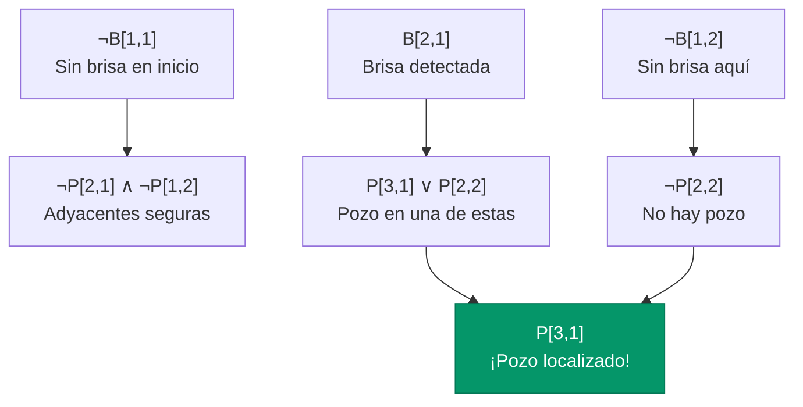

# Agentes Basados en Conocimiento: Wumpus World

Aplicando todo lo aprendido a un problema clásico de IA.

## Introducción: Poniendo Todo Junto

A lo largo de este módulo hemos aprendido:
- Cómo representar conocimiento (lógica proposicional)
- Cómo derivar nuevas conclusiones (inferencia)
- Qué podemos computar (SAT)

Ahora es momento de aplicar todo esto a un problema concreto. El **Wumpus World** es un entorno clásico de IA que nos permite ver cómo un agente puede usar lógica para razonar y tomar decisiones en un mundo parcialmente observable.

---

## El Wumpus World: Un Entorno Clásico

El Wumpus World fue introducido por Gregory Yob en 1973 como un juego de computadora y popularizado en el libro "Artificial Intelligence: A Modern Approach" de Russell y Norvig.

### La Situación

Imagina que eres un explorador en una cueva oscura. No puedes ver más allá de la celda donde estás. La cueva tiene tesoros, pero también peligros mortales. Tu objetivo: encontrar el oro y salir con vida.


### Los Elementos del Mundo

El mundo es una cuadrícula de 4×4 celdas con:

| Elemento | Descripción | ¿Cuántos? | ¿Qué pasa si lo encuentras? |
|----------|-------------|:---------:|----------------------------|
| **Agente (tú)** | Empieza en [1,1], mirando a la derecha | 1 | — |
| **Wumpus** | Un monstruo que huele muy mal | 1 | Mueres si entras a su celda |
| **Pozos** | Agujeros sin fondo en el suelo | Varios | Caes y mueres |
| **Oro** | ¡El objetivo! | 1 | Lo recoges y ganas |

**Nota sobre coordenadas:** Usamos [columna, fila], donde [1,1] es la esquina inferior izquierda.

### ¿Qué Puedes Percibir?

Aquí está lo interesante: no puedes ver lo que hay en otras celdas, pero hay **pistas**:

| Percepción | ¿Qué significa? | ¿Dónde se percibe? |
|------------|-----------------|-------------------|
| **Hedor (Stench)** | El Wumpus está en una celda adyacente | En las 4 celdas vecinas al Wumpus |
| **Brisa (Breeze)** | Hay un pozo en una celda adyacente | En las 4 celdas vecinas a cada pozo |
| **Brillo (Glitter)** | El oro está aquí mismo | Solo en la celda con el oro |
| **Golpe (Bump)** | Intentaste caminar contra una pared | Después de chocar |
| **Grito (Scream)** | Mataste al Wumpus | Si tu flecha lo alcanza |

**Importante:** "Adyacente" significa arriba, abajo, izquierda o derecha — no en diagonal.

### ¿Qué Puedes Hacer?

| Acción | Efecto |
|--------|--------|
| **Avanzar (Forward)** | Moverse una celda en la dirección que miras |
| **Girar izquierda** | Rotar 90° a la izquierda |
| **Girar derecha** | Rotar 90° a la derecha |
| **Agarrar (Grab)** | Recoger el oro (si estás en su celda) |
| **Disparar** | Lanzar tu única flecha en línea recta |
| **Escalar (Climb)** | Salir de la cueva (solo desde [1,1]) |

### Sistema de Puntuación

| Evento | Puntos |
|--------|:------:|
| Recoger el oro y salir | +1000 |
| Morir (pozo o Wumpus) | -1000 |
| Cada acción | -1 |
| Usar la flecha | -10 |

### Análisis PEAS

Recordando el framework PEAS de la Clase 2:

| Componente | En Wumpus World |
|------------|-----------------|
| **Performance** | Maximizar puntos (oro - muerte - acciones) |
| **Environment** | Cueva 4×4, parcialmente observable, determinista, estático |
| **Actuators** | 6 acciones posibles |
| **Sensors** | 5 tipos de percepciones |

**¿Por qué es interesante?**
- **Parcialmente observable**: No ves todo el mundo, solo tu celda
- **Determinista**: Las acciones tienen efectos predecibles
- **Secuencial**: Tus decisiones pasadas afectan el futuro

---

## ¿Por Qué No Funciona un Agente Simple?

Intentemos programar un agente reflejo simple:

```python
def agente_simple(percepcion):
    if percepcion.brillo:
        return 'Agarrar'
    if percepcion.brisa:
        return 'Girar'  # ¿Hacia dónde?
    if percepcion.hedor:
        return 'Huir'   # ¿A dónde?
    return 'Avanzar'    # ¿Es seguro?
```

**Problemas:**
1. Si hay brisa, ¿hacia dónde giro? No sé dónde está el pozo.
2. Si no hay brisa, ¿puedo avanzar? Tal vez sí, tal vez no.
3. El agente no tiene **memoria** de lo que ha visto antes.

**El problema fundamental:** Un agente reflejo solo mira la percepción actual. Pero para determinar si una celda es segura, necesitamos **combinar información** de múltiples percepciones en diferentes lugares.

### Un Ejemplo de Por Qué Necesitamos Razonar


**Situación:**
- Estuviste en [1,1]: sin brisa, sin hedor
- Avanzaste a [2,1]: ¡sientes brisa!

**¿Qué significa esto?**

La brisa en [2,1] indica que hay un pozo **adyacente** a [2,1]. Las celdas adyacentes son: [1,1], [3,1], [2,2].

Pero espera — estuviste en [1,1] y no moriste, así que no hay pozo ahí. Entonces el pozo debe estar en [3,1] o [2,2] (o ambos).

**¿Es seguro ir a [2,2]?** No lo sabemos todavía. Necesitamos más información.

Este tipo de razonamiento — combinar hechos, eliminar posibilidades, derivar conclusiones — es exactamente lo que la lógica proposicional nos permite hacer de manera sistemática.

---

## Representando el Mundo en Lógica

Para que nuestro agente pueda razonar, necesitamos traducir el mundo a lógica proposicional.

### Los Símbolos Proposicionales

Cada cosa que queremos representar necesita su propio símbolo:

| Símbolo | Significado | Ejemplo |
|---------|-------------|---------|
| $P_{x,y}$ | "Hay un pozo en la celda [x,y]" | $P_{3,1}$ = "Hay pozo en [3,1]" |
| $W_{x,y}$ | "El Wumpus está en [x,y]" | $W_{2,3}$ = "Wumpus en [2,3]" |
| $B_{x,y}$ | "Percibí brisa en [x,y]" | $B_{2,1}$ = "Brisa en [2,1]" |
| $S_{x,y}$ | "Percibí hedor en [x,y]" | $S_{1,3}$ = "Hedor en [1,3]" |
| $OK_{x,y}$ | "La celda [x,y] es segura" | $OK_{1,2}$ = "[1,2] es segura" |
| $V_{x,y}$ | "Ya visité [x,y]" | $V_{1,1}$ = "Visité [1,1]" |

### Las Reglas del Mundo

Ahora necesitamos expresar cómo funciona el mundo — las "leyes de la física" de Wumpus World.

#### Regla de la Brisa

"Hay brisa en una celda **si y solo si** hay un pozo en alguna celda adyacente."

Para la celda [2,2], esto se escribe:
$$B_{2,2} \leftrightarrow (P_{1,2} \lor P_{3,2} \lor P_{2,1} \lor P_{2,3})$$

Esto dice:
- Si hay brisa en [2,2], entonces hay pozo en [1,2], [3,2], [2,1] o [2,3]
- Si hay pozo en alguna de esas celdas, hay brisa en [2,2]

**Necesitamos escribir esta regla para cada celda del mapa.**

#### Regla del Hedor

Similar a la brisa:
$$S_{x,y} \leftrightarrow (W_{x-1,y} \lor W_{x+1,y} \lor W_{x,y-1} \lor W_{x,y+1})$$

"Hay hedor en [x,y] si y solo si el Wumpus está en alguna celda adyacente."

#### El Wumpus es Único

Solo hay un Wumpus. Esto requiere dos tipos de cláusulas:

**Al menos un Wumpus existe:**
$$W_{1,1} \lor W_{1,2} \lor W_{1,3} \lor \cdots \lor W_{4,4}$$

**A lo más un Wumpus existe** (para cada par de celdas diferentes):
$$\neg W_{1,1} \lor \neg W_{1,2}$$
$$\neg W_{1,1} \lor \neg W_{1,3}$$
$$\cdots$$

Esto dice "no pueden estar el Wumpus en [1,1] Y en [1,2] al mismo tiempo".

#### Definición de Seguridad

Una celda es segura si no tiene pozo ni Wumpus:
$$OK_{x,y} \leftrightarrow (\neg P_{x,y} \land \neg W_{x,y})$$

---

## Ejemplo Completo de Razonamiento

Veamos paso a paso cómo el agente razona.


### Estado Inicial

El agente está en [1,1] y percibe: **nada** (sin brisa, sin hedor, sin brillo).

**Añadimos a la base de conocimiento:**
- $\neg B_{1,1}$ (no hay brisa en [1,1])
- $\neg S_{1,1}$ (no hay hedor en [1,1])

### Primera Inferencia: Celdas Adyacentes a [1,1]

Tenemos la regla de brisa para [1,1]:
$$B_{1,1} \leftrightarrow (P_{0,1} \lor P_{2,1} \lor P_{1,0} \lor P_{1,2})$$

Pero [0,1] y [1,0] están fuera del mapa. Simplificando:
$$B_{1,1} \leftrightarrow (P_{2,1} \lor P_{1,2})$$

Sabemos que $\neg B_{1,1}$ (no hay brisa). Entonces:
$$\neg(P_{2,1} \lor P_{1,2})$$

Aplicando De Morgan:
$$\neg P_{2,1} \land \neg P_{1,2}$$

**Conclusión:** No hay pozo en [2,1] ni en [1,2].

Razonamiento similar con el hedor:
$$\neg S_{1,1} \rightarrow \neg W_{2,1} \land \neg W_{1,2}$$

**Conclusión:** El Wumpus no está en [2,1] ni en [1,2].

### ¿Son Seguras [2,1] y [1,2]?

Ahora podemos verificar:
$$OK_{2,1} = \neg P_{2,1} \land \neg W_{2,1} = True \land True = True$$

¡Sí! Las celdas [2,1] y [1,2] son **seguras** para visitar.

### El Agente se Mueve a [2,1]

Percibe: **brisa**.

**Añadimos:** $B_{2,1}$

La regla de brisa para [2,1]:
$$B_{2,1} \leftrightarrow (P_{1,1} \lor P_{3,1} \lor P_{2,0} \lor P_{2,2})$$

Simplificando (quitando fuera del mapa):
$$B_{2,1} \leftrightarrow (P_{1,1} \lor P_{3,1} \lor P_{2,2})$$

Sabemos que $B_{2,1}$ es verdadero. Además:
- $\neg P_{1,1}$ (el agente empezó ahí, no había pozo)

Entonces:
$$P_{3,1} \lor P_{2,2}$$

**Conclusión:** Hay un pozo en [3,1] o en [2,2], pero no sabemos cuál.

### El Agente Explora [1,2]

Regresa a [1,1] y va a [1,2]. Percibe: **nada** (sin brisa).

**Añadimos:** $\neg B_{1,2}$

La regla de brisa para [1,2]:
$$B_{1,2} \leftrightarrow (P_{0,2} \lor P_{2,2} \lor P_{1,1} \lor P_{1,3})$$

Como $\neg B_{1,2}$:
$$\neg P_{0,2} \land \neg P_{2,2} \land \neg P_{1,1} \land \neg P_{1,3}$$

**¡Importante!** Derivamos $\neg P_{2,2}$.

### La Inferencia Final

Teníamos: $P_{3,1} \lor P_{2,2}$ (de la brisa en [2,1])
Ahora sabemos: $\neg P_{2,2}$ (de la ausencia de brisa en [1,2])

Por silogismo disyuntivo:
$$\frac{P_{3,1} \lor P_{2,2}, \quad \neg P_{2,2}}{P_{3,1}}$$

**Conclusión definitiva:** ¡El pozo está en [3,1]!



---

## El Algoritmo del Agente

Con todo lo aprendido, podemos esbozar cómo funcionaría el agente:

```python
class AgenteLogico:
    def __init__(self):
        self.KB = BaseDeConocimiento()
        self.posicion = (1, 1)
        self.tiempo = 0
        
        # Añadir reglas del mundo
        self.KB.añadir_reglas_brisa()
        self.KB.añadir_reglas_hedor()
        self.KB.añadir_restricciones_wumpus()
    
    def siguiente_accion(self, percepcion):
        # 1. Registrar lo que percibimos
        self.KB.tell(self.crear_sentencia_percepcion(percepcion))
        
        # 2. Determinar celdas seguras
        celdas_seguras = []
        for celda in self.celdas_adyacentes():
            if self.KB.ask(f"OK_{celda}"):
                celdas_seguras.append(celda)
        
        # 3. Decidir qué hacer
        if percepcion.brillo:
            return 'Agarrar'
        elif celdas_seguras:
            # Ir a una celda segura no visitada
            destino = self.elegir_celda(celdas_seguras)
            return self.planificar_ruta(destino)
        else:
            # No hay opción segura conocida
            return self.evaluar_riesgos()
        
        self.tiempo += 1
```

Los métodos `ask()` y `tell()` son los que implementan la inferencia que vimos en las secciones anteriores.

---

## Limitaciones de Este Enfoque

Aunque funciona, la lógica proposicional tiene limitaciones importantes:

### 1. Explosión de Símbolos

Para un grid de $n \times n$ necesitamos aproximadamente:
- $n^2$ símbolos para pozos ($P_{x,y}$)
- $n^2$ símbolos para Wumpus ($W_{x,y}$)
- $n^2$ símbolos para brisa ($B_{x,y}$)
- $n^2$ símbolos para hedor ($S_{x,y}$)
- ... y más

Para 4×4: ~64 símbolos y cientos de cláusulas.
Para 100×100: ~40,000 símbolos. ¡Impráctico!

### 2. No Podemos Generalizar

Escribimos la misma regla para cada celda:
$$B_{1,1} \leftrightarrow \text{(pozos adyacentes a [1,1])}$$
$$B_{1,2} \leftrightarrow \text{(pozos adyacentes a [1,2])}$$
$$\cdots$$

Quisiéramos escribir: "Para toda celda, hay brisa si y solo si hay pozo adyacente."

Esto requiere **lógica de primer orden** (variables, cuantificadores), que está fuera del alcance de este módulo.

### 3. Incertidumbre Irreducible

A veces llegamos a conclusiones como "$P_{3,1} \lor P_{2,2}$" y no podemos avanzar más sin más información.

¿Qué hacemos? Las opciones son:
- Explorar más para obtener información
- Tomar una decisión arriesgada

Pero la lógica no nos dice **cuál opción es mejor**. Para eso necesitamos **probabilidad** y **utilidad esperada** — temas de la Clase 5.

---

## Ejercicios

:::exercise{title="Escribir Reglas en CNF" difficulty="1"}

Escribe las cláusulas CNF para la regla de brisa en la celda [2,2]:

"Hay brisa en [2,2] si y solo si hay un pozo en [1,2], [3,2], [2,1], o [2,3]"

Pista: Recuerda que $A \leftrightarrow B$ se convierte en $(A \rightarrow B) \land (B \rightarrow A)$.

:::

<details>
<summary><strong>Ver Solución</strong></summary>

**Paso 1:** Escribir el bicondicional
$$B_{2,2} \leftrightarrow (P_{1,2} \lor P_{3,2} \lor P_{2,1} \lor P_{2,3})$$

**Paso 2:** Separar en dos implicaciones

Implicación 1: $B_{2,2} \rightarrow (P_{1,2} \lor P_{3,2} \lor P_{2,1} \lor P_{2,3})$

Convertir a CNF: $\neg B_{2,2} \lor P_{1,2} \lor P_{3,2} \lor P_{2,1} \lor P_{2,3}$

Implicación 2: $(P_{1,2} \lor P_{3,2} \lor P_{2,1} \lor P_{2,3}) \rightarrow B_{2,2}$

Esto significa que **cada** disyunto implica $B_{2,2}$:
- $P_{1,2} \rightarrow B_{2,2}$ → $\neg P_{1,2} \lor B_{2,2}$
- $P_{3,2} \rightarrow B_{2,2}$ → $\neg P_{3,2} \lor B_{2,2}$
- $P_{2,1} \rightarrow B_{2,2}$ → $\neg P_{2,1} \lor B_{2,2}$
- $P_{2,3} \rightarrow B_{2,2}$ → $\neg P_{2,3} \lor B_{2,2}$

**CNF Final (5 cláusulas):**
1. $\neg B_{2,2} \lor P_{1,2} \lor P_{3,2} \lor P_{2,1} \lor P_{2,3}$
2. $\neg P_{1,2} \lor B_{2,2}$
3. $\neg P_{3,2} \lor B_{2,2}$
4. $\neg P_{2,1} \lor B_{2,2}$
5. $\neg P_{2,3} \lor B_{2,2}$

</details>

---

:::exercise{title="Inferencia Manual" difficulty="2"}

El agente ha explorado y tiene estos hechos en su KB:
- $\neg B_{1,1}$ (sin brisa en [1,1])
- $B_{2,1}$ (brisa en [2,1])
- $\neg B_{1,2}$ (sin brisa en [1,2])

Usando las reglas de brisa, determina:
1. ¿Qué puedes concluir sobre $P_{2,2}$?
2. ¿Qué puedes concluir sobre $P_{3,1}$?

Muestra tu razonamiento paso a paso.

:::

<details>
<summary><strong>Ver Solución</strong></summary>

**1. Conclusión sobre $P_{2,2}$:**

De $\neg B_{1,2}$ (sin brisa en [1,2]):
- Las celdas adyacentes a [1,2] son: [0,2] (fuera), [2,2], [1,1], [1,3]
- $\neg B_{1,2} \rightarrow \neg P_{2,2} \land \neg P_{1,1} \land \neg P_{1,3}$

Por lo tanto: **$\neg P_{2,2}$** (no hay pozo en [2,2])

**2. Conclusión sobre $P_{3,1}$:**

De $B_{2,1}$ (brisa en [2,1]):
- Las celdas adyacentes a [2,1] son: [1,1], [3,1], [2,0] (fuera), [2,2]
- $B_{2,1} \rightarrow P_{1,1} \lor P_{3,1} \lor P_{2,2}$

Sabemos:
- $\neg P_{1,1}$ (el agente empezó ahí)
- $\neg P_{2,2}$ (derivado arriba)

Aplicando silogismo disyuntivo:
$$P_{1,1} \lor P_{3,1} \lor P_{2,2}$$
$$\neg P_{1,1}$$
$$\neg P_{2,2}$$
$$\therefore P_{3,1}$$

**Conclusión: $P_{3,1}$** (hay un pozo en [3,1])

</details>

---

:::exercise{title="Diseñar Estrategia" difficulty="2"}

Supón que el agente está en la siguiente situación:
- Ha determinado que el Wumpus podría estar en [2,3] o [3,2] (no sabe cuál)
- El oro está en [3,3]
- Para llegar al oro, debe pasar por [2,3] o [3,2]
- Tiene una flecha

¿Qué debería hacer el agente? Discute las opciones y sus riesgos.

:::

<details>
<summary><strong>Ver Solución</strong></summary>

**Análisis de la situación:**
- Probabilidad de Wumpus en [2,3]: 50%
- Probabilidad de Wumpus en [3,2]: 50%
- Ambos caminos son igualmente riesgosos

**Opciones:**

**Opción 1: Disparar a ciegas**
- Disparar hacia [2,3] o [3,2]
- Si el Wumpus está ahí, lo matas (escuchas grito)
- Si no, perdiste la flecha y el otro camino sigue peligroso
- Costo: -10 puntos, 50% de éxito

**Opción 2: Explorar más**
- Ir a celdas seguras que den información (buscar hedor)
- Si encuentras hedor en alguna celda, puedes triangular la posición del Wumpus
- Costo: más acciones (-1 cada una), pero información valiosa

**Opción 3: Tomar el riesgo**
- Entrar a [2,3] o [3,2] directamente
- 50% de morir (-1000), 50% de sobrevivir
- Valor esperado: $0.5 \times 0 + 0.5 \times (-1000) = -500$

**Opción 4: Disparar estratégicamente**
- Ir a una celda desde donde puedas disparar hacia ambas ubicaciones posibles
- Si no existe tal celda, elegir la que cubra la más probable

**Mejor estrategia:** Explorar para encontrar hedor y reducir incertidumbre. Si no es posible, disparar al azar tiene mejor valor esperado que entrar sin disparar.

**Esta situación ilustra por qué necesitamos probabilidad:** La lógica nos dice "está en uno de los dos lugares" pero no cómo decidir. La probabilidad nos da herramientas para tomar decisiones bajo incertidumbre.

</details>

---

:::homework{id="wumpus-kb" title="Implementar KB del Wumpus" deadline="2025-02-14"}

Implementa en Python una base de conocimiento simple para el Wumpus World:

**Requisitos:**

1. Una clase `WumpusKB` con métodos:
   - `tell(sentencia)`: añade una sentencia a la KB
   - `ask(consulta)`: retorna True si la KB implica la consulta

2. Representar al menos:
   - Reglas de brisa para un grid 4×4
   - Hechos sobre percepciones

3. Demostrar la inferencia del ejemplo:
   - Input: $\neg B_{1,1}$, $B_{2,1}$, $\neg B_{1,2}$
   - Output: localizar el pozo en [3,1]

**Entrega:**
- Código Python documentado
- Al menos 3 casos de prueba
- Documento explicando tu implementación

:::

---

## Conexión con el Resto del Curso

### Lo Que Hemos Logrado

En este módulo aprendimos a:
- Representar conocimiento sin ambigüedad (lógica proposicional)
- Derivar conclusiones automáticamente (inferencia)
- Entender los límites computacionales (SAT)
- Aplicar todo a un problema real (Wumpus World)

### Lo Que Falta

El Wumpus World nos muestra claramente las limitaciones de la lógica binaria:

| Lo que queremos expresar | ¿Podemos en lógica? | Solución |
|--------------------------|:-------------------:|----------|
| "El pozo está en [3,1] o [2,2]" | ✓ Sí | — |
| "Probablemente está en [3,1]" | ✗ No | Probabilidad (Clase 5) |
| "¿Vale la pena el riesgo?" | ✗ No | Utilidad esperada |
| "Para toda celda, si hay brisa..." | ✗ No | Lógica de primer orden |

**La Clase 5 extenderá nuestras herramientas** para manejar incertidumbre de manera cuantitativa.

---

## Puntos Clave

1. **Wumpus World** es un entorno clásico para estudiar agentes que razonan
2. Un **agente reflejo simple no funciona** — se necesita razonamiento
3. Representamos el mundo con **símbolos proposicionales**: $P_{x,y}$, $W_{x,y}$, $B_{x,y}$
4. Las **reglas del mundo** (brisa ↔ pozo adyacente) se codifican como fórmulas
5. El agente **combina percepciones** de diferentes lugares para inferir hechos
6. La lógica proposicional tiene **limitaciones**: muchos símbolos, no generaliza, no maneja probabilidad
7. El Wumpus World **motiva** el estudio de probabilidad y decisiones bajo incertidumbre
