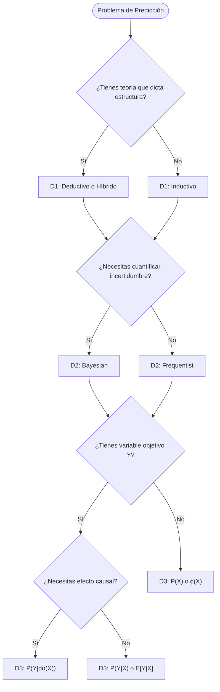

# Taxonomía de la Predicción en IA: Resumen Ejecutivo

## El Problema Fundamental

Queremos estimar **P(Y|X,Z)** o algún funcional de ella (media, quantiles, moda).

**El dilema**: Datos finitos + espacio de funciones infinito = necesitamos **restricciones**.

**Insight clave**: Todo método de predicción es una forma de restringir el espacio de hipótesis. Las diferencias entre métodos son diferencias en **qué restricciones imponen y de dónde vienen**.

---

## Las 5 Dimensiones Ortogonales

No existe UNA taxonomía correcta. Existen **5 ejes independientes** que debes decidir. Cada método es un punto en este espacio 5-dimensional.

```
Método = (D1: Fuente, D2: Probabilidad, D3: Objetivo, D4: Arquitectura, D5: Restricción)
```

| Dimensión | Pregunta Clave | Opciones |
|-----------|----------------|----------|
| **D1: Fuente de Estructura** | ¿De dónde viene la estructura del modelo? | Deductivo, Inductivo, Híbrido |
| **D2: Interpretación de Probabilidad** | ¿Qué significa "probabilidad"? | Frequentist, Bayesian, Propensity* |
| **D3: Objetivo Matemático** | ¿Qué cantidad estás estimando? | **P(Y\|X)**, **E[Y\|X]**, **P(X)**, **ϕ(X)**, **P(Y\|do(X))** |
| **D4: Arquitectura de Variables** | ¿Cómo se relacionan las variables? | Flat, Generativa, Latente, Grafos/PGM, Causal |
| **D5: Mecanismo de Restricción** | ¿Cómo restringes el espacio de hipótesis? | Arquitectura, Penalización, Prior, Calibración, Validación, Invarianza |

*\*Nota sobre D2: Popper defendió "Propensity" como tendencia objetiva del mundo. Jaynes (en "Probability Theory: The Logic of Science") argumenta que la "aleatoriedad" de una urna o baraja es realmente **incertidumbre epistémica** - no conocemos (o elegimos no modelar) la física mecánica. Ver documento completo para más detalle.*

---

## Mapa Visual de las 5 Dimensiones

```mermaid
flowchart LR
    subgraph D1 [D1: Fuente]
        DED[Deductivo]
        IND[Inductivo]
        HIB[Híbrido]
    end
    
    subgraph D2 [D2: Probabilidad]
        FREQ[Frequentist]
        BAYES[Bayesian]
    end
    
    subgraph D3 [D3: Objetivo]
        PYX["P(Y|X) o E[Y|X]"]
        PX["P(X) o ϕ(X)"]
        DOX["P(Y|do(X))"]
    end
    
    subgraph D4 [D4: Arquitectura]
        FLAT[Flat]
        GEN[Generativa]
        LAT[Latente]
        GRAF[Grafos/Causal]
    end
    
    subgraph D5 [D5: Restricción]
        ARQ[Arquitectura]
        REG[Regularización]
        PRI[Prior/Calibración]
    end
    
    D1 -.-> D2
    D2 -.-> D3
    D3 -.-> D4
    D4 -.-> D5
```



**Lectura**: Las dimensiones son independientes. Puedes combinar cualquier opción de cada una.

---

## Tabla de Métodos Comunes

| Método | D1 | D2 | D3 | D4 | D5 |
|--------|----|----|----|----|-----|
| Regresión Lineal | Inductivo | Freq | **E[Y\|X]** | Flat | L2 |
| Random Forest | Inductivo | Freq | **E[Y\|X]** | Flat | Ensemble |
| Deep Neural Net | Inductivo | Freq | **E[Y\|X]** | Flat | Arquitectura |
| Gaussian Process | Inductivo | Bayes | **P(Y\|X)** | Flat | Kernel |
| VAE | Inductivo | Bayes | **P(X)** | Latente | Prior |
| DSGE calibrado | Deductivo | Freq | **P(Y\|X)** | Grafo | Momentos |
| Causal Forest | Inductivo | Freq | **P(Y\|do(X))** | Causal | Invarianza |
| Autoencoder | Inductivo | Freq | **ϕ(X)** | Latente | Arquitectura |
| GPT/BERT | Inductivo | Freq | **P(X₂\|X₁)** | Latente | Transformer |
| K-Means | Inductivo | Freq | Clusters | Flat | K fijo |

---

## Guía de Decisión Rápida



---

## Jerarquía Matemática de Objetivos

| Más General | → | Más Específico |
|-------------|---|----------------|
| **P(X,Y)** conjunta | → | **P(Y\|X)** condicional |
| **P(Y\|X)** distribución | → | **E[Y\|X]** solo media |
| **P(X)** densidad | → | **ϕ(X)** representación |

**Regla**: Si conoces la cantidad más general, puedes derivar las más específicas. No al revés.

---

## Combinaciones Típicas por Dominio

| Dominio | Combinación típica |
|---------|-------------------|
| **Deep Learning estándar** | Inductivo + Freq + **E[Y\|X]** + Flat + Arquitectura |
| **Economía estructural** | Deductivo + Freq + Grafo + Momentos |
| **Bayesian ML** | Inductivo + Bayes + **P(Y\|X)** + Flat + Prior |
| **Self-supervised (GPT, BERT)** | Inductivo + Freq + **P(X₂\|X₁)** + Latente + Transformer |
| **Causal ML** | Inductivo + Freq + **P(Y\|do(X))** + Causal + Invarianza |

---

**Documento completo**: Ver `01_taxonomia_prediccion.md` para definiciones detalladas, ejemplos y casos de estudio.
