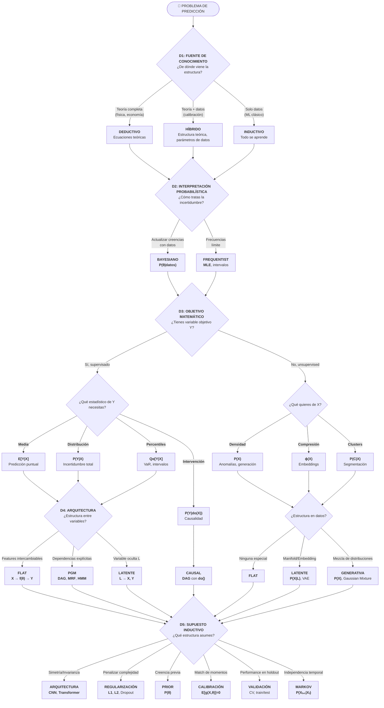

# Taxonomía de la Predicción en IA

> *"Knowing the future can be a kind of imprisonment."*  
> — Paul Atreides, Dune

Predecir es un problema fundamental en IA, pero no lo es todo, solo e suna parte del proceso que puede ayudar a los agentes a entender el mundo *¿De dónde viene el conocimiento? ¿Qué significa la incertidumbre? ¿Qué queremos realmente del modelo?*

Empecemos por entender la estructura.

---

## Parte 0: El Problema Fundamental

### ¿Qué es predecir?

En su forma más general, **predecir** es estimar alguna cantidad desconocida a partir de información disponible.

**Notación**:
- **Y**: Variable objetivo (lo que queremos predecir)
- **X**: Variables observables / features
- **Z**: Información auxiliar observable / proxies
- **L**: Variable latente (no observada, inferida por el modelo)
- **C**: Cluster o categoría discreta
- **θ**: Parámetros del modelo

### El objetivo matemático

Dependiendo del contexto, podemos querer estimar diferentes cantidades. Cada una responde a una pregunta diferente:

**Nota importante sobre la notación:**
En estas notas usamos **E[·]** (valor esperado/media) como el estadístico principal por ser el más común en la práctica. Sin embargo, formalmente podríamos querer estimar **cualquier funcional o estadístico** de la distribución:

| Estadístico | Notación | Cuándo usarlo |
|-------------|----------|---------------|
| **Media** | E[Y\|X] | Predicción puntual, minimiza MSE |
| **Mediana** | Q₀.₅[Y\|X] | Robusto a outliers, minimiza MAE |
| **Quantiles** | Qα[Y\|X] | Riesgo (VaR), intervalos de predicción |
| **Varianza** | Var[Y\|X] | Incertidumbre, volatilidad |
| **Moda** | Mode[Y\|X] | Valor más probable |

Donde dice **E[Y\|X]**, léase como "un estadístico de Y dado X" - la media es simplemente el caso más frecuente.

| Objetivo | Notación | Descripción |
|----------|----------|-------------|
| Distribución marginal de Y | **P(Y)** | Distribución de Y sin condicionar en nada |
| Media incondicional | **E[Y]** | Solo la media de Y (el baseline más simple) |
| Distribución condicional completa | **P(Y\|X,Z)** | Toda la forma de la distribución de Y dado X y Z |
| Valor esperado condicional | **E[Y\|X,Z]** | Solo la media de Y dado X y Z |
| Distribución de los datos | **P(X)** o **P(X,Z)** | La densidad de los inputs (sin objetivo) |
| Representación | **ϕ(X) → ℝᵈ** | Un embedding o compresión de X |
| Efecto causal | **P(Y\|do(X))** | El resultado de *intervenir* en X |

#### Explicación de cada objetivo:

**P(Y) - Distribución marginal**
> "¿Cómo se distribuye Y en general, sin saber nada más?"

Es la distribución de Y ignorando cualquier información de X o Z. Es el punto de partida: si no conoces ningún feature, ¿qué puedes decir de Y?

*Ejemplo*: Distribución de retornos diarios del S&P 500. Sin saber nada del contexto (qué día es, qué pasó en el mercado), ¿cuál es la probabilidad de un retorno de +2%? La respuesta está en P(Y).

**E[Y] - Media incondicional (el baseline)**
> "¿Cuál es el promedio histórico de Y?"

Es el predictor más simple posible cuando no tienes features. **Todo modelo más complejo debe superar este baseline** para justificar su complejidad.

**Nota**: El "mejor" estadístico incondicional depende de la función de pérdida:
| Si minimizas... | El baseline óptimo es... | Notación |
|-----------------|-------------------------|----------|
| Error cuadrático (MSE) | **Media** | E[Y] |
| Error absoluto (MAE) | **Mediana** | Q₀.₅[Y] |
| Pérdida asimétrica | **Quantil** correspondiente | Qα[Y] |

*Ejemplo*: "El precio promedio de una casa es $300,000". Si tu modelo sofisticado con 50 features no supera esta predicción naive, algo está mal. E[Y] es el piso mínimo de performance (para MSE).

**P(Y|X) - Distribución condicional completa**
> "Dado que observo X, ¿cuál es la distribución completa de posibles valores de Y?"

No solo te dice el valor más probable, sino toda la forma: ¿es simétrica? ¿tiene colas pesadas? ¿es multimodal? Esto es crucial cuando necesitas cuantificar incertidumbre.

*Ejemplo*: Pronóstico del clima. No solo "mañana habrá 20°C", sino la distribución completa: 10% probabilidad de <15°C, 60% de 18-22°C, 30% de >22°C.

**E[Y|X] - Valor esperado (media condicional)**
> "Dado que observo X, ¿cuál es el valor promedio esperado de Y?"

Es un solo número - el "mejor guess" en sentido de mínimo error cuadrático. Pierdes información sobre variabilidad.

*Ejemplo*: Predicción de precio de casa. El modelo dice "$250,000" - un número, no una distribución.

**Nota sobre series de tiempo:**
Las series de tiempo son un caso especial donde los features X son la **historia de la misma variable Y**:
- P(Y_{t+1} | Y_t, Y_{t-1}, ...) es P(Y|X) donde X = {Y_t, Y_{t-1}, ...} (pero con diferentes supuestos)
- Modelos como AR, ARIMA, LSTM, y Transformers temporales usan esta estructura
- El baseline **E[Y]** sigue siendo relevante: un modelo temporal que no supere "predecir la media histórica" no aporta valor
- También existe el baseline "naive" de series de tiempo: predecir Y_{t+1} = Y_t (el último valor observado)

**La propiedad de Markov (memorylessness):**
Una simplificación poderosa es asumir que **solo el presente importa**:
- **P(Y_{t+1} | Y_t, Y_{t-1}, ...) = P(Y_{t+1} | Y_t)** ← Propiedad de Markov
- "El futuro es independiente del pasado dado el presente"
- Reduce drásticamente la complejidad: de historia infinita a un solo estado
- Es un supuesto **deductivo/híbrido**: decides a priori que la historia lejana es irrelevante
- Modelos: Cadenas de Markov, Hidden Markov Models (HMM), filtros de Kalman

**P(X) - Distribución de los datos**
> "¿Cuál es la probabilidad de observar este input X?"

No hay variable objetivo Y. Modelas cómo se distribuyen los datos en sí mismos.

*Ejemplo*: Detección de fraude. Si P(transacción) es muy baja, la transacción es "rara" → posible fraude.

**ϕ(X) → ℝᵈ - Representación (embedding)**
> "¿Cómo puedo comprimir X en un vector de dimensión menor que capture su esencia?"

Es una función determinista que mapea inputs a un espacio de menor dimensión. No es probabilístico.

*Ejemplo*: Word2Vec convierte palabras en vectores de 300 dimensiones donde "rey - hombre + mujer ≈ reina".

**P(Y|do(X)) - Efecto causal (intervención)**
> "Si yo CAMBIO X activamente, ¿qué pasa con Y?"

Es diferente de P(Y|X) que solo pregunta "si OBSERVO X". La diferencia es crucial:
- P(Y|X): "Las personas que toman aspirina tienen menos infartos" (correlación)
- P(Y|do(X)): "Si le DOY aspirina a alguien, ¿tendrá menos infartos?" (causación)

*Ejemplo*: Si observas que ciudades con más heladerías tienen más crimen, P(crimen|heladerías) es alto. Pero P(crimen|do(cerrar heladerías)) no baja el crimen - ambos son causados por el calor.

### Jerarquía de generalidad

```
                                    Más información / Más general
                                              ▲
                                              │
┌─────────────────────────────────────────────┴─────────────────────────────────────────────┐
│                                                                                           │
│   P(X,Y,Z)  ─────────────────────── Distribución conjunta completa                        │
│       │                                                                                   │
│       ├──► P(Y|X,Z) ──► E[Y|X,Z] ──► Predicción condicional                               │
│       │        │                                                                          │
│       │        └──► Var[Y|X,Z], Q_α[Y|X,Z] ──► Varianza, quantiles                        │
│       │                                                                                   │
│       ├──► P(Y) ──► E[Y] ──► Baseline (predicción sin features)                           │
│       │                                                                                   │
│       ├──► P(X,Z) ──► P(X) ──► Generación, detección de anomalías                         │
│       │                 │                                                                 │
│       │                 └──► ϕ(X) ──► Representación (compresión con pérdida)             │
│       │                                                                                   │
│       └──► P(X|Y) ──► Inferencia inversa (¿qué X generó este Y?)                          │
│                                                                                           │
└───────────────────────────────────────────────────────────────────────────────────────────┘
                                              │
                                              ▼
                                    Menos información / Más específico


    ¿Y el efecto causal P(Y|do(X))?
    
    P(Y|do(X)) NO se deriva de P(X,Y) directamente. Requiere información adicional:
    estructura causal (un DAG) que te dice qué variables causan qué.
    
    P(X,Y,Z) + Estructura Causal ──► P(Y|do(X))
```

**Regla clave**: Si conoces una cantidad más general (arriba), puedes derivar las más específicas (abajo). No al revés. Más información siempre puede comprimirse; menos información no puede expandirse.

**¿Por qué ϕ(X) está "debajo" de P(X)?**
- De P(X) puedes derivar muchas representaciones ϕ(X) (ej: los modos de la distribución, componentes principales)
- De ϕ(X) no puedes recuperar P(X) - perdiste información al comprimir

**¿Por qué P(Y|do(X)) está separado?**
- No puedes derivar efectos causales solo de datos observacionales P(X,Y)
- Necesitas supuestos adicionales sobre la estructura causal
- Por eso causalidad requiere más que solo "más datos"

**¿Por qué E[Y] importa como baseline?**

E[Y] es el **baseline universal** contra el que todo modelo predictivo debe compararse:
- Si tu modelo E[Y|X] no mejora sobre predecir E[Y] siempre, los features X no aportan información útil
- En ML esto se mide con métricas como **R²** (qué porcentaje de varianza explica el modelo sobre el baseline)
- Un R² de 0 significa: "mi modelo sofisticado no es mejor que predecir la media"
- Un R² negativo significa: "mi modelo es PEOR que predecir la media" (sobreajuste o error)

La pregunta fundamental antes de construir cualquier modelo complejo es: **¿Mis features X realmente ayudan a predecir Y mejor que simplemente usar E[Y]?** Si la respuesta es no, el modelo más sofisticado del mundo no te salvará.

Por ejemplo:
- De **P(Y|X)** puedes calcular **E[Y|X] = ∫ y · P(y|X) dy**
- De **E[Y|X]** **no puedes** recuperar **P(Y|X)** (perdiste información sobre varianza, forma, etc.)

### El problema fundamental: Restricción

> *"The future is always a surprise to those who look too far ahead."*  
> — Children of Dune

Imagina que tienes tres puntos en un plano y quieres trazar la curva que los conecta. ¿Cuál eliges? Podría ser una línea recta. Podría ser una parábola. Podría ser una onda sinusoidal. Podría ser un garabato que pasa exactamente por los tres puntos y luego hace piruetas absurdas.

Matemáticamente, **todas son válidas**. Los datos — esos tres puntos — no te dicen cuál es "la correcta".

Esta es la paradoja central de la predicción: los datos nunca son suficientes. Siempre necesitas algo más — un supuesto, una creencia, una restricción sobre qué curvas son "razonables". Cada método de predicción es, en el fondo, una respuesta diferente a esta pregunta: *¿qué formas del mundo consideras plausibles?*

**El dilema formal**:
- Tenemos **datos finitos** (N observaciones)
- El espacio de funciones posibles es **infinito**
- Hay infinitos modelos que ajustan perfectamente los datos de entrenamiento

**Consecuencia**: 
Todo método de predicción es una forma de **restringir el espacio de hipótesis**. Las diferencias entre métodos son diferencias en:
1. **Qué restricciones** imponen
2. **De dónde vienen** esas restricciones
3. **Cómo se expresan** matemáticamente

De los datos viene el ajuste. De la teoría viene la estructura. De la restricción viene la generalización.

Esta es la base de nuestra taxonomía.

---

Ahora que entendemos qué significa predecir y por qué necesitamos restringir nuestras hipótesis, podemos preguntarnos: ¿cuáles son las decisiones fundamentales que definen cualquier método de predicción?

## Parte 1: Las 5 Dimensiones Ortogonales

No existe UNA forma correcta de categorizar los métodos de predicción. Pero existe una forma *útil*: pensar en **5 ejes independientes** que caracterizan cualquier enfoque. Cada método es un punto en este espacio 5-dimensional. La magia desaparece cuando puedes nombrar las coordenadas.

```
Método = (D1: Fuente del Conocimiento Estructural, 
          D2: Interpretación de Probabilidad, 
          D3: Objetivo Matemático, 
          D4: Arquitectura de Variables, 
          D5: Supuesto Inductivo)
```

Las dimensiones son **ortogonales**: puedes elegir cualquier combinación de opciones en cada eje.

---

### Dimensión 1: Fuente del Conocimiento Estructural

> *"In theory, theory and practice are the same. In practice, they are not."*

*Antes de los datos, está la pregunta: ¿qué sabes ya?*

**Pregunta clave**: *"¿De dónde viene la estructura del modelo?"*

Hay dos caminos para saber algo del mundo. El primero dice: *pienso, luego predigo*. El segundo dice: *observo, luego generalizo*. Esta es quizás la dimensión más fundamental. Antes de hablar de algoritmos o matemáticas, debemos preguntarnos: ¿qué **sabemos** (o creemos saber) sobre el problema antes de ver los datos?

| Tipo | Descripción | Ejemplos | Situación real |
|------|-------------|----------|----------------|
| **Deductivo** | La estructura viene de teoría/axiomas previos a los datos | Modelos físicos, DSGE en economía, sistemas expertos | *Simulación de vuelo*: ecuaciones de aerodinámica definen el modelo, datos solo validan |
| **Inductivo** | La estructura emerge de patrones en los datos | ML clásico, Deep Learning, clustering | *Recomendador de Netflix*: no hay "teoría de gustos", solo patrones en millones de usuarios |
| **Híbrido** | Teoría provee esqueleto, datos ajustan parámetros | Calibración económica, Physics-Informed NNs, Bayesian con priors informativos | *Modelo macroeconómico*: teoría dice que consumo depende de ingreso esperado, datos calibran elasticidades |

---

#### Enfoque Deductivo: "La teoría primero"

En el enfoque deductivo, **la estructura del modelo existe antes de ver cualquier dato**. Viene de:
- Leyes físicas (Newton, Maxwell, termodinámica)
- Axiomas económicos (optimización de agentes, equilibrio de mercados)
- Lógica formal (reglas de inferencia, ontologías)

**Flujo deductivo:**
```
Axiomas/Teoría  ──►  Modelo Matemático  ──►  Predicciones  ──►  Datos validan/refutan
```

**Características:**
- El modelo puede existir sin datos (ej: ecuaciones de Einstein existían antes de confirmarlas)
- Los datos sirven para **validar** o **refutar**, no para descubrir estructura
- Alta interpretabilidad: cada término tiene significado teórico
- Puede fallar si la teoría está equivocada

**Ejemplo detallado - Física:**
Las ecuaciones de Navier-Stokes describen fluidos. No las "aprendimos" de datos - las derivamos de principios de conservación (masa, momento, energía). Un simulador de clima usa estas ecuaciones; los datos solo calibran condiciones iniciales.

**Ejemplo detallado - Economía (DSGE):**
Un modelo DSGE parte de supuestos: hogares maximizan utilidad, firmas maximizan ganancias, mercados se equilibran. De estos axiomas se derivan ecuaciones (Euler, Phillips). La estructura está fijada; los datos solo determinan valores de parámetros como elasticidades.

---

#### Enfoque Inductivo: "Los datos primero"

En el enfoque inductivo, **la estructura emerge de los patrones en los datos**. No hay teoría previa que dicte la forma funcional.

**Flujo inductivo:**
```
Datos  ──►  Buscar patrones  ──►  Modelo que ajusta  ──►  Predicciones
```

**Características:**
- Sin datos, no hay modelo
- El modelo "descubre" relaciones que no conocíamos
- Puede encontrar patrones no lineales, interacciones complejas
- Riesgo: puede encontrar patrones espurios (correlación sin causación)
- Menor interpretabilidad: ¿qué significa el peso 0.73 en la capa 5?

**Ejemplo detallado - Recomendador de Netflix:**
No existe una "teoría de gustos cinematográficos" que diga que si te gusta X, te gustará Y. El sistema observa millones de usuarios, encuentra patrones (gente que vio A también vio B), y los explota. La estructura (qué factores importan) emerge de los datos.

**Ejemplo detallado - Reconocimiento de imágenes:**
No hay axiomas que digan "un gato tiene orejas puntiagudas y bigotes". La red neuronal ve millones de imágenes etiquetadas y aprende features discriminativas. Nadie programó qué buscar.

---

#### Enfoque Híbrido: "Lo mejor de ambos mundos"

El enfoque híbrido combina conocimiento teórico con aprendizaje de datos. La teoría provee el **esqueleto**, los datos ajustan los **detalles**.

**Flujo híbrido:**
```
Teoría parcial  ──►  Estructura con "huecos"  ──►  Datos llenan huecos  ──►  Modelo completo
```

**Variantes del enfoque híbrido:**

| Variante | Qué provee la teoría | Qué proveen los datos |
|----------|---------------------|----------------------|
| **Calibración** | Forma funcional completa | Valores de parámetros |
| **Physics-Informed NN** | Restricciones (ej: conservación de energía) | Función de aproximación |
| **Priors informativos** | Distribución a priori sobre parámetros | Actualización posterior |
| **Modelos semi-paramétricos** | Parte paramétrica (teoría) | Parte no-paramétrica (datos) |

**Ejemplo detallado - Calibración económica:**
Un modelo macroeconómico tiene la forma: `C = f(Y, r, θ)` donde:
- La teoría dice que Consumo (C) depende de Ingreso (Y) y tasa de interés (r)
- La forma funcional f viene de optimización de hogares
- Pero el parámetro θ (elasticidad) no lo dice la teoría
- Los datos determinan θ mediante match de momentos (ej: ajustar para que el modelo reproduzca la volatilidad observada del PIB)

**Ejemplo detallado - Physics-Informed Neural Networks:**
Quieres predecir el flujo de calor en un material. Sabes que debe satisfacer la ecuación de calor (∂T/∂t = α∇²T). En lugar de solo minimizar error de predicción, agregas un término al loss que penaliza violar la ecuación. La red aprende una función que:
1. Ajusta los datos observados
2. Respeta la física conocida

---

**El caso de la calibración económica (expandido):** 

La calibración es el ejemplo canónico de enfoque híbrido en ciencias sociales:

```
┌─────────────────────────────────────────────────────────────────────┐
│                                                                     │
│   TEORÍA (Deductivo)                    DATOS (Inductivo)          │
│   ─────────────────                     ────────────────           │
│   • Hogares maximizan utilidad          • Series de tiempo del PIB │
│   • Firmas maximizan ganancias          • Inflación observada      │
│   • Mercados se equilibran              • Tasas de interés         │
│            │                                     │                  │
│            ▼                                     ▼                  │
│   Ecuaciones estructurales              Momentos empíricos         │
│   (Euler, Phillips, etc.)               (media, varianza, corr)    │
│            │                                     │                  │
│            └──────────────┬──────────────────────┘                  │
│                           ▼                                         │
│                    CALIBRACIÓN                                      │
│            Encontrar θ tal que momentos del                         │
│            modelo ≈ momentos de los datos                           │
│                           │                                         │
│                           ▼                                         │
│                  Modelo calibrado                                   │
│            (estructura teórica + parámetros empíricos)              │
│                                                                     │
└─────────────────────────────────────────────────────────────────────┘
```

La teoría te dice *qué* variables se relacionan y *cómo* (funcionalmente). Los datos te dicen los *valores numéricos* de los parámetros.

**Nota importante: DSGE vs Calibración**

Es común confundir estos términos porque suelen aparecer juntos, pero son cosas distintas:

| Concepto | ¿Qué es? | Dimensión |
|----------|----------|-----------|
| **DSGE** | Un **tipo de modelo** (estructura basada en teoría micro: agentes optimizando, equilibrio general) | D1 (Deductivo) + D4 (Arquitectura de grafo/ecuaciones) |
| **Calibración** | Una **técnica de estimación** (elegir parámetros para reproducir momentos observados) | D5 (Supuesto inductivo) |

```
DSGE puede estimarse con:        Calibración puede aplicarse a:
├── Calibración ←──────────────→ ├── DSGE
├── Maximum Likelihood           ├── Modelos de agentes
├── Bayesiano                    ├── Simulaciones físicas
└── GMM (Momentos Generalizados) └── Cualquier modelo con parámetros libres
```

En otras palabras: **DSGE es el "qué"** (qué modelo usas), **calibración es el "cómo"** (cómo estimas sus parámetros).

---

**Atrapar una pelota:**

Un niño de 5 años puede atrapar una pelota en el aire. No sabe física. No calcula trayectorias parabólicas ni resuelve ecuaciones diferenciales. Simplemente ha lanzado y atrapado pelotas cientos de veces. Su cerebro aprendió el patrón. Esto es **inductivo**.

Un ingeniero de la NASA calcula exactamente dónde caerá un satélite. Usa las leyes de Newton, la resistencia del aire, la rotación de la Tierra. Nunca ha "practicado" con satélites cayendo — deriva la respuesta de principios físicos. Esto es **deductivo**.

¿Quién predice mejor? El niño falla si le lanzas algo que nunca ha visto — un frisbee, una pluma. El ingeniero puede predecir objetos que nunca ha observado, pero necesita conocer todas las fuerzas involucradas. Puede que el niñe no pueda predecir apriori pero es capaz de atrapar la pelota, el ingeniere puede ser capaz de predecir apriori pero incapaz de atrapar la pelota.

No tienen que ser excluyentes, pueden ser híbridos.
---

**Intuición resumida:**
- **Deductivo**: "Sé cómo funciona el mundo; los datos confirman"
- **Inductivo**: "No sé cómo funciona; los datos me lo dirán"
- **Híbrido**: "Tengo una idea aproximada; los datos la refinan"

**¿Cuándo usar cada uno?**

| Situación | Enfoque recomendado |
|-----------|---------------------|
| Tienes teoría sólida y bien establecida | Deductivo |
| No hay teoría, solo datos abundantes | Inductivo |
| Teoría parcial + necesitas generalizar | Híbrido |
| Datos escasos pero conocimiento experto | Híbrido (priors) |
| Necesitas interpretabilidad/explicabilidad | Deductivo o Híbrido |
| Solo importa precisión predictiva | Inductivo |

---

### Dimensión 2: Interpretación de Probabilidad/Incertidumbre

*La probabilidad es un número. Pero ¿qué significa ese número?*

**Pregunta clave**: *"Cuando digo 'hay 70% de probabilidad de lluvia', ¿qué significa ese número?"*

Dos estadísticos miran la misma moneda.

El **frecuentista** dice: "Existe una probabilidad verdadera de que caiga cara. No la conozco, pero si repito el experimento miles de veces, la frecuencia observada me la revelará."

El **bayesiano** dice: "La moneda ya tiene un lado arriba — solo no lo veo. Mi '50%' no describe la moneda, describe *lo que yo sé*. Si viera cómo la lanzas — el ángulo, la fuerza — mi probabilidad cambiaría. La incertidumbre está en mí, no en ella."

Ninguno está equivocado. El primero habla del mundo. El segundo habla del conocimiento sobre el mundo.

| Interpretación | Filosofía | Qué es un parámetro **θ** | Qué es incertidumbre | Situación real |
|----------------|-----------|------------------------------|----------------------|----------------|
| **Frequentist** | Probabilidad = frecuencia límite en repeticiones infinitas | Constante fija desconocida | Variabilidad muestral | *A/B testing*: "si repitiera el experimento infinitas veces, ¿qué fracción favorece A?" |
| **Bayesian** | Probabilidad = grado de creencia subjetivo | Variable aleatoria con distribución | Se actualiza con evidencia | *Diagnóstico médico*: "dado el historial del paciente, mi creencia de que tiene X es 30%" |
| **Propensity** | Probabilidad = tendencia inherente del sistema | Propiedad del mecanismo causal | Irreducible, parte de la realidad | *Física cuántica*: la probabilidad es propiedad del electrón, no de nuestra ignorancia |

---

#### Nota filosófica: Tipos de incertidumbre y el debate Popper-Jaynes

La distinción entre interpretaciones tiene raíces filosóficas profundas sobre la **naturaleza de la incertidumbre**:

**Karl Popper y la Propensity:**
Popper argumentó que la probabilidad puede ser una **tendencia objetiva** del mundo físico - una "propensión" real del sistema a producir ciertos resultados. Bajo esta vista, cuando decimos que un electrón tiene 50% de probabilidad de spin-up, esto es una propiedad física del electrón, no de nuestro conocimiento.

**E.T. Jaynes y la incertidumbre epistémica:**
En *"Probability Theory: The Logic of Science"*, Jaynes argumenta algo diferente. Considera el ejemplo de una **urna con bolas** o una **baraja de cartas**:

> Cuando asignamos P = 1/52 a sacar el As de Espadas de una baraja "bien barajada", ¿es porque la baraja tiene una "propensión" objetiva? 

Jaynes diría: **No**. La baraja tiene un orden físico determinado después de barajar. Si conociéramos exactamente:
- La posición inicial de cada carta
- La mecánica exacta de cada movimiento del barajeo
- Las propiedades físicas de las cartas

...podríamos predecir el orden final con certeza. La probabilidad 1/52 refleja **nuestra ignorancia** (o nuestra decisión de no modelar la física), no una propiedad de la baraja.

**Dos tipos de incertidumbre:**

| Tipo | Nombre | Descripción | ¿Reducible? | Ejemplo |
|------|--------|-------------|-------------|---------|
| **Epistémica** | "No sé" | Incertidumbre por falta de conocimiento | Sí, con más información | Baraja: no conozco el orden, pero existe uno |
| **Aleatoria** | "No se puede saber" | Incertidumbre irreducible del sistema | No, es fundamental | ¿Mecánica cuántica? (debatido) |

**La posición de Jaynes:**
Para Jaynes, casi toda la "aleatoriedad" que usamos en estadística y ML es realmente **epistémica disfrazada**. Modelamos urnas, dados, y barajas como "aleatorios" porque:
1. No conocemos los detalles mecánicos
2. No queremos (o no podemos) modelarlos
3. La aproximación probabilística funciona bien en la práctica

Esto no significa que la probabilidad sea inútil - al contrario, Jaynes la defiende como **la herramienta correcta para razonar bajo incertidumbre**. Pero es honesto sobre su naturaleza: describe nuestro estado de conocimiento, no necesariamente el mundo.

**Implicación práctica:**
En ML, la distinción aparece como:
- **Incertidumbre epistémica** → Incertidumbre sobre los parámetros del modelo (reducible con más datos)
- **Incertidumbre aleatoria (aleatoric)** → "Ruido" en los datos (supuestamente irreducible)

Pero siguiendo a Jaynes, incluso lo que llamamos "ruido aleatorio" puede ser epistémico - variables que no medimos o no incluimos en el modelo.

---

**Implicaciones prácticas**:

| Aspecto | Frequentist | Bayesian |
|---------|-------------|----------|
| Output del modelo | Punto óptimo **θ̂** | Distribución **P(θ\|Data)** |
| Intervalos de confianza | "Si repitiera, 95% contendrían el verdadero valor" | "Hay 95% de probabilidad de que **θ** esté aquí" |
| Priors | No existen (o son implícitos) | Explícitos y requeridos |
| Computación | Típicamente más simple | Típicamente más costosa (MCMC, VI) |

**Nota importante**: Puedes ser Deductivo+Frequentist, Deductivo+Bayesian, Inductivo+Frequentist, Inductivo+Bayesian. Son ejes independientes.

**¿Cuándo usar cada interpretación?**

| Situación | Enfoque recomendado |
|-----------|---------------------|
| Muchos datos, pocos parámetros | Frequentist (MLE basta) |
| Pocos datos, conocimiento previo fuerte | Bayesian (priors ayudan) |
| Necesitas cuantificar incertidumbre en parámetros | Bayesian |
| A/B testing, experimentos repetibles | Frequentist |
| Diagnóstico, actualización secuencial | Bayesian |
| Solo necesitas predicción puntual | Cualquiera (Frequentist más simple) |

> *Estas son heurísticas, no reglas. La elección óptima en esta dimensión depende de las otras cuatro — entender el sistema completo es más importante que optimizar cada eje por separado.*

---

### Dimensión 3: Objetivo Matemático

*No todos los que predicen quieren lo mismo.*

**Pregunta clave**: *"¿Qué cantidad estás tratando de estimar?"*

**Nota sobre notación de variables:**
| Símbolo | Significado | Ejemplo |
|---------|-------------|---------|
| **X** | Features/inputs observados | Imagen, texto, mediciones |
| **Y** | Variable objetivo a predecir | Etiqueta, precio, categoría |
| **Z** | Variable auxiliar observada (información extra) | Metadata, contexto, otra modalidad |
| **L** | Variable latente (no observada, inferida) | Representación comprimida, estado oculto |
| **C** | Cluster o categoría discreta | Segmento de cliente, tópico |

La diferencia clave: **Z es observable** (la tienes en tus datos), **L es latente** (la infiere el modelo).

#### Caso A: CON variable objetivo Y (Supervised)

| Objetivo | Notación | Qué obtienes | Cuándo usarlo | Situación real |
|----------|----------|--------------|---------------|----------------|
| **Distribución condicional** | **P(Y\|X)** | Forma completa de la distribución | Necesitas incertidumbre completa | *Pronóstico meteorológico*: no solo "lloverá" sino probabilidad por intensidad |
| **Valor esperado** | **E[Y\|X]** | Solo la media | Predicción puntual suficiente | *Precio de casa*: quieres UN número |
| **Efecto causal** | **P(Y\|do(X))** | Resultado de intervención | Decisiones, políticas | *Pricing*: ¿qué pasa si CAMBIO el precio del producto? |
| **Quantiles/Intervalos** | **Qα(Y\|X)** | Percentiles específicos | Riesgo, predicción robusta | *VaR en finanzas*: ¿cuál es la pérdida máxima al 95%? |

#### Caso B: SIN variable objetivo (Unsupervised)

| Objetivo | Notación | Qué obtienes | Cuándo usarlo | Situación real |
|----------|----------|--------------|---------------|----------------|
| **Distribución de datos** | **P(X)** | Densidad de probabilidad | Detección de anomalías, generación | *Fraude*: transacciones con baja **P(X)** son sospechosas |
| **Representación** | **ϕ(X) → L** | Embedding/compresión (L es latente) | Reducción de dimensión, transfer | *Autoencoder*: comprimir imágenes; *BERT*: embeddings de texto |
| **Estructura latente discreta** | **P(C\|X)** | Asignación a clusters | Segmentación, taxonomía | *Segmentar clientes* en grupos de comportamiento |
| **Reconstrucción** | **E[X]** o **X̂** | Versión "limpia" de input | Denoising, imputación | *Restaurar imagen borrosa*, completar datos faltantes |

#### Caso C: MIXTO (Self-supervised, Generativo)

| Objetivo | Notación | Qué obtienes | Cuándo usarlo | Situación real |
|----------|----------|--------------|---------------|----------------|
| **Distribución con latentes** | **P(X,L)** | Modelo generativo con espacio latente | Datos faltantes, generación | *VAE*: generar caras nuevas; L captura variaciones |
| **Predicción de parte de X** | **P(X₂\|X₁)** | Y derivado del mismo X | Pretraining, representaciones | *GPT*: predecir siguiente palabra; *BERT*: predecir palabra enmascarada |

**¿Qué objetivo elegir?**

| Tu necesidad | Objetivo recomendado |
|--------------|----------------------|
| Un número (predicción puntual) | **E[Y\|X]** |
| Probabilidad de cada clase | **P(Y\|X)** |
| Cuantificar riesgo (colas) | **Qα(Y\|X)** (quantiles) |
| Tomar decisiones / intervenir | **P(Y\|do(X))** (causal) |
| Detectar anomalías | **P(X)** (densidad) |
| Comprimir / representar datos | **ϕ(X)** (embeddings) |
| Agrupar sin etiquetas | **P(C\|X)** (clustering) |
| Pretraining para transfer | **P(X₂\|X₁)** (self-supervised) |

> *Estas son heurísticas, no reglas. La elección óptima en esta dimensión depende de las otras cuatro — entender el sistema completo es más importante que optimizar cada eje por separado.*

---

### Dimensión 4: Arquitectura de Variables

*Las variables no son islas. O sí lo son — y esa es una decisión.*

**Pregunta clave**: *"¿Las variables solo se usan como inputs, o tienen una relación estructural específica entre ellas?"*

**Terminología de grafos:**
| Término | Significado | Visualización |
|---------|-------------|---------------|
| **DAG** | Directed Acyclic Graph (grafo dirigido sin ciclos) | A → B → C (flechas, no puedes volver al inicio) |
| **MRF** | Markov Random Field (grafo no dirigido) | A — B — C (conexiones sin dirección) |
| **PGM** | Probabilistic Graphical Model (término general) | Incluye DAGs (Bayesian Networks) y MRFs |

```
DAG (Bayesian Network):       MRF (Markov Random Field):
    A ───► B                      A ─── B
    │      │                      │     │
    ▼      ▼                      │     │
    C ───► D                      C ─── D

Flechas = dirección causal    Líneas = dependencia simétrica
```

| Arquitectura | Estructura | Supuesto implícito | Mejor para | Situación real |
|--------------|------------|-------------------|------------|----------------|
| **Flat/Discriminativa** | **[X, Z] → Y** | Variables son intercambiables como inputs | Alta precisión con muchos datos | *Clasificación de spam*: todas las features son inputs equivalentes |
| **Generativa** | Modelo de **P(X,Z)** junto con Y | El mundo tiene estructura que podemos simular | Datos faltantes, generación | *Generar rostros*: necesitas entender cómo se distribuyen los pixels |
| **Latente** | X,Z son vistas ruidosas de **L** oculto | La realidad es más simple que las observaciones | Ruido, fusión de sensores | *GPS + acelerómetro*: ambos miden posición real con ruido diferente |
| **Grafos/PGM** | DAG o MRF de dependencias | Independencias condicionales explícitas | Interpretabilidad, conocimiento experto | *Diagnóstico médico*: síntomas dependen de enfermedad, no entre sí |
| **Causal** | DAG con dirección causal | Mecanismos son estables bajo intervención | Decisiones, robustez OOD | *Política pública*: ¿subir impuestos CAUSA menos consumo? |

**Discriminativo vs Generativo - La distinción clave:**

| Enfoque | Qué modela | Pregunta que responde | ¿Puede generar datos nuevos? |
|---------|------------|----------------------|------------------------------|
| **Discriminativo** | **P(Y\|X)** | "Dado este input X, ¿cuál es Y?" | No directamente |
| **Generativo** | **P(X)** o **P(X,Y)** | "¿Cómo se ven los datos?" | Sí, muestreando de P(X) |

*Ejemplo - Clasificar gatos vs perros:*
- **Discriminativo** (ej: Logistic Regression, SVM): Aprende la frontera de decisión entre gatos y perros. No sabe "cómo se ve un gato", solo sabe distinguirlos.
- **Generativo** (ej: Naive Bayes, Gaussian Mixture): Aprende P(X|gato) y P(X|perro) - cómo se ven los gatos, cómo se ven los perros. Puede generar imágenes nuevas Y clasificar usando Bayes.

```
DISCRIMINATIVO:     X ──────────────────────────► P(Y|X) ──► Ŷ
                    (aprende frontera directamente)

GENERATIVO:         Aprende P(X|Y) para cada Y
                              │
                              ▼
                    Clasifica via Bayes: P(Y|X) ∝ P(X|Y)P(Y)
                    Genera muestreando de P(X|Y)
```

**Aclaración importante - Dos significados de "Generativo":**

El término "generativo" se usa en ML con dos significados que a veces se confunden:

| Significado | Definición | Ejemplo |
|-------------|------------|---------|
| **Arquitectura generativa** (clásico) | Modelar P(X) o P(X,Y) en lugar de solo P(Y\|X) | Naive Bayes, Gaussian Mixture, VAE |
| **IA Generativa** (moderno) | Cualquier modelo capaz de **generar contenido nuevo** | GPT, Stable Diffusion, DALL-E |

*¿Por qué la confusión?* Un LLM como GPT modela **P(Xₜ₊₁\|X₁:ₜ)**, que técnicamente es condicional (discriminativo en cierto sentido). Pero al encadenar estas predicciones, genera secuencias completas de texto - por eso lo llamamos "generativo" en el sentido de capacidad.

```
GPT:  P(X₂|X₁) × P(X₃|X₁,X₂) × P(X₄|X₁,X₂,X₃) × ... = P(X₁,X₂,X₃,X₄,...)
      ────────────────────────────────────────────────────────────────────
      Predicciones condicionales encadenadas = Distribución conjunta P(X)
```

**En resumen**: GPT es generativo en **capacidad** (genera texto) aunque su objetivo inmediato sea condicional.

**Visualización de arquitecturas**:

*Nota: **θ** (theta) representa los **parámetros del modelo** - los números que se aprenden/ajustan durante el entrenamiento (pesos, coeficientes, etc.)*

```
FLAT:           X₁, X₂, Z₁, Z₂  ───────►  f(·;θ)  ───────►  Y
                                          (θ = parámetros de f)

GENERATIVA (con etiquetas, ej: Naive Bayes):
                
                θ ───► P(X|Y;θ) ───► Para clasificar: P(Y|X) ∝ P(X|Y)P(Y)
                                 └──► Para generar: muestrear X ~ P(X|Y=clase)

GENERATIVA (sin etiquetas, ej: VAE, GAN):
                
                L ~ P(L)  ───►  Decoder/Generator  ───►  X generado
                (latente)       P(X|L;θ)                 (imagen, texto, etc.)

LATENTE:        L (oculto)
                 ├───►  X (vista ruidosa 1)
                 ├───►  Z (vista ruidosa 2)
                 └───►  Y

PGM (general):  A ───► B ───► C
                       │
                       └───► D

    Ejemplos específicos de PGM:
    ┌─────────────────────────────────────────────────────────────────┐
    │                                                                 │
    │  MARKOV:      X_t ───► X_{t+1} ───► X_{t+2} ───► ...           │
    │               (PGM temporal: solo el presente determina futuro) │
    │                                                                 │
    │  HMM:         L_t ───► L_{t+1} ───► L_{t+2}  (ocultos, Markov)  │
    │                │         │          │                           │
    │                ▼         ▼          ▼                           │
    │               Y_t      Y_{t+1}    Y_{t+2}    (observaciones)    │
    │               (PGM con variables latentes temporales)           │
    │                                                                 │
    └─────────────────────────────────────────────────────────────────┘

CAUSAL:         X ───do───► Y    (intervención, no solo observación)
                       ▲
                       │
                       Z (confounder a controlar)
```

**¿Qué arquitectura elegir?**

| Situación | Arquitectura recomendada |
|-----------|--------------------------|
| Features intercambiables, sin estructura especial | Flat |
| Quieres generar datos nuevos | Generativa |
| Datos ruidosos de múltiples fuentes | Latente |
| Conoces dependencias entre variables | PGM/Grafo |
| Necesitas efectos causales | Causal |
| Datos secuenciales/temporales | PGM temporal (Markov, HMM) |
| Imágenes, texto, señales | Latente + arquitectura especializada |

> *Estas son heurísticas, no reglas. La elección óptima en esta dimensión depende de las otras cuatro — entender el sistema completo es más importante que optimizar cada eje por separado.*

---

### Dimensión 5: Supuesto Inductivo y Estructural

*Todo modelo hace supuestos sobre cómo funciona el mundo — sin ellos, generalizar sería imposible.*

Este eje captura **qué creencias estructurales** incorpora el modelo. En la literatura se conoce como:
- **Sesgo inductivo** (inductive bias) — término técnico en ML
- **Prior** — término bayesiano para creencias previas
- **Restricción** — porque limita el espacio de hipótesis

Usamos "supuesto" porque enfatiza que es una **decisión filosófica** sobre la naturaleza del problema, no solo una técnica de regularización.

Miguel Ángel decía que la escultura ya existía dentro del mármol — él solo quitaba lo que sobraba. La predicción funciona igual: el espacio de modelos posibles es infinito, y tus supuestos determinan cuáles consideras plausibles.

Cada tipo de supuesto es un cincel diferente:
- La **arquitectura** asume ciertas invarianzas (espaciales, temporales)
- La **regularización** asume que funciones simples son más probables
- Los **priors** expresan creencias explícitas sobre parámetros
- La **validación** asume que el futuro se parecerá al pasado

**Pregunta clave**: *"Dado que tengo datos finitos, ¿qué supuesto estructural uso para elegir entre los infinitos modelos que ajustan los datos?"*

| Supuesto | Qué asume | Ejemplo | Situación real |
|----------|-----------|---------|----------------|
| **Arquitectura** | Limita qué funciones son representables | CNN (invarianza traslacional), Transformer (atención) | *Reconocimiento de objetos*: un gato es gato esté arriba o abajo de la imagen |
| **Penalización** | Castiga complejidad en la función de pérdida | L2 = funciones suaves, L1 = funciones sparse | *Regresión con muchas variables*: L1 fuerza a usar solo las importantes |
| **Prior probabilístico** | Distribución explícita sobre parámetros | Prior Gaussiano en pesos, GP kernel | *Pocos datos*: "creo que los parámetros están cerca de cero" |
| **Independencia condicional** | Asume que ciertas variables son independientes dadas otras | Propiedad de Markov, Naive Bayes, PGMs | *Markov*: el pasado lejano no importa dado el presente |
| **Calibración/Momentos** | Match de momentos/estadísticas observadas | SMM, GMM (Momentos Generalizados), calibración económica | *DSGE*: ajustar para que el modelo reproduzca volatilidad del PIB observada |
| **Validación cruzada** | Selección por performance en held-out | CV, train/val/test split | *Elegir hiperparámetros*: probar en datos que el modelo no vio |
| **Invarianza causal** | Solo usar relaciones estables bajo cambio de distribución | IRM, Causal regularization | *Modelo médico* que funcione igual en hospitales diferentes |

**Insight fundamental**: 
Todo supuesto inductivo es matemáticamente equivalente a algún tipo de "prior" o creencia sobre qué funciones son más plausibles.

| Supuesto | Equivalencia Bayesiana |
|----------|------------------------|
| L2 regularization | Prior Gaussiano sobre pesos |
| L1 regularization | Prior Laplaciano sobre pesos |
| Dropout | Prior sobre redes sparse |
| CNN architecture | Prior de invarianza traslacional |
| Propiedad de Markov | Prior de independencia condicional temporal |
| Validación cruzada | Prior implícito de generalización |

**¿Qué supuesto elegir?**

| Situación | Supuesto recomendado |
|-----------|----------------------|
| Invarianza espacial conocida (imágenes) | Arquitectura (CNN) |
| Invarianza secuencial (texto, tiempo) | Arquitectura (Transformer, RNN) |
| Muchas features, pocas relevantes | Penalización L1 (sparsity) |
| Quieres funciones suaves | Penalización L2 |
| Conocimiento previo sobre parámetros | Prior probabilístico |
| Datos temporales | Propiedad de Markov |
| Modelo teórico con parámetros libres | Calibración/Momentos |
| No sabes qué supuesto usar | Validación cruzada |
| Modelo debe funcionar en múltiples contextos | Invarianza causal |

> *Estas son heurísticas, no reglas. La elección óptima en esta dimensión depende de las otras cuatro — entender el sistema completo es más importante que optimizar cada eje por separado.*

---

Con las cinco dimensiones en mano, podemos ubicar cualquier método concreto como un punto en este espacio. Lo que sigue es un atlas de los métodos más comunes — no exhaustivo, pero sí representativo.

## Parte 2: Matriz de Métodos

Cada método concreto es un punto en el espacio 5D. Las tablas siguientes ubican los métodos más comunes — no como una lista para memorizar, sino como un mapa para orientarse.

### Métodos Supervisados (con Y)

En aprendizaje supervisado tenemos pares **(X, Y)** y queremos aprender la relación entre ellos. La mayoría de estos métodos son **inductivos** (aprenden de datos) y **frecuentistas** (optimizan una función de pérdida). Las diferencias principales están en:

- **Objetivo**: ¿Queremos el valor esperado **E[Y|X]** o la distribución completa **P(Y|X)**?
- **Supuesto**: ¿Qué estructura asumimos? (regularización, arquitectura, priors)
- **Arquitectura**: ¿Asumimos estructura plana, grafos, o relaciones causales?

| Método | D1: Fuente | D2: Prob | D3: Objetivo | D4: Arquitectura | D5: Supuesto | Caso de uso típico |
|--------|------------|----------|--------------|------------------|-----------------|-------------------|
| **Regresión Lineal** | Inductivo | Freq | **E[Y\|X]** | Flat | Ninguna/L2 | Predicción de ventas simple |
| **Ridge/Lasso** | Inductivo | Freq | **E[Y\|X]** | Flat | L2/L1 | Muchas features, pocas observaciones |
| **Logistic Regression** | Inductivo | Freq | **P(Y\|X)** | Flat | Ninguna/L2 | Clasificación binaria interpretable |
| **Random Forest** | Inductivo | Freq | **E[Y\|X]** | Flat | Ensemble | Clasificación tabular robusta |
| **XGBoost/LightGBM** | Inductivo | Freq | **E[Y\|X]** | Flat | Boosting+Regularización | Competencias, datos tabulares |
| **Deep Neural Net** | Inductivo | Freq | **E[Y\|X]** | Flat | Arquitectura+L2 | Imágenes, texto, señales |
| **Gaussian Process** | Inductivo | Bayes | **P(Y\|X)** | Flat | Kernel (prior) | Optimización con pocos datos |
| **Bayesian Neural Net** | Inductivo | Bayes | **P(Y\|X)** | Flat | Prior en pesos | Incertidumbre en deep learning |
| **Quantile Regression** | Inductivo | Freq | **Qα(Y\|X)** | Flat | Ninguna | VaR en finanzas, predicción robusta |
| **Bayesian Network** | Híbrido | Bayes | **P(Y,X,Z)** | Grafo | Estructura explícita | Diagnóstico, sistemas expertos |
| **DSGE calibrado** | Deductivo | Freq | **P(Y\|X)** | Grafo | Momentos | Política macroeconómica |
| **Bayesian DSGE** | Deductivo | Bayes | **P(Y\|X)** | Grafo | Prior+Momentos | Bancos centrales |
| **Causal Forest** | Inductivo | Freq | **P(Y\|do(X))** | Causal | Ensemble | Efectos heterogéneos de tratamiento |
| **Double ML** | Inductivo | Freq | **P(Y\|do(X))** | Causal | Cross-fitting | Inferencia causal con ML |
| **Physics-Informed NN** | Híbrido | Freq | **E[Y\|X]** | Flat | Ecuaciones | Simulación con datos escasos |
| **Conformal Prediction** | Inductivo | Freq | Intervalo | Flat | Calibración | Intervalos con garantías |

### Métodos No Supervisados (sin Y)

Sin variable objetivo **Y**, el problema cambia: ¿qué podemos aprender solo de **X**? Las respuestas principales son:

- **P(X)**: Modelar la distribución de los datos (densidad, generación, detección de anomalías)
- **ϕ(X)**: Encontrar representaciones comprimidas (embeddings, reducción de dimensión)
- **Clusters**: Agrupar observaciones similares

Casi todos usan arquitectura **latente** — asumen que hay estructura oculta que explica los datos observados.

| Método | D1: Fuente | D2: Prob | D3: Objetivo | D4: Arquitectura | D5: Supuesto | Caso de uso típico |
|--------|------------|----------|--------------|------------------|-----------------|-------------------|
| **K-Means** | Inductivo | Freq | Clusters | Flat | K fijo | Segmentación de clientes |
| **Gaussian Mixture Model** | Inductivo | Freq/Bayes | **P(X)** | Latente | Mezcla Gaussiana | Clustering probabilístico |
| **PCA** | Inductivo | Freq | **ϕ(X)** | Latente | Linealidad | Reducción de dimensión |
| **t-SNE/UMAP** | Inductivo | Freq | **ϕ(X)** | Latente | Preservar vecindarios | Visualización |
| **Autoencoder** | Inductivo | Freq | **E[X]** (reconstrucción) | Latente | Arquitectura | Compresión, denoising |
| **VAE** | Inductivo | Bayes | **P(X)** | Latente | Prior Gaussiano | Generación de imágenes |
| **GAN** | Inductivo | Freq | **P(X)** implícito | Latente | Adversarial | Generación realista |
| **Normalizing Flow** | Inductivo | Freq | **P(X)** exacto | Latente | Invertibilidad | Densidad exacta, generación |
| **KDE** | Inductivo | Freq | **P(X)** | Flat | Kernel | Detección de anomalías simple |
| **Isolation Forest** | Inductivo | Freq | Anomalía score | Flat | Ensemble | Detección de outliers |

### Métodos Self-Supervised

El aprendizaje auto-supervisado es un truco ingenioso: **crear Y a partir de X**. En lugar de etiquetar datos manualmente, diseñamos tareas donde la supervisión viene de los datos mismos:

- **Predecir la siguiente palabra** (GPT): Y = siguiente token, X = tokens anteriores
- **Predecir palabras ocultas** (BERT): Y = palabra enmascarada, X = contexto
- **Comparar versiones aumentadas** (SimCLR): Y = "misma imagen", X = dos augmentaciones

El objetivo real no es resolver estas tareas — es aprender **representaciones ϕ(X)** útiles para tareas downstream.

| Método | D1: Fuente | D2: Prob | D3: Objetivo | D4: Arquitectura | D5: Supuesto | Caso de uso típico |
|--------|------------|----------|--------------|------------------|-----------------|-------------------|
| **Word2Vec** | Inductivo | Freq | **P(ctx\|word)** | Latente | Ventana de contexto | Embeddings de palabras |
| **BERT** | Inductivo | Freq | **P(Xₘₐₛₖ\|Xᵣₑₛₜₒ)** | Latente | Transformer | Embeddings de texto |
| **GPT** | Inductivo | Freq | **P(Xₜ₊₁\|X₁:ₜ)** | Latente | Transformer | Generación de texto |
| **SimCLR** | Inductivo | Freq | **ϕ(X)** contrastivo | Latente | Augmentaciones | Representaciones visuales |
| **CLIP** | Inductivo | Freq | **ϕ(X) ≈ ϕ(Z)** | Latente | Contrastivo multimodal | Imagen-texto alignment |
| **MAE** | Inductivo | Freq | **E[Xₘₐₛₖ\|Xᵥᵢₛ]** | Latente | Masking+Transformer | Pretraining visual |

### Métodos Secuenciales/Temporales (Markov)

Cuando los datos tienen estructura temporal, la **propiedad de Markov** es una restricción poderosa: el futuro solo depende del presente, no de toda la historia.

**P(Xₜ₊₁ | X₁, X₂, ..., Xₜ) = P(Xₜ₊₁ | Xₜ)**

Esta simplificación hace tratable modelar secuencias largas. Los métodos varían en:

- **Observable vs Latente**: ¿El estado es visible (Markov Chain) o hay que inferirlo (HMM, Kalman)?
- **Lineal vs No lineal**: ¿Las transiciones son lineales (Kalman) o arbitrarias (Particle Filter)?
- **Discreto vs Continuo**: ¿Estados discretos (HMM) o continuos (Kalman)?

Son **híbridos** en D1 porque combinan estructura teórica (la propiedad de Markov) con estimación de parámetros desde datos.

| Método | D1: Fuente | D2: Prob | D3: Objetivo | D4: Arquitectura | D5: Supuesto | Caso de uso típico |
|--------|------------|----------|--------------|------------------|-----------------|-------------------|
| **Cadena de Markov** | Híbrido | Freq | **P(X_{t+1}\|X_t)** | Grafo | Propiedad Markov | Transiciones de estados, PageRank |
| **HMM** | Híbrido | Freq/Bayes | **P(Y\|L), P(L_{t+1}\|L_t)** | Latente+Grafo | Markov + Emisión | Reconocimiento de voz, genómica |
| **Kalman Filter** | Híbrido | Bayes | **P(L_t\|Y_{1:t})** | Latente+Grafo | Gaussiano+Lineal | Tracking, navegación, fusión sensores |
| **Particle Filter** | Híbrido | Bayes | **P(L_t\|Y_{1:t})** | Latente+Grafo | Markov (no lineal) | Tracking con no-linealidades |

### IA Generativa Moderna: LLMs y Generadores de Imágenes

Los modelos de "IA Generativa" que dominan hoy (ChatGPT, Stable Diffusion, DALL-E, Midjourney) son combinaciones específicas en nuestra taxonomía de 5 dimensiones:

| Modelo | Tipo | D1 | D2 | D3: Objetivo | D4: Arquitectura | D5: Supuesto |
|--------|------|----|----|--------------|------------------|-----------------|
| **GPT / LLaMA** | LLM | Inductivo | Freq | **P(Xₜ₊₁\|X₁:ₜ)** | Latente | Transformer + Scale |
| **Claude / Gemini** | LLM | Inductivo | Freq | **P(Xₜ₊₁\|X₁:ₜ)** | Latente | Transformer + RLHF |
| **BERT** | Encoder | Inductivo | Freq | **P(Xₘₐₛₖ\|Xᵣₑₛₜₒ)** | Latente | Transformer (bidireccional) |
| **Stable Diffusion** | Imagen | Inductivo | Freq | **P(X\|texto)** | Latente | U-Net + Diffusion |
| **DALL-E 3** | Imagen | Inductivo | Freq | **P(X\|texto)** | Latente | Transformer + Diffusion |
| **Midjourney** | Imagen | Inductivo | Freq | **P(X\|texto)** | Latente | Diffusion |
| **Sora** | Video | Inductivo | Freq | **P(X\|texto)** | Latente | Diffusion Transformer |

**Insight clave**: Todos comparten:
- **D1: Inductivo** - aprenden de datos masivos, no de teoría
- **D4: Latente** - trabajan con representaciones internas comprimidas
- La diferencia está en **D3** (qué predicen) y **D5** (qué supuesto/arquitectura usan)

**¿Cómo funcionan?**

```
LLM (GPT, Claude):
    
    "El gato está en" ───► Transformer ───► P(siguiente palabra)
                                                  │
                                                  ▼ (muestrear)
                                             "el tejado"
    
    Autoregresivo: genera token por token, cada uno condiciona el siguiente
    Objetivo: P(Xₜ₊₁ | X₁, X₂, ..., Xₜ)

DIFFUSION (Stable Diffusion, DALL-E, Midjourney):
    
    Entrenamiento:
        Imagen real ───► Agregar ruido gradualmente ───► Ruido puro
                    ◄─── Aprender a QUITAR ruido ◄───
    
    Generación:
        Ruido puro ───► Quitar ruido paso a paso ───► Imagen generada
                              ▲
                              │
        "un gato astronauta" ─┘ (texto condiciona el proceso)
    
    Objetivo: P(X | texto) via proceso de denoising
```

**¿Por qué son "generativos"?**

| Modelo | ¿Modela P(X)? | ¿Genera contenido nuevo? | Tipo de "generativo" |
|--------|---------------|--------------------------|----------------------|
| LLM | Sí, P(texto) autoregressivamente | Sí | Generativo (capacidad + arquitectura) |
| Diffusion | Sí, P(imagen\|texto) | Sí | Generativo (capacidad + arquitectura) |
| BERT | No directamente | No (es encoder) | No generativo |
| Clasificador | No, solo P(Y\|X) | No | Discriminativo |

---

Saber que existen cinco dimensiones es útil. El siguiente diagrama muestra cómo se relacionan las dimensiones entre sí — no es una guía de qué elegir, sino un mapa de las opciones disponibles.

## Parte 3: Mapa Visual de la Taxonomía

### Flujo de las 5 dimensiones



### Combinaciones comunes

| Si tu situación es... | Considera... |
|-----------------------|--------------|
| Muchos datos, sin teoría previa | Inductivo + Frequentist + DNN |
| Pocos datos, conocimiento experto | Híbrido + Bayesian + PGM |
| Necesitas tomar decisiones/políticas | Cualquier D1 + Causal + Invarianza |
| Imágenes/texto/señales | Inductivo + Arquitectura especializada (CNN, Transformer) |
| Datos tabulares estructurados | Inductivo + Gradient Boosting |
| Cuantificar riesgo | Quantiles o Bayesian + **P(Y\|X)** |
| Detectar anomalías | Inductivo + **P(X)** + Density estimation |
| Generar datos sintéticos | Inductivo + **P(X)** + VAE/GAN/Flow |
| Transfer learning | Self-supervised + Latente |
| Simulación con física conocida | Híbrido + Physics-Informed |
| Economía/macro | Deductivo + Calibración/Momentos |

---

## Parte 4: Heurísticas para Elegir

> **Advertencia**: Lo que sigue son heurísticas, no reglas. Son puntos de partida para orientar la exploración, no respuestas definitivas. El contexto siempre manda.

### Heurísticas por dimensión

Cada dimensión tiene preguntas que ayudan a elegir:

**D1: Fuente de Conocimiento**
- Pregunta: *¿Tienes teoría validada del fenómeno?*
- Sí → Deductivo o Híbrido
- No → Inductivo
- ¿Pocos datos? → Híbrido puede ayudar

**D2: Interpretación de Probabilidad**
- Pregunta: *¿Necesitas incertidumbre sobre los parámetros?*
- Sí → Bayesiano
- Solo predicción puntual → Frequentist suele bastar

**D3: Objetivo Matemático**
- Pregunta: *¿Qué harás con la predicción?*
- Decisión binaria → **P(Y|X)**
- Un número → **E[Y|X]**
- Cuantificar riesgo → Quantiles
- Intervenir/causar → **do(X)**

**D4: Arquitectura de Variables**
- Pregunta: *¿Hay estructura conocida entre variables?*
- Sí, dependencias explícitas → PGM/Grafo
- Datos de alta dimensión → Latente
- Sin estructura especial → Flat

**D5: Supuesto Inductivo**
- Pregunta: *¿Qué invariancias o estructura conoces del problema?*
- Invarianza espacial → CNN
- Invarianza secuencial → Transformer/Markov
- No sé → Regularización + Cross-validation

### Reglas generales (aproximadas)

Algunas combinaciones que suelen funcionar:

- **Pocos datos + mucha teoría** → Deductivo o Híbrido + Bayesiano + PGM
- **Muchos datos + poca teoría** → Inductivo + Frequentist + DNN o Gradient Boosting
- **Necesitas explicar el modelo** → PGM, modelos lineales, evitar cajas negras
- **Necesitas efectos causales** → Arquitectura Causal (no hay atajo)
- **Alta dimensión (imágenes, texto, audio)** → Arquitectura especializada es casi obligatoria (CNN, Transformer)
- **Series de tiempo** → Propiedad de Markov + arquitectura temporal (LSTM, Transformer)

### Lo que las heurísticas NO te dicen

- **Qué features usar** — eso es conocimiento de dominio
- **Cuántos datos son "suficientes"** — depende de la complejidad del problema
- **Si el modelo funcionará** — solo los datos de prueba te dirán
- **Cuál es el mejor hiperparámetro** — eso es validación cruzada

> **Nota final**: Estas heurísticas son mapas aproximados. El territorio real es tu problema específico — con sus datos, sus requisitos, sus restricciones. No existe receta universal. El objetivo es reducir el espacio de búsqueda, no eliminarlo.

---

## Parte 5: Casos de Estudio

### Caso 1: Economía Macroeconómica (DSGE)

**Problema**: Simular efectos de política monetaria

| Dimensión | Elección | Justificación |
|-----------|----------|---------------|
| D1: Fuente | **Deductivo** | Teoría económica (Euler equations, equilibrio general) dicta la estructura |
| D2: Probabilidad | **Frequentist** (o Bayesian en bancos centrales modernos) | Calibrar a momentos observados |
| D3: Objetivo | **P(Y\|X)** | Distribución de outcomes dado shocks |
| D4: Arquitectura | **Grafo** | Sistema de ecuaciones con dependencias explícitas |
| D5: Supuesto | **Momentos/Calibración** | Ajustar para reproducir volatilidades, correlaciones observadas |

**Flujo**:
```
Teoría microeconómica ──► Ecuaciones estructurales ──► Parámetros a calibrar
                                                              │
                                               Datos macroeconómicos
                                                              │
                                              Match de momentos (SMM)
                                                              │
                                              Modelo calibrado ──► Simulación de política
```

---

### Caso 2: Computer Vision (Clasificación de imágenes)

**Problema**: Clasificar imágenes en categorías

| Dimensión | Elección | Justificación |
|-----------|----------|---------------|
| D1: Fuente | **Inductivo** | No hay "teoría de imágenes"; patrones emergen de datos |
| D2: Probabilidad | **Frequentist** | Optimizar cross-entropy loss |
| D3: Objetivo | **P(Y\|X)** via softmax | Distribución sobre clases |
| D4: Arquitectura | **Flat** (pero CNN impone estructura) | Todas las features → output |
| D5: Supuesto | **Arquitectura (CNN)** | Invarianza traslacional: objeto es igual donde sea en la imagen |

**Por qué CNN**:
- Un gato en la esquina superior izquierda es el mismo gato que en el centro
- Convolución + pooling implementan esta invarianza matemáticamente
- Es un "prior duro" sobre la clase de funciones

---

### Caso 3: Medicina (Decisión de tratamiento)

**Problema**: ¿Dar tratamiento A o B a un paciente?

| Dimensión | Elección | Justificación |
|-----------|----------|---------------|
| D1: Fuente | **Híbrido** | Conocimiento médico + datos de ensayos |
| D2: Probabilidad | **Bayesian** | Necesitas incertidumbre para decisiones de vida/muerte |
| D3: Objetivo | **P(Y\|do(X))** | ¿Qué pasa si DOY este tratamiento? (causal) |
| D4: Arquitectura | **Causal** | Distinguir correlación de causación |
| D5: Supuesto | **Prior clínico** | Conocimiento médico previo sobre efectos |

**Por qué causal**:
- Pacientes que reciben tratamiento A pueden ser diferentes de los que reciben B (confounding)
- Queremos saber qué pasa si INTERVENIMOS, no solo qué se observa
- Un modelo correlacional podría decir "A es mejor" porque pacientes más sanos lo reciben

---

### Caso 4: Finanzas (Value at Risk)

**Problema**: ¿Cuál es la pérdida máxima del portafolio al 95%?

| Dimensión | Elección | Justificación |
|-----------|----------|---------------|
| D1: Fuente | **Inductivo** | Mercados son complejos, sin teoría simple |
| D2: Probabilidad | **Frequentist** | Estimar quantiles empíricos |
| D3: Objetivo | **Q₀.₀₅(Y\|X)** | El percentil 5, no la media |
| D4: Arquitectura | **Flat** | Features de mercado → pérdida |
| D5: Supuesto | **Validación** | Backtesting en datos históricos |

**Por qué quantiles, no media**:
- La media de pérdidas es irrelevante para riesgo
- Importa el peor caso razonable (cola de la distribución)
- **E[Y|X]** puede ser positivo mientras **Q₀.₀₅(Y|X)** es muy negativo

---

### Caso 5: NLP Moderno (GPT, BERT)

**Problema**: Representaciones de texto para múltiples tareas

| Dimensión | Elección | Justificación |
|-----------|----------|---------------|
| D1: Fuente | **Inductivo** | No hay gramática formal suficiente; aprender de corpus |
| D2: Probabilidad | **Frequentist** | Maximizar likelihood |
| D3: Objetivo | **P(Xₜ₊₁\|X₁:ₜ)** (GPT) o **P(Xₘₐₛₖ\|Xᵣₑₛₜₒ)** (BERT) | Self-supervised: Y se deriva de X |
| D4: Arquitectura | **Latente** | Aprender representación oculta del lenguaje |
| D5: Supuesto | **Arquitectura Transformer** | Atención permite capturar dependencias largas |

**Por qué self-supervised**:
- Etiquetar texto para cada tarea es costosísimo
- El propio texto contiene "supervisión gratuita" (predecir palabras)
- Representaciones aprendidas transfieren a muchas tareas downstream

---

### Caso 6: Detección de Fraude

**Problema**: Identificar transacciones fraudulentas

| Dimensión | Elección | Justificación |
|-----------|----------|---------------|
| D1: Fuente | **Inductivo** | Fraude evoluciona, no hay modelo teórico estable |
| D2: Probabilidad | **Frequentist** | Estimar densidad |
| D3: Objetivo | **P(X)** | Transacciones anómalas = baja probabilidad |
| D4: Arquitectura | **Flat** | Features de transacción |
| D5: Supuesto | **Densidad/Ensemble** | KDE, Isolation Forest |

**Por qué unsupervised**:
- Hay muy pocos ejemplos de fraude etiquetado
- Los fraudulentos son "diferentes" de los normales
- **P(X)** bajo = "esta transacción no se parece a las normales"

---

### Caso 7: Robótica (Fusión de sensores)

**Problema**: Estimar posición real a partir de GPS + acelerómetro + giroscopio

| Dimensión | Elección | Justificación |
|-----------|----------|---------------|
| D1: Fuente | **Inductivo** (o Híbrido si usas modelo físico de movimiento) | Calibrar con datos |
| D2: Probabilidad | **Bayesian** | Actualizar creencia sobre posición con cada medición |
| D3: Objetivo | **P(L\|X,Z)** | Distribución de posición latente dado sensores |
| D4: Arquitectura | **Latente** | Posición real L genera observaciones ruidosas X, Z |
| D5: Supuesto | **Modelo de proceso (Kalman)** | Física del movimiento como prior |

**Por qué latente + Bayesian**:
- La posición real es UNA, pero la medimos con múltiples sensores ruidosos
- Cada sensor tiene diferente tipo de ruido (GPS salta, acelerómetro drifta)
- Kalman filter fusiona óptimamente bajo supuestos Gaussianos

---

### Caso 8: Física Computacional (Simulación de fluidos)

**Problema**: Resolver Navier-Stokes rápidamente

| Dimensión | Elección | Justificación |
|-----------|----------|---------------|
| D1: Fuente | **Híbrido** | Ecuaciones de física conocidas + datos para acelerar |
| D2: Probabilidad | **Frequentist** | Minimizar error de reconstrucción |
| D3: Objetivo | **E[Y\|X]** | Estado futuro del fluido dado inicial |
| D4: Arquitectura | **Flat** (con estructura de física en loss) | Features → estado |
| D5: Supuesto | **Ecuaciones diferenciales** | Loss incluye residual de Navier-Stokes |

**Por qué Physics-Informed**:
- Resolver ecuaciones exactas es muy lento
- NN puede aproximar solución rápidamente
- Pero sin física, NN puede violar conservación de masa/energía
- Agregar ecuaciones al loss = "prior de física"

---

## El Rol de Z vs L (Variables Auxiliares y Latentes)

**Distinción fundamental:**
- **Z (observable)**: Información adicional que *tienes* en tus datos
- **L (latente)**: Representación oculta que *infiere* el modelo

```
OBSERVABLE:     X ──┬── Y       (datos que tienes)
                    └── Z

LATENTE:        X ───► L ───► X̂  (L es inferido, no observado)
```

### Roles de Z (variable auxiliar observable)

| Rol de Z | Descripción | Cómo se usa | Ejemplo |
|----------|-------------|-------------|---------|
| **Feature adicional** | Información extra para predecir Y | Concatenar con X: **P(Y\|X,Z)** | Predecir ventas: X=historial, Z=clima |
| **Proxy ruidoso de X** | Z mide lo mismo que X con error | Modelos de error de medición | Encuestas: respuesta observada Z vs opinión real X |
| **Vista alternativa** | X y Z son perspectivas del mismo objeto | Contrastive learning: **ϕ(X) ≈ ϕ(Z)** | Imagen y su descripción textual (CLIP) |
| **Confounder** | Variable que afecta tanto X como Y | Controlar/bloquear en análisis causal | Educación afecta tanto ingreso como salud |
| **Instrumento** | Variable que afecta Y solo a través de X | IV regression | Distancia a universidad como instrumento para educación |
| **Variable de agrupación** | Define subpoblaciones | Cobertura condicional en Conformal | Garantizar precisión por género/edad |

### Roles de L (variable latente)

| Rol de L | Descripción | Cómo se usa | Ejemplo |
|----------|-------------|-------------|---------|
| **Representación comprimida** | Embedding de dimensión menor | **ϕ(X) → L** donde dim(L) < dim(X) | Autoencoder, PCA |
| **Estado oculto** | Variable no medida que genera observaciones | **P(X\|L)** donde L causa X | HMM: L=estado del sistema, X=mediciones |
| **Factor latente** | Causa común de múltiples observaciones | X, Z son vistas ruidosas de L | Factor Analysis: L=inteligencia, X,Z=tests |
| **Espacio generativo** | De donde se muestrean nuevos datos | **P(L)** y **P(X\|L)** | VAE: L~N(0,I), luego decodificar a imagen |

---

## Combinaciones Comunes vs Raras

### Combinaciones muy comunes (campo maduro)
- **Inductivo + Frequentist + E[Y|X] + Flat + Arquitectura** = Deep Learning estándar
- **Inductivo + Bayesian + P(Y|X) + Flat + Prior** = Gaussian Processes
- **Deductivo + Frequentist + Grafo + Momentos** = Economía estructural

### Combinaciones menos comunes pero válidas (campo emergente)
- **Deductivo + Bayesian + Grafo + Prior** = Bayesian DSGE (bancos centrales)
- **Inductivo + Frequentist + Causal + Invarianza** = IRM, Causal ML
- **Híbrido + Frequentist + P(X) + Arquitectura+Ecuaciones** = Physics-informed generative models

### Combinaciones raras/inexploradas (oportunidades de investigación)
- **Deductivo + Frequentist + ϕ(X) + Latente** = ¿Autoencoders con estructura teórica?
- **Deductivo + cualquier cosa + Deep Learning** = Espacio muy subexplorado
- La mayoría de Deep Learning es Inductivo; hay oportunidad en Deductivo+Deep

---

## Reflexión Final

> *"All models are wrong, but some are useful."*  
> — George Box

Hemos recorrido un territorio vasto. Desde los axiomas de la física hasta las redes neuronales de mil millones de parámetros. Desde el teorema de Bayes hasta los filtros de Kalman. Desde la humilde media aritmética hasta los efectos causales que distinguen correlación de intervención.

Pero si tuvieras que quedarte con una sola idea, que sea esta: **no existe el método de predicción**. No hay algoritmo universalmente superior, ni paradigma que los gobierne a todos. Lo que existe es un espacio de decisiones — cinco dimensiones donde cada elección tiene consecuencias, donde cada supuesto abre puertas y cierra otras.

La predicción, al final, es un acto de humildad disfrazado de confianza. Decimos "el modelo predice X" cuando en realidad queremos decir "dados estos supuestos, estos datos, y estas restricciones, nuestra mejor estimación es X". La honestidad está en conocer los supuestos. La sabiduría está en elegirlos bien.

---


- *¿De dónde viene su conocimiento?* ¿De teoría, de datos, o de ambos?
- *¿Cómo trata la incertidumbre?* ¿Como frecuencia o como creencia?
- *¿Qué intenta estimar?* ¿Una media, una distribución, un efecto causal?
- *¿Qué estructura asume?* ¿Variables planas, grafos, latentes?
- *¿Cómo restringe las hipótesis?* ¿Con arquitectura, regularización, priors?
Apunta a  **entender qué estamos haciendo cuando intentamos predecirlo**.

---

> *"The oracle sees, but cannot choose."*  
> — Dune Messiah

> *«La información no es suficiente para garantizar la vida.»*  
> — Ghost in the Shell (1995)

Este documento ha tratado sobre **ver** — sobre estimar, predecir, cuantificar incertidumbre. Pero ver no es actuar. El oráculo ve el futuro, pero eso no le dice qué hacer con esa visión.

Existe en el campo una especie de **fetiche con la predicción** — en el sentido casi marxista del término: una fascinación con el objeto (el modelo, la métrica, el accuracy) que oscurece las relaciones subyacentes. Nos obsesionamos con P(Y|X) y olvidamos preguntar: ¿para qué queremos saber Y? ¿Qué haremos con esa predicción?

Porque la inteligencia artificial no es, en su esencia, sobre predicción. Es sobre **agentes**, sobre **decisiones**, sobre sistemas que actúan en el mundo y aprenden de las consecuencias. Es sobre inteligencia — la capacidad de adaptarse, de elegir, de perseguir objetivos en entornos inciertos. La predicción es una herramienta, no el fin.

Los LLMs han ayudado a recordarnos esto. Después de años de obsesión con benchmarks de clasificación y métricas de regresión, los modelos de lenguaje trajeron de vuelta la conversación sobre **agentes**: sistemas que razonan, que planean, que interactúan. Que no solo predicen la siguiente palabra, sino que la usan para lograr algo.

