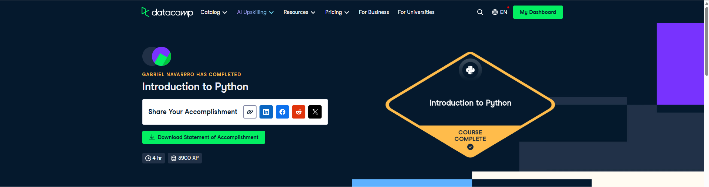

# Plantilla de Entrega

Esta es la plantilla que debes copiar a tu carpeta `estudiantes/tu_usuario/certificaciones/` para entregar la evidencia del curso.

**Curso:** [Introduction to Python for Data Science](https://app.datacamp.com/learn/courses/intro-to-python-for-data-science)

**Requisitos de la evidencia:**
1. El nombre del curso
2. El progreso al 100%
3. Tu usuario logueado

---

# Evidencia: Introduction to Python for Data Science

Nombre del Estudiante: [Tu Nombre Aquí]
Fecha: [Fecha]

## Prueba de Finalización

Por favor, inserta aquí abajo una captura de pantalla clara donde se vea:
1.  El nombre del curso.
2.  El progreso al 100%.
3.  Tu usuario logueado.

o enlace al certificado público:
[https://www.datacamp.com/completed/statement-of-accomplishment/course/54be453b6d00f470309b18f12b6b0c42849080dc]
